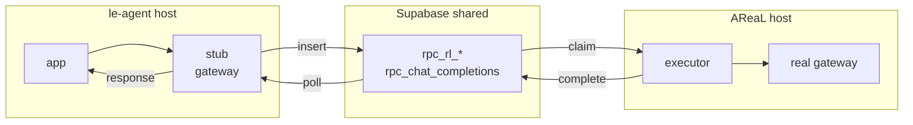
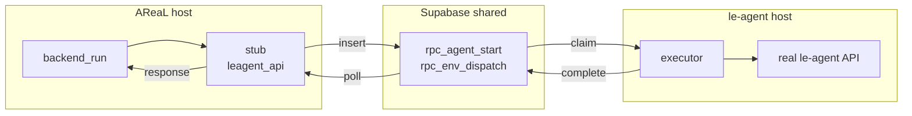
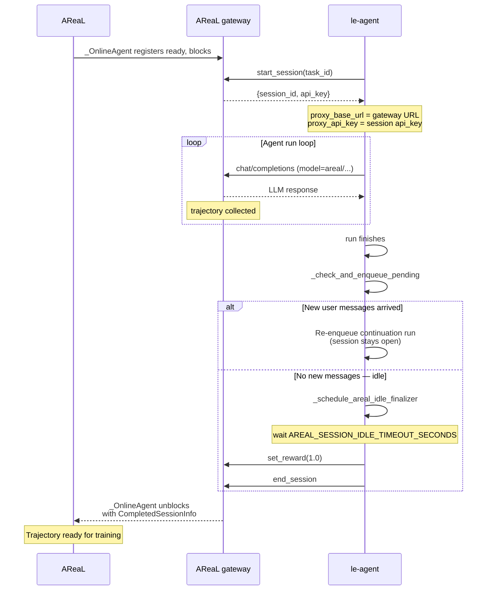
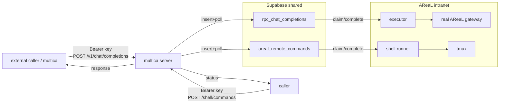
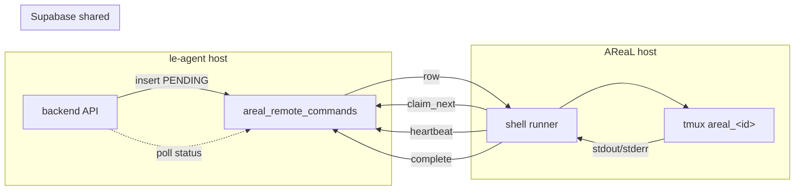
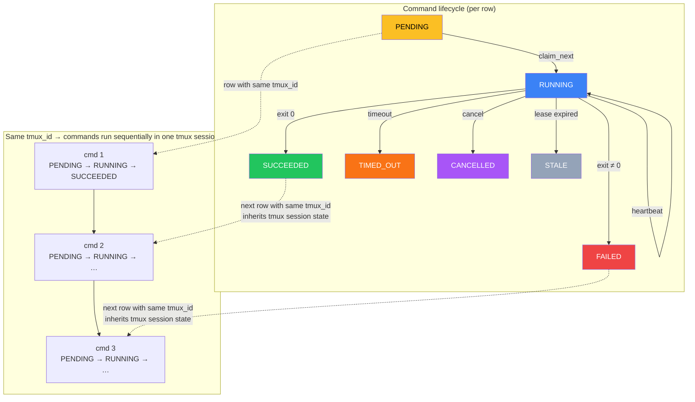

# db_bridge — Supabase-as-springboard RPC bridge

Relays all cross-service HTTP calls between **le-agent** and **AReaL** through
per-endpoint Supabase tables, so the two services can run on hosts that cannot
reach each other but share one Supabase database.

It is a transparent drop-in when the matching stub and executor processes are
scoped with the same `BRIDGE_USER_ID`: point the existing service URLs at local
stub servers and run the matching executor on the other host. If one stub serves
multiple users, the caller must send `X-Bridge-User-Id` with each bridged
request instead.

## How it works

Each cross-service call is a **channel** backed by one Supabase table. For every
channel there are two bridge components:

- **Stub server** — a localhost HTTP server that mirrors the *remote* API the
  local app calls. It captures the request (method, path, headers, raw body),
  enqueues a row, polls that row for the response, and returns it. Transparent.
- **Executor worker** — polls the table, atomically claims a pending row
  (`FOR UPDATE SKIP LOCKED`), forwards it to the *real* local service over
  loopback, and writes the response back.

**Gateway channels** — `rl_start_session`, `rl_set_reward`, `rl_end_session`, `chat_completions`



**Leagent API channels** — `agent_start`, `env_dispatch`



### Online training pipeline

When AReaL runs in **online mode**, le-agent and AReaL cooperate through the
bridge to collect RL trajectories. Each training sample follows this lifecycle:

1. **AReaL** `_OnlineAgent` registers as "ready" on the proxy gateway, then
   blocks waiting for an external session.
2. **le-agent** calls `start_session` → gets back `session_id` + `api_key`.
   The `api_key` / gateway URL become the agent's `proxy_base_url` and
   `proxy_api_key`, routing all LLM calls through AReaL's proxy gateway.
3. The agent runs, making `/chat/completions` calls through the bridge (model
   names starting with `areal/`). AReaL collects the trajectory for training.
4. When the agent finishes a run, `_check_and_enqueue_pending` checks for new
   user messages that arrived during execution:
   - **New messages found** → re-enqueue a continuation run (same session, no
     `end_session` yet).
   - **No new messages** → schedule `_schedule_areal_idle_finalizer`, which
     fires after `AREAL_SESSION_IDLE_TIMEOUT_SECONDS` if no run is active.
5. The finalizer calls `set_reward` (constant `1.0`) then `end_session`,
   signalling AReaL that the trajectory is complete and ready for training.
6. `_OnlineAgent` unblocks, returning `CompletedSessionInfo` with the
   trajectory for AReaL's training loop.

> **Note (sub-project E):** `/rl/start_session` body may include `env_id`
> (string, optional) for trajectory attribution. Older callers omit it; the
> bridge forwards it to AReaL if present.



| Channel               | Path                               | Group         | Stub host | Executor host |
|-----------------------|------------------------------------|---------------|-----------|---------------|
| `rl_start_session`    | `/rl/start_session`                | `gateway`     | le-agent  | AReaL         |
| `rl_set_reward`       | `/rl/set_reward`                   | `gateway`     | le-agent  | AReaL         |
| `rl_end_session`      | `/rl/end_session`                  | `gateway`     | le-agent  | AReaL         |
| `chat_completions`    | `/chat/completions`                | `gateway`     | le-agent  | AReaL         |
| `agent_start`         | `/api/agent/start`                 | `leagent_api` | AReaL     | le-agent      |
| `env_dispatch`        | `/api/v1/env-dispatch`             | `leagent_api` | AReaL     | le-agent      |
| `env_dispatch_delete` | `/api/v1/env-dispatch/{projectID}` | `leagent_api` | AReaL     | le-agent      |

The le-agent SSE stream (`/api/tasks/{id}/stream`) is intentionally **not**
bridged: AReaL's `_wait_for_agent_run` already falls back to polling the shared
`agent_runs` / `tasks` tables directly.

### Streaming chat completions (SSE)

The multica public server (`POST /v1/chat/completions`) supports OpenAI
`stream: true`, relayed end-to-end through the database:

1. The caller's request is parked in `rpc_chat_completions` as usual.
2. The AReaL-side executor claims it, opens a streaming upstream request, moves
   the row to a new `streaming` status (recording the response status/headers),
   and relays the upstream SSE into the `bridge_stream_chunks` table one ordered
   chunk at a time. Chunks are flushed on SSE event boundaries (`\n\n`), so a
   `data: …` event is never split; batching is tunable via
   `BRIDGE_STREAM_FLUSH_BYTES` / `BRIDGE_STREAM_FLUSH_INTERVAL`.
3. The multica server returns a `text/event-stream` `StreamingResponse` that
   polls `bridge_stream_chunks` and replays each chunk to the caller until the
   final chunk (or a terminal row).

Each chunk append heartbeats the parent row; a background sweep
(`BRIDGE_STREAM_SWEEP_INTERVAL`) marks crashed streams (no heartbeat past
`BRIDGE_STALE_SECONDS`) as errored so they are not stuck forever. Caller-side
timeouts are `MULTICA_STREAM_FIRST_CHUNK_TIMEOUT` (stream must begin) and
`MULTICA_STREAM_INTER_CHUNK_TIMEOUT` (max gap between chunks).

Streaming is served **only** by the multica public server. The loopback stub
(`db_bridge.run_stub`) relays buffered bodies only and rejects `stream: true`
with HTTP 400.

## Setup

Copy this `db_bridge/` directory to **both** hosts, then install dependencies:

```bash
cd db_bridge
uv sync                # create .venv and install dependencies
```

For optional header encryption at rest, include the crypto extra:

```bash
uv sync --extra crypto  # installs the 'cryptography' package
```

Apply the schema once against the shared database (it is idempotent):

```bash
psql "$DATABASE_URL" -f db_bridge/schema.sql
# or paste schema.sql into the Supabase SQL editor
```

Existing installs that already contain bridge rows may get `user_id` added as a
nullable column first. Drain, delete, or backfill old rows, then re-apply
`schema.sql` to enforce `user_id not null` on empty/backfilled tables.

## Deployment — four processes total

Run two processes per host — one stub, one executor. **All commands must use
`uv run`** so Python resolves the package and its virtual environment correctly;
bare `python -m db_bridge.*` will fail with `ModuleNotFoundError`.

**le-agent host**
```bash
cd db_bridge && set -a && source .env.leagent && set +a
pids=()
cleanup() {
  trap - INT TERM EXIT
  kill "${pids[@]}" 2>/dev/null || true
  wait "${pids[@]}" 2>/dev/null || true
}
trap cleanup INT TERM EXIT

# gateway stub (multica -> AReaL RL): gateway is a multica-side group -> --side multica
uv run python -m db_bridge.run_stub     --side multica & pids+=("$!")
# leagent_api executor (AReaL -> le-agent API /api/agent/*)
uv run python -m db_bridge.run_executor --side leagent & pids+=("$!")

wait -n "${pids[@]}"
status=$?
cleanup
exit "$status"
```

**AReaL host**
```bash
cd multica/db_bridge && set -a && source .env.areal && set +a
# uv run python -m db_bridge.run_stub     --side areal   # serves /api/agent/* on 127.0.0.1:9101
uv run python -m db_bridge.run_executor --side areal # forwards /rl/*, /chat/completions to the real gateway

```

Stub servers bind to `127.0.0.1` only; the local application is the sole caller.

### Running with tmux

Use tmux when you want the bridge to keep running after your SSH session
disconnects. Run the matching command on each host from the directory that
contains `db_bridge/`. These commands start one tmux session with separate
`stub` and `executor` windows.

**le-agent host**
```bash
tmux new-session -d -s db_bridge_leagent -n stub \
  'cd db_bridge && set -a && source .env.leagent && set +a && uv run python -m db_bridge.run_stub --side multica'

tmux new-window -t db_bridge_leagent -n executor \
  'cd db_bridge && set -a && source .env.leagent && set +a && uv run python -m db_bridge.run_executor --side leagent'

tmux attach -t db_bridge_leagent
```

**AReaL host**
```bash
tmux new-session -d -s db_bridge_areal -n stub \
  'cd db_bridge && set -a && source .env.areal && set +a && uv run python -m db_bridge.run_stub --side areal'

tmux new-window -t db_bridge_areal -n executor \
  'cd db_bridge && set -a && source .env.areal && set +a && uv run python -m db_bridge.run_executor --side areal'

tmux attach -t db_bridge_areal
```

Common tmux operations:

```bash
tmux ls                                      # list bridge sessions
tmux attach -t db_bridge_leagent             # inspect le-agent bridge
tmux attach -t db_bridge_areal               # inspect AReaL bridge
tmux kill-session -t db_bridge_leagent       # stop le-agent bridge
tmux kill-session -t db_bridge_areal         # stop AReaL bridge
```

This is only process supervision for the existing bridge stub/executor. It does
not add a database channel that executes arbitrary shell commands.

## Transparent integration (config-only)

For a per-user bridge deployment, no application code changes are needed: set
the same `BRIDGE_USER_ID` on the stub and executor processes that handle that
user's traffic, then point existing URLs at the local stubs. If a single stub
process serves multiple users, callers must include
`X-Bridge-User-Id: <user-uuid>` on bridged requests. See `.env.leagent.example`
and `.env.areal.example`.

**le-agent app** (`api.py` / workers):
```bash
AREAL_ONLINE_TRAINING_ENABLED=true
AREAL_PROXY_GATEWAY_URL=http://127.0.0.1:9100
```
`AREAL_PROXY_GATEWAY_URL` is returned by `areal_online.gateway_url()` and is also
handed to the agent as the LLM `proxy_base_url` (`agent_loop.py` passes it as the
OpenAI `api_base`), so `/rl/*` and AReaL `/chat/completions` route through the
gateway stub automatically.

The gateway stub only enqueues `/chat/completions` requests whose JSON `model`
starts with `areal/`, for example `areal/qwen/qwen3_5-9b`. Other models bypass
the Supabase queue and are forwarded directly to the received request URL.

**AReaL** (`customized_areal/tpfc/backend_run.py`):
```bash
LE_AGENT_API_URL=http://127.0.0.1:9101
```
`backend_run` POSTs `/api/agent/start` there, and
reads run status from the shared `agent_runs` / `tasks` tables (covering the
dropped SSE stream).

## Multica-side server (public internet, static-key auth)

The **multica server** is a third bridge participant for the topology where
`multica` runs on the public internet and `AReaL` runs on an intranet that can
reach multica but **multica cannot reach AReaL**. Both still share one Supabase
database, so every call is DB-routed exactly like the stub/executor channels —
multica never connects to AReaL directly.

Unlike the loopback stub servers (which bind `127.0.0.1` and trust their single
local caller), the multica server is **internet-exposed**, so every route is
authenticated with static API keys. It offers two surfaces in one process:

- **LLM** — an OpenAI-compatible `POST /v1/chat/completions` (alias
  `/chat/completions`). It reuses the existing `rpc_chat_completions` table:
  the request is enqueued under a single fixed `MULTICA_BRIDGE_USER_ID`, the
  **already-running AReaL executor** claims it and forwards it to the real
  AReaL gateway (`BRIDGE_GATEWAY_UPSTREAM_URL`), and the response comes back
  through the DB. Only models starting with `areal/` are accepted (others →
  `400`); streaming (`stream: true`) is not supported (`400`).
- **Remote shell** — `/shell/commands` endpoints that enqueue / inspect /
  cancel rows in `areal_remote_commands`. The **existing AReaL shell runner**
  (`run_shell_runner`) claims and executes them unchanged.



> **No AReaL-side changes.** The AReaL executor already claims
> `rpc_chat_completions` rows for all users (its `BRIDGE_USER_ID` is unset), and
> the AReaL shell runner already drains `areal_remote_commands`. Adding the
> multica server requires no change to the executor, the runner, or `.env.areal`.

> **Trust boundary.** `MULTICA_LLM_API_KEYS` and `MULTICA_SHELL_API_KEYS` are
> **separate** key sets on purpose: the shell endpoint enqueues arbitrary code
> that the AReaL runner executes on the trusted host. A shell key is effectively
> remote code execution on the AReaL box. Treat it as highly sensitive, keep the
> server behind a TLS reverse proxy, and use a **distinct**
> `MULTICA_BRIDGE_USER_ID` from le-agent's so external traffic stays isolated in
> the shared tables. Auth is fail-closed: an empty key set rejects everything.

### Running it (multica host)

Apply `schema.sql` once (idempotent), then copy `.env.multica.example` to
`.env.multica`, set the keys, and run behind a reverse proxy:

```bash
cd db_bridge && set -a && source .env.multica && set +a
uv run python -m db_bridge.run_multica
```

A `/healthz` endpoint returns `{"status": "ok", "service": "multica"}`.

Example calls (through the proxy that fronts `MULTICA_PORT`):

```bash
# LLM (only areal/ models; no streaming)
curl -sS https://multica.example.com/v1/chat/completions \
  -H "Authorization: Bearer $MULTICA_LLM_KEY" \
  -H "Content-Type: application/json" \
  -d '{"model":"areal/qwen3","messages":[{"role":"user","content":"hi"}]}'

# Remote shell: enqueue → poll status → cancel
curl -sS https://multica.example.com/shell/commands \
  -H "Authorization: Bearer $MULTICA_SHELL_KEY" \
  -H "Content-Type: application/json" \
  -d '{"tmux_id":"debug-gpu","command":"nvidia-smi","timeout_seconds":120}'
curl -sS https://multica.example.com/shell/commands/<id> \
  -H "Authorization: Bearer $MULTICA_SHELL_KEY"
curl -sS -X POST https://multica.example.com/shell/commands/<id>/cancel \
  -H "Authorization: Bearer $MULTICA_SHELL_KEY"
```

### Configuration (multica server)

| Variable | Default | Purpose |
|----------|---------|---------|
| `SUPABASE_URL` | — (required) | Shared Supabase project URL |
| `SUPABASE_SERVICE_ROLE_KEY` | — (required) | Service-role key (RLS bypass) |
| `MULTICA_BRIDGE_USER_ID` | — (required) | Fixed user UUID all multica traffic is enqueued under (use a distinct value from le-agent's) |
| `MULTICA_LLM_API_KEYS` | — | Comma-separated static keys for the LLM endpoint (empty = reject all) |
| `MULTICA_SHELL_API_KEYS` | — | Comma-separated static keys for the shell endpoint (empty = reject all) |
| `MULTICA_BIND_HOST` | `0.0.0.0` | Bind address (keep behind a reverse proxy) |
| `MULTICA_PORT` | `9200` | Bind port |
| `MULTICA_CHAT_TIMEOUT` | `180` | Seconds to wait for the AReaL response before `504` |
| `MULTICA_UPSTREAM_API_KEY` | — | Optional auth injected toward the real AReaL gateway; the inbound multica key is always stripped first |
| `MULTICA_SHELL_DEFAULT_TIMEOUT` | `300` | Default per-command timeout (seconds) |
| `MULTICA_SHELL_MAX_TIMEOUT` | `3600` | Upper bound a requested command timeout is clamped to |
| `MULTICA_SHELL_DEFAULT_CWD` | — | Working directory when a command omits `cwd` |
| `BRIDGE_MAX_BODY_BYTES` | `67108864` | Reject (413) request bodies larger than this |
| `BRIDGE_POLL_INTERVAL` | `0.075` | DB poll interval while waiting for a response |

## Configuration (environment variables)

| Variable | Default | Purpose |
|----------|---------|---------|
| `SUPABASE_URL` | — (required) | Shared Supabase project URL |
| `SUPABASE_SERVICE_ROLE_KEY` | — (required) | Service-role key (RLS bypass) |
| `BRIDGE_POLL_INTERVAL` | `0.075` | Poll interval in seconds (~50–100 ms) |
| `BRIDGE_STALE_SECONDS` | `300` | Reclaim rows stuck in `claimed` past this |
| `BRIDGE_USER_ID` | — | Optional default user UUID for this bridge process; if unset, stub callers must send `X-Bridge-User-Id` |
| `BRIDGE_CODEC_THRESHOLD` | `2048` | Bytes above which bodies are gzip+base64'd |
| `BRIDGE_MAX_BODY_BYTES` | `67108864` | Reject (413) bodies larger than this |
| `BRIDGE_STUB_HOST` | `127.0.0.1` | Stub bind address |
| `BRIDGE_GATEWAY_STUB_PORT` | `9100` | Port for the gateway stub (le-agent side) |
| `BRIDGE_LEAGENT_STUB_PORT` | `9101` | Port for the le-agent-API stub (AReaL side) |
| `BRIDGE_GATEWAY_UPSTREAM_URL` | `http://127.0.0.1:8080` | Real AReaL gateway (AReaL executor) |
| `BRIDGE_LEAGENT_UPSTREAM_URL` | `http://127.0.0.1:8000` | Real le-agent API (le-agent executor) |
| `BRIDGE_TIMEOUT_<CHANNEL>` | per-channel | Override stub wait timeout (e.g. `BRIDGE_TIMEOUT_CHAT_COMPLETIONS=180`) |
| `BRIDGE_CONCURRENCY_<CHANNEL>` | per-channel | Override executor worker count |
| `BRIDGE_REDACT_TOKENS_AFTER_COMPLETE` | `false` | Redact `Authorization` from rows after completion |
| `BRIDGE_HEADER_ENCRYPTION_KEY` | — | Required shared Fernet key for encrypted `multica_api` credentials |
| `BRIDGE_STATS_INTERVAL` | `0` | Seconds between metrics/queue-depth log lines (`0` disables) |
| `BRIDGE_CLEANUP_INTERVAL` | `300` | Seconds between executor cleanup passes (`0` disables) |
| `BRIDGE_ROW_RETENTION_SECONDS` | `86400` | Keep terminal bridge rows for this many seconds |
| `BRIDGE_CLEANUP_BATCH_LIMIT` | `1000` | Maximum rows deleted per channel per cleanup pass |

## Observability

By default, processes log only request/response events: stub enqueue, direct
chat forwarding, returned responses, timeouts, and relay errors; executor
forward failures and completed upstream responses. Idle DB polling does not
produce logs.

Set `BRIDGE_STATS_INTERVAL` to a positive number to opt into periodic
per-channel metrics/queue-depth logs. Stub side reports `enqueued / inflight /
done / errors / timeouts`, payload sizes, and average end-to-end latency;
executor side reports `forwarded / forward_errors`, average forward latency,
and live `queue_depth` (pending row counts). Oversized requests are rejected
with 413 before enqueue; relay timeouts return 504; executor transport failures
return 502.

A `/healthz` endpoint on each stub server returns `{"status": "ok", "side":
"<side>", "channels": [...]}`.

## User isolation

Every queued bridge row stores `user_id`, and every bridge table has a
`(user_id, status, created_at)` index so polling and claiming can stay scoped
and fast. The bridge never derives this value from JWT `Authorization` tokens.
Choose one explicit source:

- Set `BRIDGE_USER_ID=<user-uuid>` when a stub/executor pair is dedicated to
  one user. Use the same value on both sides of that pair. Executors with this
  setting only claim rows for that user.
- Send `X-Bridge-User-Id: <user-uuid>` on each bridged request when one stub
  process serves multiple users. The stub stores this value on the row, then
  strips the header before forwarding to the real upstream service.

If neither source is present, the stub returns `400` and does not enqueue a row.

## Security hardening

- **Token encryption at rest** — `BRIDGE_HEADER_ENCRYPTION_KEY` is mandatory for
  `multica_api` channels. Both the AReaL-side stub and Multica-side executor use
  the same Fernet key. Generate one with:

  ```bash
  python -c 'from cryptography.fernet import Fernet; print(Fernet.generate_key().decode())'
  ```

  The stub encrypts caller `Authorization` before the request reaches the
  database; the executor decrypts it in memory immediately before forwarding.
  This requires the `cryptography` package (`uv sync --extra crypto`). A missing
  or invalid key makes the relevant bridge process fail fast.
- **Post-completion redaction** — set `BRIDGE_REDACT_TOKENS_AFTER_COMPLETE=true`
  to scrub the stored `Authorization` value (to `REDACTED`) after the response
  has been relayed for other channel groups. `multica_api` rows are always
  redacted after terminal success or failure.
- **Payload limits** — bodies above `BRIDGE_MAX_BODY_BYTES` are rejected. On
  self-hosted Supabase, also raise the PostgREST/proxy request-body limit
  (Kong/nginx) so large chat payloads and base64 files are not truncated; gzip
  compression (automatic above `BRIDGE_CODEC_THRESHOLD`) keeps most payloads
  small.

## Retention / cleanup

Executors periodically delete old terminal rows (`done` / `error`) in bounded
batches. Active `pending` / `claimed` rows are never deleted by cleanup because
they may still be claimed or reclaimed. Defaults keep terminal rows for one day
and delete up to 1000 old rows per channel every 300 seconds.

Set `BRIDGE_CLEANUP_INTERVAL=0` to disable automatic cleanup, or raise
`BRIDGE_ROW_RETENTION_SECONDS` if you need a longer audit window. Cleanup is
not user-scoped; it only deletes terminal rows older than the retention window.

## Crash recovery

There is no separate reaper process. `bridge_claim_next` reclaims any row left
in `claimed` longer than `BRIDGE_STALE_SECONDS`, so if an executor dies
mid-request another worker picks the row up after the stale window.

## Tests

```bash
cd db_bridge
uv run python -m pytest -q                                                   # unit + in-memory integration (no DB needed)
BRIDGE_TEST_PG_DSN=postgresql://... uv run python -m pytest -q               # also runs live-DB schema tests
```


> **📌 Reminder — AReaL remote shell runner.** This section documents the
> optional `run_shell_runner` process that executes arbitrary shell text on the
> AReaL host via the shared database. It is gated behind
> `AREAL_REMOTE_SHELL_ENABLED=true` and should only be enabled on trusted hosts.
> Keep this section up to date when the runner's schema, config, or lifecycle
> changes.

## AReaL remote shell runner (trusted-host, feature-flagged)

A separate, optional process executes arbitrary shell text on the AReaL host on
behalf of authenticated le-agent users and agents, using the shared database as
the command transport. It exists for the case where the two machines cannot
reach each other over SSH but share one Supabase database.

> **Trust boundary.** This is **not** a sandbox. A runner with the flag enabled
> runs arbitrary host shell code for any caller authorized to enqueue commands.
> `tmux` is used only for lifecycle management (named sessions, log capture,
> termination), not isolation. Enable it only where the AReaL host is
> intentionally trusted for those callers.

### How it works





1. The le-agent backend (the user-facing, user-access-checked service) inserts
   rows into `areal_remote_commands` with status `PENDING`, a `user_id`, and a
   caller-chosen `tmux_id`.
2. The runner on the AReaL host claims a row (`areal_shell_claim_next`), creates
   or reuses the tmux session `areal_<tmux_id>`, and runs the command. Commands
   with the same `tmux_id` are claimed one at a time so they target the same
   remote terminal sequentially.
3. While running, it heartbeats (`areal_shell_heartbeat`) to refresh its lease
   and persist bounded `stdout_tail` / `stderr_tail` / `log_bytes`, observing
   any backend cancellation.
4. On exit it writes a terminal status (`SUCCEEDED` / `FAILED`), the exit code,
   and final logs (`areal_shell_complete`). Timeouts → `TIMED_OUT`, cancellation
   → `CANCELLED`. A periodic sweep marks ambiguous expired-lease running rows
   `STALE` rather than re-executing them.

The runner uses `SUPABASE_SERVICE_ROLE_KEY` because it claims/updates rows
across users. Logs may contain secrets (commands are arbitrary); product
surfaces must treat them as user-private data.

### Running it (AReaL host)

Apply `schema.sql` (idempotent) so the `areal_remote_commands` table and
`areal_shell_*` functions exist, then:

```bash
cd db_bridge && set -a && source .env.areal && set +a
AREAL_REMOTE_SHELL_ENABLED=true uv run python -m db_bridge.run_shell_runner
```

`tmux` must be installed on the host. With the flag unset/false the runner
starts but refuses to claim any command, so an accidental deploy never executes
host shell code.

### Configuration

| Variable | Default | Purpose |
|----------|---------|---------|
| `AREAL_REMOTE_SHELL_ENABLED` | `false` | Master switch; runner refuses to claim when false |
| `AREAL_REMOTE_SHELL_RUNNER_ID` | random | Stable runner identity for leases |
| `AREAL_REMOTE_SHELL_POLL_INTERVAL` | `1.0` | Seconds between claim/monitor polls |
| `AREAL_REMOTE_SHELL_LEASE_SECONDS` | `60` | Lease duration; must exceed the poll interval |
| `AREAL_REMOTE_SHELL_SWEEP_INTERVAL` | `30` | Seconds between stale-row sweeps |
| `AREAL_REMOTE_SHELL_DEFAULT_TIMEOUT` | `300` | Default per-command timeout (seconds) |
| `AREAL_REMOTE_SHELL_MAX_TIMEOUT` | `3600` | Upper bound a command timeout is clamped to |
| `AREAL_REMOTE_SHELL_MAX_LOG_BYTES` | `65536` | Bounded tail captured per stream |
| `AREAL_REMOTE_SHELL_MAX_CONCURRENCY` | `4` | Max commands executed in parallel |
| `AREAL_REMOTE_SHELL_DEFAULT_CWD` | — | Working directory when a command omits one |
| `AREAL_REMOTE_SHELL_SESSION_PREFIX` | `areal_` | tmux session name prefix |
| `AREAL_REMOTE_SHELL_WORK_DIR` | `/tmp/areal_remote_shell` | Runner scratch dir for capture files |
| `AREAL_REMOTE_SHELL_TMUX_BIN` | `tmux` | tmux binary path |
| `AREAL_REMOTE_SHELL_CLEANUP_INTERVAL` | `300` | Seconds between terminal-row cleanup passes (`0` disables) |
| `AREAL_REMOTE_SHELL_RETENTION_SECONDS` | `604800` | Keep terminal command rows this long |

Example enqueue shape:

```sql
insert into public.areal_remote_commands (
  user_id,
  tmux_id,
  command,
  cwd,
  timeout_seconds
)
values (
  '<user_uuid>',
  'debug-gpu',
  'nvidia-smi',
  '/tmp',
  120
);
```

Use the same `tmux_id` for follow-up commands that should reuse the same remote
tmux terminal. Use a different `tmux_id` for independent terminals. The runner
no longer requires or reads `task_id` or `account_id` for remote shell commands.

> The le-agent backend command-creation / inspection / cancellation API (with
> feature-flag gating and user authorization) is the companion slice and lives
> in the le-agent backend, not in `db_bridge`.

---

> **📌 AReaL Training Integration.** This section documents how the remote shell
> runner orchestrates AReaL training jobs — commands, configs, checkpoints,
> error handling, and timeouts. Keep this section up to date when training
> scripts, config structures, or checkpoint paths change.

## AReaL training integration

The remote shell runner can execute AReaL training commands on the AReaL host.
This section is the single source of truth for all training modes, their
commands, configs, injectable parameters, checkpoint discovery, and failure
modes.

### Training commands

AReaL supports three training scripts and six config presets. All commands are
run from the AReaL project root directory.

**Script 1: `train_tpfc_tree_search.py`** — offline tree-search training
(inference + training on the same GPU cluster, data from parquet files or
fresh-query database table).

| Mode | Config | Command |
|------|--------|---------|
| GRPO v1 | `config_tpfc_Qwen3-5L-9B-Instruct_tree_search.yaml` | `cd /dfs/share-groups/letrain/zhoujie/AReaL-main && uv run customized_areal/tpfc/scripts/train_tpfc_tree_search.py --config customized_areal/tpfc/configs/config_tpfc_Qwen3-5L-9B-Instruct_tree_search.yaml 2>&1 \| tee training.log` |
| GRPO v2 | `config_tpfc_Qwen3-5L-9B-Instruct_tree_search_v2.yaml` | `cd /dfs/share-groups/letrain/zhoujie/AReaL-main && uv run customized_areal/tpfc/scripts/train_tpfc_tree_search.py --config customized_areal/tpfc/configs/config_tpfc_Qwen3-5L-9B-Instruct_tree_search_v2.yaml 2>&1 \| tee training_v2.log` |
| Self-play | `config_tpfc_Qwen3-5L-9B_tree_search_self_play.yaml` | `cd /dfs/share-groups/letrain/zhoujie/AReaL-main && uv run customized_areal/tpfc/scripts/train_tpfc_tree_search.py --config customized_areal/tpfc/configs/config_tpfc_Qwen3-5L-9B_tree_search_self_play.yaml 2>&1 \| tee training_self_play.log` |
| OPD / distill | `config_tpfc_Qwen3-5L-9B-opd.yaml` | `cd /dfs/share-groups/letrain/zhoujie/AReaL-main && uv run customized_areal/tpfc/scripts/train_tpfc_tree_search.py --config customized_areal/tpfc/configs/config_tpfc_Qwen3-5L-9B-opd.yaml 2>&1 \| tee training_opd.log` |
| VL-8B | `config_tpfc_Qwen3-VL-8B-Instruct_tree_search.yaml` | `cd /dfs/share-groups/letrain/zhoujie/AReaL-main && uv run customized_areal/tpfc/scripts/train_tpfc_tree_search.py --config customized_areal/tpfc/configs/config_tpfc_Qwen3-VL-8B-Instruct_tree_search.yaml 2>&1 \| tee training.log` |

**Script 2: `train_triggered_sft_loss.py`** — online triggered training
(agent queries the backend API in real time; no pre-stored dataset).

| Mode | Config | Command |
|------|--------|---------|
| Triggered SFT | `config_Qwen3-5L-9B_trggered_training.yaml` | `cd /dfs/share-groups/letrain/zhoujie/AReaL-main && uv run customized_areal/tiggered_training/train_triggered_sft_loss.py --config customized_areal/tiggered_training/config_Qwen3-5L-9B_trggered_training.yaml --loss-mode sft` |
| Triggered GRPO | same config | `cd /dfs/share-groups/letrain/zhoujie/AReaL-main && uv run customized_areal/tiggered_training/train_triggered_sft_loss.py --config customized_areal/tiggered_training/config_Qwen3-5L-9B_trggered_training.yaml --loss-mode grpo gconfig.n_samples=4 train_dataset.batch_size=1` |

**Script 3: `train_tpfc.py`** — basic PPO/GRPO training without tree search
(uses AReaL's standard PPOTrainer; no MCTS tree backup or rollout caching).

> Note: `train_tpfc.py` references `config_tpfc.yaml` which is not present in
> `customized_areal/tpfc/configs/`. This script is a development/legacy entry
> point; prefer `train_tpfc_tree_search.py` for production training.

### Config system — Hydra + OmegaConf override injection

AReaL uses Hydra for config composition and CLI overrides, backed by OmegaConf
for merging and validation. Every YAML field can be overridden on the command
line without editing the file:

```
uv run <script> --config <yaml> key.subkey=value key2=value2 ...
```

The `--config` flag is the only required CLI argument. Everything after it is
treated as a Hydra override. The config system also supports environment
variable resolution inside YAML (e.g. `${oc.env:SWANLAB_API_KEY,""}`) and
automatic `.env` file loading via `dotenv`.

**Key override for model changes**: `actor.path` is the central hub. Changing
it cascades via OmegaConf interpolation to `tokenizer_path`, `ref.path`,
`sglang.model_path`, and `vllm.model` — all derived from `${actor.path}`.

### Injectable config fields

| Field | Override syntax | Default (varies by config) |
|-------|----------------|---------------------------|
| Model path | `actor.path=...` | `/dfs/share-groups/letrain/ckpt/Qwen3.5-9B` or `Qwen3-VL-8B-Instruct` |
| Dataset path | `train_dataset.path=...` | `customized_areal/tpfc/data/generated_training_final_update.parquet` |
| Learning rate | `actor.optimizer.lr=...` | `1.70e-6` |
| Epochs | `total_train_epochs=...` | `4` or `5` |
| Output dir | `cluster.fileroot=...` | `/dfs/share-groups/letrain/zhoujie/AReaL-main/tmp/areal/experiments` |
| Experiment name | `experiment_name=...` | `tpfc-grpo` or `tpfc-distill` |
| Trial name | `trial_name=...` | varies |
| Batch size | `train_dataset.batch_size=...` | `32` (3-GPU) or `8` (2-GPU) or `1` (triggered) |
| N samples | `gconfig.n_samples=...` | `8` or `16` |
| GPU count | `cluster.n_gpus_per_node=...` | `3` or `2` |
| Allocation mode | `allocation_mode=...` | `sglang:d1+fsdp:d2` (3-GPU) or `sglang:d1+fsdp:d1` (2-GPU) |
| Loss mode | `tree_search.loss_mode=...` | `GRPO` or `DISTILL` |
| Recover mode | `recover.mode=...` | `on` or `disabled` |
| SGLang memory budget | `sglang.mem_fraction_static=...` | `0.85` or `0.30` (distill) |
| Adv normalization | `actor.adv_norm.mean_level=...` | `group` or `batch` |

Example — swap model, data, and experiment name in one command:

```bash
cd /dfs/share-groups/letrain/zhoujie/AReaL-main && \
uv run customized_areal/tpfc/scripts/train_tpfc_tree_search.py \
  --config customized_areal/tpfc/configs/config_tpfc_Qwen3-5L-9B-Instruct_tree_search.yaml \
  actor.path=/new/model/path \
  train_dataset.path=/new/data.parquet \
  experiment_name=my_exp \
  trial_name=my_trial
```

### Config comparison table

| Field | tree_search v1 | v2 | self_play | opd (distill) | VL-8B | triggered (sft/grpo) |
|-------|:---:|:---:|:---:|:---:|:---:|:---:|
| **Script** | `train_tpfc_tree_search.py` | same | same | same | same | `train_triggered_sft_loss.py` |
| **Extra CLI** | — | — | — | — | — | `--loss-mode sft\|grpo` |
| **Model** | Qwen3.5-9B | Qwen3.5-9B | Qwen3.5-9B | Qwen3.5-9B | Qwen3-VL-8B | Qwen3.5-9B |
| **GPUs** | 3 | 3 | 2 | 2 | 3 | 2 |
| **allocation** | d1+d2 | d1+d2 | d1+d1 | d1+d1 | d1+d2 | d1+d1 |
| **batch_size** | 32 | 32 | 32 | 8 | 32 | 1 |
| **n_samples** | 8 | 8 | 8 | 8 | 16 | 1 (sft) / override (grpo) |
| **offload_params** | false | true | false | true | true | false |
| **loss_mode** | GRPO | GRPO | GRPO | DISTILL | GRPO | sft=masked NLL, grpo=GRPO |
| **agent.mode** | inline | inline | inline | inline | inline | online |
| **recover** | on | on | on | disabled | disabled | on |
| **fresh_query** | no | no | yes | no | no | no |
| **train_dataset.path** | parquet | parquet | parquet | parquet | parquet | "null" (empty dataloader) |
| **mem_fraction_static** | 0.85 | 0.85 | 0.85 | 0.30 | 0.85 | 0.85 |
| **adv_norm** | group | batch | group | group | batch | group |
| **total_train_epochs** | 4 | 4 | 4 | 4 | 5 | 4 |
| **total_train_steps** | — | — | 200 | — | — | 64 |
| **valid_dataset** | same parquet | same | same | same | same | null |
| **SwanLab project** | tpfc-grpo | tpfc-grpo | tpfc-grpo | tpfc-opd | tpfc-grpo | tpfc-grpo |
| **Ref model** | colocation | colocation | colocation | no ref | colocation | no ref |

### Triggered training vs tree-search training

| Property | Triggered SFT | Triggered GRPO | Tree Search GRPO | Self-play GRPO |
|----------|:---:|:---:|:---:|:---:|
| Data source | Online rollout | Online rollout | Pre-stored parquet | Fresh query from DB |
| Loss | Masked NLL (patched PPOActor) | GRPO | GRPO | GRPO |
| Agent mode | `online` | `online` | `inline` | `inline` |
| Requires backend API running | **yes** | **yes** | no | no |
| batch_size | 1 | 1 | 32 | 32 |
| n_samples | 1 | >=2 (override) | 8/16 | 8 |
| Ref model | not needed | not needed | colocation | colocation |
| Training step limit | `total_train_steps: 64` | same | `total_train_epochs: 4/5` | `total_train_steps: 200` |

Triggered training uses `agent.mode: online`, meaning the agent calls the
le-agent backend API in real time to generate queries. The backend API and
dramatiq workers **must be running** for triggered training to work.
Tree-search training uses `agent.mode: inline` and reads queries from a
parquet file — no backend dependency. Self-play also uses `inline` mode but
fetches training queries from the database via `use_fresh_query=true`.

### Checkpoints and output discovery

#### Checkpoint directory structure

```
<fileroot>/checkpoints/<user>/<experiment_name>/<trial_name>/actor/
  epoch{e}epochstep{s}globalstep{g}/
```

Default fileroot: `/dfs/share-groups/letrain/zhoujie/AReaL-main/tmp/areal/experiments`

Example full path:
```
/dfs/.../experiments/checkpoints/zhoujie22/tpfc-grpo/trial_0525/actor/epoch3epochstep5globalstep15/
```

Recovery checkpoints (for resuming interrupted training) are stored at:
```
<fileroot>/checkpoints/<user>/<experiment_name>/<trial_name>/actor/recover_checkpoint/
```

#### Determining training success

Check all three conditions:

1. **Exit code 0** — the training script exited cleanly.
2. **Log message** — stdout/stderr contains the exact string
   `Training completes! Total time elapsed` (emitted once by
   `areal/utils/stats_logger.py` upon successful completion).
3. **Checkpoint directory exists and is non-empty** — at least one
   `epoch*epochstep*globalstep*` subdirectory exists under the actor
   save root.

#### Metrics

| Backend | When active | Location |
|---------|-------------|----------|
| SwanLab | `stats_logger.swanlab.mode != "disabled"` | Cloud dashboard (project: `tpfc-grpo` or `tpfc-opd`) |
| WandB | `stats_logger.wandb.mode != "disabled"` | Currently `disabled` in all TPFC configs |
| TensorBoard | `stats_logger.tensorboard.path` set | Not configured in current configs |
| stdout | Always | Per-step progress + tabulated metrics |

Step progress format: `Epoch X/Y Step Z/W Train step N/M done.`

A copy of the resolved config is saved to
`<stats_logger log path>/config.yaml` on rank 0 at startup.

#### Finding the latest checkpoint (candidate model path)

```bash
# Method 1: scan the actor checkpoint directory for the latest epoch
SAVE_ROOT="<fileroot>/checkpoints/$(whoami)/<experiment_name>/<trial_name>/actor"
LATEST_CHECKPOINT=$(ls -d1 "$SAVE_ROOT"/epoch* 2>/dev/null | sort | tail -1)

# Method 2: using AReaL's Saver API
cd /dfs/share-groups/letrain/zhoujie/AReaL-main
uv run python3 -c "
from areal.utils.saver import Saver
import os
root = Saver.get_model_save_root(
    experiment_name='tpfc-grpo',
    trial_name='trial_0525',
    fileroot='/dfs/share-groups/letrain/zhoujie/AReaL-main/tmp/areal/experiments',
    name='actor',
)
dirs = sorted(d for d in os.listdir(root) if d.startswith('epoch'))
print(os.path.join(root, dirs[-1]) if dirs else 'NO_CHECKPOINT_FOUND')
"
```

### Timeouts and resource planning

| Scenario | Estimated duration | Recommended timeout |
|----------|--------------------|---------------------|
| Tree-search GRPO (3 GPU) | 2–3 hours | 10800s (3h) |
| OPD / distill (2 GPU) | 2–3 hours | 10800s (3h) |
| Triggered SFT (2 GPU, online) | 1–2 hours | 7200s (2h) |
| Large-scale / conservative | 4+ hours | 14400s (4h) |

**Parallel training**: 3-GPU configs occupy the full machine and cannot run
concurrently. 2-GPU configs (opd, triggered) could run two in parallel on a
4-GPU machine with explicit `CUDA_VISIBLE_DEVICES` partitioning. Serial
execution is safer and recommended.

The `backend_run.py` reference timeouts are:
- Per agent run: 1500s (25 min) — `backend_run.py:96`
- Overall run wait: 9000s (2.5h) — `backend_run.py:519`

### Error patterns and retry

#### OOM (out of memory)

- **stderr keywords**: `CUDA out of memory` or `torch.cuda.OutOfMemoryError`
- **Mitigation**: `actor.gradient_checkpointing=true` (enabled in all configs)
  and `actor.fsdp.offload_params=true` (enabled in v2, VL, opd;
  **not** enabled in v1, self_play, or triggered configs)
- **Override to enable offloading**:
  `actor.fsdp.offload_params=true`

#### Dataset errors

| Error | Exception | Location |
|-------|-----------|----------|
| Parquet file missing | `FileNotFoundError("TPFC dataset parquet not found: {path}")` | `tpfc_dataset.py:141` |
| No parquet files in dir | `ValueError("No parquet files found in directory: {path}")` | `tpfc_dataset.py:138` |
| Parquet has no rows | `ValueError("TPFC dataset parquet has no rows: {path}")` | `tpfc_dataset.py:146` |
| Invalid image path | `ValueError("Invalid image path: {path!r}")` | `tpfc_dataset.py:75` |

#### Safe re-submission after interruption

Depends on `recover.mode` in the config:

| `recover.mode` | Behavior on re-submit | Configs using it |
|----------------|----------------------|------------------|
| `on` | **Resumes** from last saved checkpoint automatically | v1, v2, self_play, triggered |
| `disabled` | **Starts fresh** from scratch | opd, VL-8B |

To force a clean re-run on a config with `recover.mode=on`, either:
- Override on CLI: `recover.mode=disabled`
- Or use a new `experiment_name` / `trial_name` to write to a fresh directory

#### Residual cleanup

| Type | Action needed |
|------|---------------|
| GPU zombie processes | Manual `kill` required after hard crashes |
| TPFC sandbox | Auto-cleaned by `cleanup_sandbox_for_task()` in `backend_run.py` |
| Distributed locks | In-memory (torch distributed store), no file cleanup needed |
| Shared auth token lock | `.shared_auth_token.refresh.lock` may persist; safe to delete |

### Environment and prerequisites

No manual environment setup is needed before running training commands:

- `uv run` automatically resolves the project virtual environment
- AReaL's launcher sets `CUDA_DEVICE_MAX_CONNECTIONS=1` and other CUDA env vars
- `.env` files are auto-loaded by `load_expr_config` via `dotenv`
- `SWANLAB_API_KEY` is resolved from environment via `${oc.env:SWANLAB_API_KEY,""}`

**Minimum command** (everything else comes from the YAML config):

```bash
cd /dfs/share-groups/letrain/zhoujie/AReaL-main && \
uv run customized_areal/tpfc/scripts/train_tpfc_tree_search.py \
  --config customized_areal/tpfc/configs/config_tpfc_Qwen3-5L-9B-Instruct_tree_search.yaml
```

For triggered training, the le-agent backend API and dramatiq workers **must
already be running** (see `run_all.sh` for the standard startup sequence).
