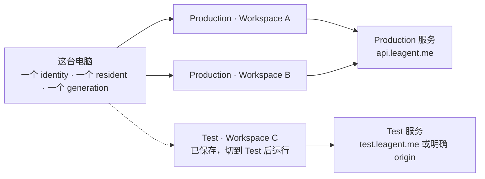
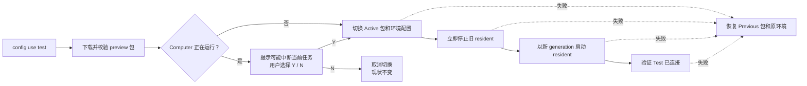
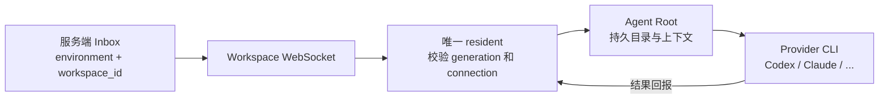
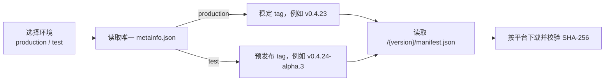
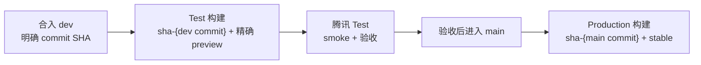

# Multica Computer V1

> Issue [#2484](https://github.com/LRM-Teams/multica/issues/2484) · 2026-08-10

一台电脑只有一个 Computer identity 和一个常驻 resident，但可以连接多个工作区。

简单理解：Computer 是电脑上的常驻“工头”；每条 Workspace connection 是某个工作区发给它的一张门禁卡。一个工头可以持有多张门禁卡，同时为多个工作区工作。

本文描述 Computer V1 的最终用户模型、环境切换、Workspace connection、版本发布和故障恢复契约。实时发布与部署证据记录在对应 PR 和 GitHub Actions 中，避免把会过期的运行状态写死在架构文档里。

## 1. 总模型

- 同一个 OS 用户下只有一个机器级 Computer identity，不随 workspace slug 变化。
- 只有一个 resident 持有本机锁、健康端口和 PID。
- 每条 Workspace connection 独立授权；一个工作区断开不会影响其他工作区。
- 同一时刻 resident 只连接一个环境的一个服务 origin，同时服务该环境下的全部已连接工作区。
- Production 和 Test 的连接可以同时保存；切换环境时重启 resident，另一环境的连接不会丢失。
- Computer owner 是整机 lifecycle mutation 的唯一授权主体。Workspace owner/admin
  不因此获得别人 Computer 的升级或重启权限。



## 2. Workspace connection

`binding` 是内部协议和数据库术语，产品界面使用 `Workspace connection`。

一条 connection 保存：

- `environment`
- 不可变的 `workspace_id`
- `computer_id`
- 服务 origin
- 可撤销的 execution credential
- 接受时间和激活状态

本地唯一键是 `(environment, workspace_id)`。slug 只用于显示，工作区改名不会改变连接身份。

| 问题 | Computer V1 的答案 |
| --- | --- |
| 一台电脑能连接两个工作区吗？ | 可以；同一环境下由一个 resident 同时服务。 |
| 工作区改名会断开吗？ | 不会；身份使用不可变的 `workspace_id`。 |
| 只删除 Workspace A 里的 Computer 呢？ | 只删除 A 的服务端机器挂载；B 的 connection、credential 和执行状态保留。 |
| connection 是一个额外进程或目录吗？ | 不是；它是一条独立授权，不是 resident，也不是本机 workspace 目录。 |
| 在 Workspace A 点击升级会只升级 A 吗？ | 不会。A 只是入口；升级的是整台 Computer，A、B 等全部 active connections 随后使用同一新版本并看到同一进度。 |

## 3. 环境和包

用户只选择环境。服务 origin、包稳定性和发布清单是一组固定套餐，不提供独立的 `release_channel` 配置。

| 环境 | 服务 | 包 | 清单 |
| --- | --- | --- | --- |
| Production | `api.leagent.me` / `www.leagent.me` | stable | `/computer/metainfo.json` → `environments.production` |
| Test | `https://82.157.184.89`；以后可通过部署配置切到 `test.leagent.me` | preview | `/computer/metainfo.json` → `environments.test` |

Computer 页面从公共 `/api/config.environment` 读取服务端声明的 `production` 或 `test`，并使用 `daemon_server_url`、`daemon_app_url` 分别填入 Test API/Web origin。两个值今天可以相同，但协议允许以后拆成不同域名。页面不能根据域名或 IP 猜环境。Production 显示普通 setup 命令；Test 页面由浏览器直接读取 `https://cdn.leagent.me/computer/metainfo.json`，校验后优先显示 `environments.test.tag` 的精确安装版本及完整环境/origin 命令。元数据仍在加载或暂时不可达时回退到合法的 `test` selector，由安装脚本在执行时解析当前 Test preview；这不能阻塞应用构建、部署或用户复制命令。

第一次连接环境：

```bash
multica setup /my-workspace

multica setup --environment test \
  --server-url https://82.157.184.89 \
  --app-url https://82.157.184.89 \
  /my-workspace
```

setup 会直接激活目标环境、建立当前 Workspace connection 并启动 Computer；不需要随后再运行 `config use`。如果本机已有另一个 active environment，setup 会在写配置、登录和重启前询问是否切换；自动化可显式使用 `--yes`。

以后切换环境：

```bash
multica config use test
multica config use production
multica config show
```

人的登录会话保存在环境配置中；Computer 替工作区执行任务的 credential 单独保存在 `~/.multica/computer/bindings.json`。两者不是同一个万能凭证。

## 4. Setup 契约

一次成功的 `setup` 必须完成全部步骤：

1. 校验环境和 origin；若会切换已有 active environment，先取得用户确认。
2. 登录并把 slug 解析成不可变的 `workspace_id`。
3. 由服务端授权 Computer connection 并签发 execution credential。
4. 以 `(environment, workspace_id)` 原子 upsert 本地 connection；重复 setup 是修复，不制造副本。
5. 启动或重启唯一 resident，并领取新的 generation。
6. 用 `running + connected:true` 验收 environment、origin 和工作区均一致。

工作区没有 Agent 时也可以 setup 成功；验收依据是 Computer 是否真正连接服务，不是 runtime 数量。

环境切换流程：



切换不会为了等当前任务结束而卡住半小时。Computer 正在运行时，CLI 会明确提示：切换会立即重启 resident，当前任务可能中断；用户确认 `Y` 才继续，选择 `N` 时 Active 包、环境配置和 resident 都不变。自动化可以显式使用 `--yes`。切换后的连接验收失败时，恢复 Previous 包、原配置和原环境。

## 5. 一条任务如何找到本机 Agent



旧 generation 即使进程仍存活，也会被服务端拒绝，避免两个 resident 同时接受或回报工作。

## 6. Delete Computer

界面只提供一个 `Delete Computer` 动作。它删除的是当前工作区里的 Computer 挂载，不是物理电脑或本机文件。

canonical API 是 `DELETE /api/computers/{computerId}`。旧客户端使用的 `DELETE /api/runtimes/by-daemon/{computerId}` 只调用同一个 handler，不提供另一套删除语义；旧 `runtime_mode` query 也不能把一次 Computer 删除缩小成部分 runtime 删除。产品不暴露独立 connection revoke 或 Computer 级批量删除 Agent 的接口。

### 前置条件

- 当前 Computer 仍有 active Agent 时，后端返回 `409 computer_has_active_agents`。
- 拒绝时 runtime、Workspace connection、credential 和本机数据全部保持不变。
- 用户必须通过正常 Agent 删除流程移除全部 Agent，再确认删除 Computer；Computer 删除本身不级联删除 active Agent。

### 确认后实际发生

同一个数据库事务会：

1. 删除当前工作区内该 Computer 的 runtime 投影。
2. 删除其已归档 Agent 的服务端数据、历史和消息。
3. 撤销当前 `(Computer, Workspace)` connection 和 execution credential。
4. 写入 registration tombstone，阻止仍在运行的 resident 靠 heartbeat 自动注册回来。
5. 即使 Computer 已经没有 runtime，也会撤销 connection，不留下空 Computer。

### 明确不会发生

- 不删除本机 Agent Root、memory、session、skill 或工作文件。
- 不删除 resident、Computer identity 或物理电脑。
- 不影响其他工作区的 connection、credential、runtime 和执行状态。
- 不代替“删除本机 Agent workspace 目录”；后者是另一个显式磁盘操作。

### 重新接入

以后显式执行 `multica setup` 会清除该工作区的 registration tombstone，并建立一条新的 Workspace connection。已经删除的服务端历史不会恢复。

## 7. 发布轨道

| 用户输入 | 读取路径 | 允许指向 | 用途 |
| --- | --- | --- | --- |
| Production / 省略 / `--version latest` | `/computer/metainfo.json` → `environments.production` | stable `vX.Y.Z` | 正式环境和全新安装默认值 |
| Test / `--version test` | `/computer/metainfo.json` → `environments.test` | `alpha.N` / `beta.N` / `rc.N` | 手工跟随测试环境推荐版本 |
| `--version v0.5.0-rc.2` | `/computer/0.5.0-rc.2/manifest.json` | 精确版本 | 复现、恢复和排障 |

为什么不是“一个 JSON 包含所有东西”？因为两个文件回答的是两个不同问题：

- `/computer/metainfo.json` 回答“Production 和 Test **现在推荐哪一版**”，所以它会变，但它是唯一会移动的版本目录。
- `/computer/{version}/manifest.json` 回答“**这一版具体下载什么、SHA-256 是多少**”，所以它一旦发布就永远不能变。



不再发布根目录 `manifest.json`、`latest.json`、`alpha.json`、`test.json`，也不再发布 `/vX.Y.Z/release.json`。`metainfo.json` 缺失或损坏时明确失败，不偷偷读取可能已经过期的第二套指针。

```bash
# 默认稳定版
curl -fsSL https://cdn.leagent.me/computer/install.sh | bash

# 手工跟随测试环境推荐版本
curl -fsSL https://cdn.leagent.me/computer/install.sh | bash -s -- --version test

# 精确版本
curl -fsSL https://cdn.leagent.me/computer/install.sh | bash -s -- --version v0.5.0-rc.2
```

Test 页面优先展示从 canonical metainfo 解析出的精确版本，让复制命令明确且便于复现；元数据尚未解析或暂时不可达时可以展示可移动的 `test` selector，由安装脚本在执行时解析当前 Test preview。精确 tag 仍用于页面安装的首选展示、复现、恢复和排障。不存在 `alpha` selector 或根目录 channel JSON fallback。

## 8. 升级契约

### 本机只有一份 Computer

`$HOME/.local/bin/multica` 既是 CLI 也是 Computer。start、supervise 和 `computer upgrade` 都用这一份文件。升级先把校验过的候选写到 ephemeral scratch，再把它换到 PATH 上，旧文件留成 `multica.prev`。失败或 rollback 把 `.prev` 换回去。

没有 `versions/<tag>` catalog，也没有 `activation.json` Active 指针。generation 仍是 resident 的任期号：新进程接班后，服务端拒绝旧任期的迟到心跳和结果。

升级步骤：

1. 按环境解析包源，或使用排障指定的精确版本。
2. 校验压缩包 SHA-256 和候选 binary SHA-256。
3. 把候选写到 scratch，再原子换到 PATH，保留 `.prev`。
4. 用更大的 Computer generation 启动 successor resident。
5. 验证目标版本、successor 和全部 runtime 收敛；失败时从 `.prev` 恢复。

### Raft 对齐

Raft Computer 也是一份 PATH 二进制：`upgrade` 把 `process.execPath` rename 成 `.prev`，再把新文件放到同一路径。Multica 现在用同一模型。

## 9. 部署轨道



`dev` push 自动构建带不可变 commit + Computer version tag 的后端/Web 镜像并部署腾讯 Test，例如 `sha-ef0f011-computer-0.4.24-alpha.4`；因此同一个源码 commit 后来改用新的 preview 包时会得到新镜像 tag，不会覆盖旧字节。客户端 prerelease 由显式版本 tag 发布，不是每次 `dev` push 都自动增加 `alpha.N`。验收通过的代码进入 `main` 后，Production 流水线从这个明确的 main commit 构建自己的不可变镜像，正式 Computer 包则使用稳定 tag 发布。两条轨道都记录源 commit、镜像 tag、客户端版本与校验和。

GitHub runner 标签和部署边界也是分开的：`[self-hosted, aliyun]` 只接 Production，`[self-hosted, s89, test]` 只接 Test；`test` Environment 只允许 `dev` 部署。s89 使用独立目录、Compose project、数据库和数据盘，不能复用 Production 的运行时 credential。

## 10. 日常命令

```bash
# 连接工作区
multica setup /workspace-a

# 连接腾讯测试工作区
multica setup --environment test --server-url https://82.157.184.89 --app-url https://82.157.184.89 /workspace-a

# 切换环境
multica config use test
multica config use production

# 查看配置、身份和连接
multica config show
multica computer status
multica computer doctor

# 生命周期
multica computer start
multica computer restart
multica computer logs
```

产品文案使用 `Computer` 和 `Workspace connection`。`daemon` 与 `binding` 只保留在内部兼容 API、数据库和代码标识中。

当前 Test 登录中，已有用户使用固定验证码 `888888`，自由注册关闭。以后切到 `test.leagent.me` 时，只修改部署 origin 和 OAuth 回调，不改变 Computer 的环境模型。

## 11. 怎么判断“真的完成了”

这些证据不能混成一句“已经发布”：

| 证据 | 只能证明什么 |
| --- | --- |
| PR 合并 + commit SHA | 代码进入了目标分支。 |
| CI 全绿 | 这个 commit 通过了流水线检查。 |
| Release tag + GitHub assets | 某个版本制品被构建出来。 |
| CDN manifest + checksum | 用户能下载到哪份公开字节。 |
| Deploy workflow + image tag | 哪份服务镜像被部署。 |
| 公网 `/health` / 页面内容 | 外部用户实际访问到什么。 |
| 本机 `type -a multica`、PATH 二进制、进程和 health | 某台电脑真正运行的是哪个版本和环境。 |

所以“CDN 有 alpha 包”不能证明腾讯 Test 已部署，“Web 已部署”也不能证明某台 Computer 已升级。[#2497](https://github.com/LRM-Teams/multica/issues/2497) 按这些层次逐项记录真实验收证据，父 [#2484](https://github.com/LRM-Teams/multica/issues/2484) 最后关闭。

## 结论

1. 一台电脑只有一个 Computer identity 和一个 resident。
2. 一个 Computer 可以连接多个工作区。
3. Production 固定 stable；Test 固定 preview。
4. `Delete Computer` 只删除当前工作区的服务端机器挂载，不删除本机文件或其他工作区。
5. Raft 的行为可用于验证删除语义，但不为 Multica 的发布清单命名背书。
