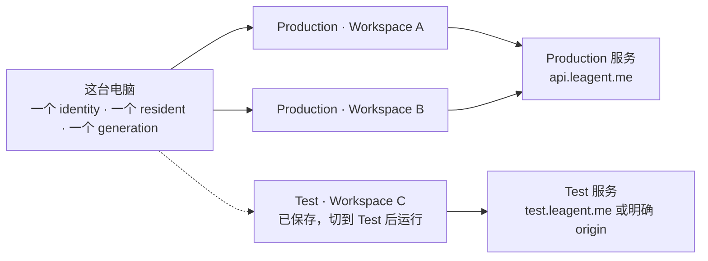
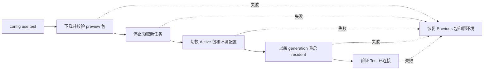
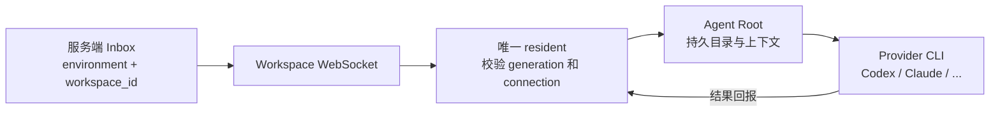
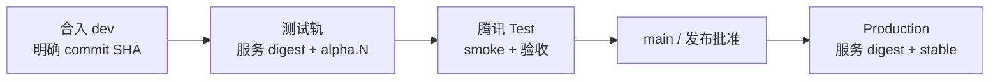

# Multica Computer V1

> Issue [#2484](https://github.com/LRM-Teams/multica/issues/2484) · 2026-08-10

一台电脑只有一个 Computer identity 和一个常驻 resident，但可以连接多个工作区。

简单理解：Computer 是电脑上的常驻“工头”；每条 Workspace connection 是某个工作区发给它的一张门禁卡。一个工头可以持有多张门禁卡，同时为多个工作区工作。

当前状态：Computer 核心实现已由 [#2608](https://github.com/LRM-Teams/multica/pull/2608) 合入；腾讯测试环境和生产部署编排仍待真实基础设施落地。

## 1. 总模型

- 同一个 OS 用户下只有一个机器级 Computer identity，不随 workspace slug 变化。
- 只有一个 resident 持有本机锁、健康端口和 PID。
- 每条 Workspace connection 独立授权；一个工作区断开不会影响其他工作区。
- 同一时刻 resident 只连接一个环境的一个服务 origin，同时服务该环境下的全部已连接工作区。
- Production 和 Test 的连接可以同时保存；切换环境时重启 resident，另一环境的连接不会丢失。



## 2. Workspace connection

`binding` 是内部协议和数据库术语，产品界面使用 `Workspace connection`。

一条 connection 保存：

- `environment`
- 不可变的 `workspace_id`
- `computer_id`
- 服务 origin
- 可撤销的 execution credential
- 接受时间和激活状态

本地唯一键是 `(environment, workspace_id)`。slug 只用于显示，工作区改名不会改变连接身份。

| 问题 | Computer V1 的答案 |
| --- | --- |
| 一台电脑能连接两个工作区吗？ | 可以；同一环境下由一个 resident 同时服务。 |
| 工作区改名会断开吗？ | 不会；身份使用不可变的 `workspace_id`。 |
| 只删除 Workspace A 里的 Computer 呢？ | 只删除 A 的服务端机器挂载；B 的 connection、credential 和执行状态保留。 |
| connection 是一个额外进程或目录吗？ | 不是；它是一条独立授权，不是 resident，也不是本机 workspace 目录。 |

## 3. 环境和包

用户只选择环境。服务 origin、包稳定性和发布清单是一组固定套餐，不提供独立的 `release_channel` 配置。

| 环境 | 服务 | 包 | 清单 |
| --- | --- | --- | --- |
| Production | `api.leagent.me` / `www.leagent.me` | stable | `/computer/manifest.json` |
| Test | `test.leagent.me` 或明确的腾讯云 HTTP(S) origin | preview | `/computer/alpha.json` |

第一次连接环境：

```bash
multica setup /my-workspace

multica setup --environment test \
  --test-url https://test.leagent.me \
  /my-workspace
```

以后切换环境：

```bash
multica config use test
multica config use production
multica config show
```

人的登录会话保存在环境配置中；Computer 替工作区执行任务的 credential 单独保存在 `~/.multica/computer/bindings.json`。两者不是同一个万能凭证。

## 4. Setup 契约

一次成功的 `setup` 必须完成全部步骤：

1. 校验环境和 origin。
2. 登录并把 slug 解析成不可变的 `workspace_id`。
3. 由服务端授权 Computer connection 并签发 execution credential。
4. 以 `(environment, workspace_id)` 原子 upsert 本地 connection；重复 setup 是修复，不制造副本。
5. 启动或重启唯一 resident，并领取新的 generation。
6. 用 `running + connected:true` 验收 environment、origin 和工作区均一致。

工作区没有 Agent 时也可以 setup 成功；验收依据是 Computer 是否真正连接服务，不是 runtime 数量。

环境切换流程：



切换前先停止领取新任务，让当前任务自然结束；任一步失败都恢复 Previous 包、原配置和原环境。

## 5. 一条任务如何找到本机 Agent



旧 generation 即使进程仍存活，也会被服务端拒绝，避免两个 resident 同时接受或回报工作。

## 6. Delete Computer

界面只提供一个 `Delete Computer` 动作。它删除的是当前工作区里的 Computer 挂载，不是物理电脑或本机文件。

### 前置条件

- 当前 Computer 仍有 active Agent 时，后端返回 `409 computer_has_active_agents`。
- 拒绝时 runtime、Workspace connection、credential 和本机数据全部保持不变。
- 用户必须先移除全部 Agent，再确认删除 Computer。

### 确认后实际发生

同一个数据库事务会：

1. 删除当前工作区内该 Computer 的 runtime 投影。
2. 删除其已归档 Agent 的服务端数据、历史和消息。
3. 撤销当前 `(Computer, Workspace)` connection 和 execution credential。
4. 写入 registration tombstone，阻止仍在运行的 resident 靠 heartbeat 自动注册回来。
5. 即使 Computer 已经没有 runtime，也会撤销 connection，不留下空 Computer。

### 明确不会发生

- 不删除本机 Agent Root、memory、session、skill 或工作文件。
- 不删除 resident、Computer identity 或物理电脑。
- 不影响其他工作区的 connection、credential、runtime 和执行状态。
- 不代替“删除本机 Agent workspace 目录”；后者是另一个显式磁盘操作。

### 重新接入

以后显式执行 `multica setup` 会清除该工作区的 registration tombstone，并建立一条新的 Workspace connection。已经删除的服务端历史不会恢复。

## 7. 发布轨道

| 用户输入 | 读取路径 | 允许指向 | 用途 |
| --- | --- | --- | --- |
| Production / 省略 / `--version latest` | `/computer/manifest.json` | stable `vX.Y.Z` | 正式环境和全新安装默认值 |
| Test / `--version alpha` | `/computer/alpha.json` | `alpha.N` / `beta.N` / `rc.N` | 测试环境和滚动预发布 |
| `--version v0.5.0-rc.2` | `/computer/0.5.0-rc.2/manifest.json` | 精确版本 | 复现、恢复和排障 |
| 旧客户端 | `/computer/latest.json` | 根 manifest 的兼容别名 | 迁移期兼容；新安装器不走此主路径 |

```bash
# 默认稳定版
curl -fsSL https://cdn.leagent.me/computer/install.sh | bash

# 滚动预发布
curl -fsSL https://cdn.leagent.me/computer/install.sh | bash -s -- --version alpha

# 精确版本
curl -fsSL https://cdn.leagent.me/computer/install.sh | bash -s -- --version v0.5.0-rc.2
```

`--version` 只用于安装、恢复和排障。Computer 正常运行后，由当前环境固定选择 stable 或 preview。

## 8. 升级契约

升级不是覆盖一个文件，而是“验货 → 入库 → 接班 → 可回退”：

1. 按环境解析包源，或使用排障指定的精确版本。
2. 校验压缩包 SHA-256 和候选 binary SHA-256。
3. 将不可变版本 stage 到 VersionStore。
4. 激活新的 `Active` 并保留 `Previous`。
5. 用更大的 generation 启动 successor resident。
6. 验证目标版本、successor 和全部 runtime 收敛；失败时切回 `Previous`。

generation 是 resident 的任期号。新进程接班后，服务端会拒绝旧任期的迟到心跳和结果。

## 9. 部署目标和当前事实



目标契约：`dev` 自动部署腾讯测试服务并发布 preview 客户端；验收后，`main`/生产批准提升已验证的服务 digest，并发布 stable 客户端。服务和客户端制品都必须记录 commit、版本与校验和。

当前仓库仍只有 `aliyun-dev` Environment 和 Aliyun self-hosted runner，没有腾讯 runner，也没有独立的 Test / Production 受保护 Environment。因此 [#2497](https://github.com/LRM-Teams/multica/issues/2497) 仍需要真实基础设施、服务健康和 CDN/部署证据。

## 10. 日常命令

```bash
# 连接工作区
multica setup /workspace-a

# 连接腾讯测试工作区
multica setup --environment test --test-url https://test.leagent.me /workspace-a

# 切换环境
multica config use test
multica config use production

# 查看配置、身份和连接
multica config show
multica computer status
multica computer doctor

# 生命周期
multica computer start
multica computer restart
multica computer logs
```

产品文案使用 `Computer` 和 `Workspace connection`。`daemon` 与 `binding` 只保留在内部兼容 API、数据库和代码标识中。

## 11. Issue 状态

| Issue | 状态 |
| --- | --- |
| [#2485](https://github.com/LRM-Teams/multica/issues/2485) | 前置 Computer module 契约已完成并关闭。 |
| #2486–#2494、#2496 | 实现已由 [#2608](https://github.com/LRM-Teams/multica/pull/2608) 合入。 |
| [#2495](https://github.com/LRM-Teams/multica/issues/2495) | Desktop 不在本轮范围。 |
| [#2497](https://github.com/LRM-Teams/multica/issues/2497) | 腾讯测试基础设施、真实部署与 served evidence 待完成。 |
| [#2484](https://github.com/LRM-Teams/multica/issues/2484) | 父 issue 等待 #2497 的真实交付证据。 |

## 结论

1. 一台电脑只有一个 Computer identity 和一个 resident。
2. 一个 Computer 可以连接多个工作区。
3. Production 固定 stable；Test 固定 preview。
4. `Delete Computer` 只删除当前工作区的服务端机器挂载，不删除本机文件或其他工作区。
5. Raft 的行为可用于验证删除语义，但不为 Multica 的发布清单命名背书。
