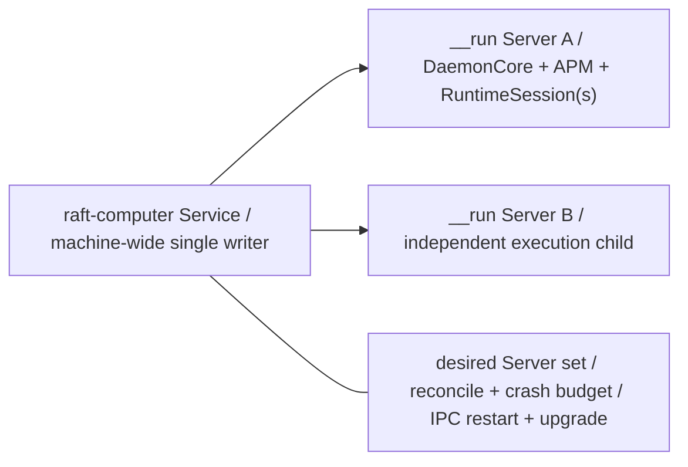
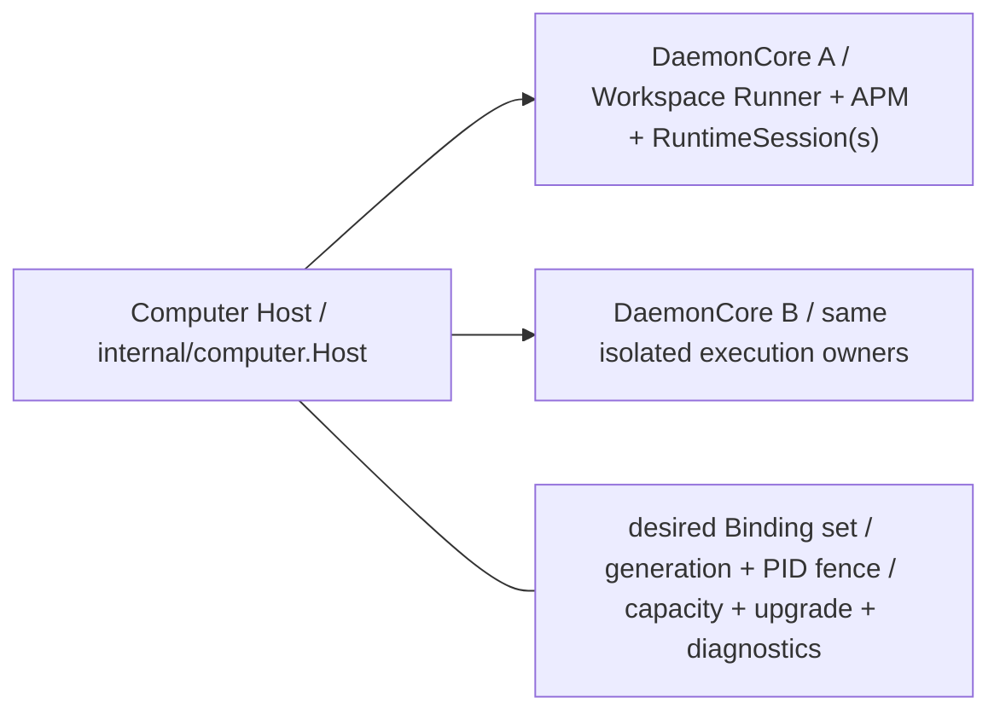
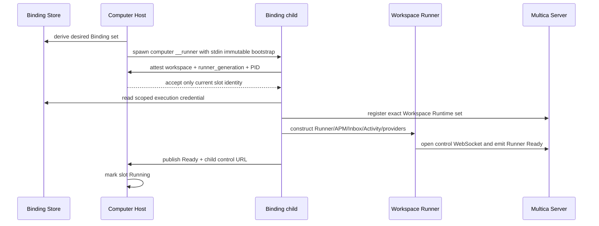
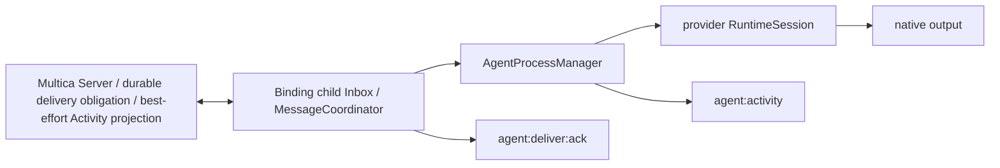
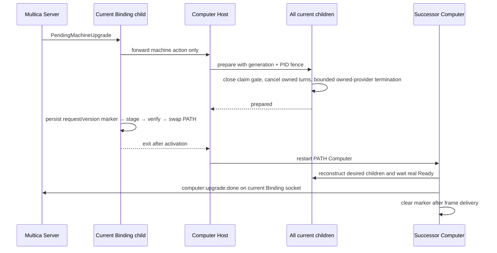
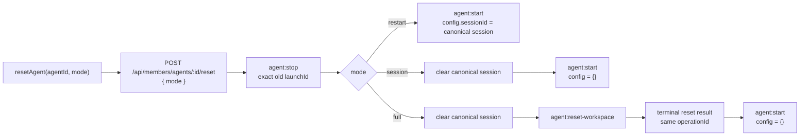

# Raft v1.0.16 与 Multica 架构对比

> 目标：对齐 Raft 的 **process ownership / fault containment**，但不照搬其业务 cardinality。
>
> 结论：Raft 的 isolation key 是 `serverId`；Multica 的对位 isolation key 是 immutable `workspace_id`。Workspace **等同于** Raft Server，不是另一套业务实体。Multica 保留一个完整的 `Computer`，不新增 `computerhost` package。

## Executive summary / 核心结论

| 维度 | Raft v1.0.16 | Multica aligned architecture | 结论 |
| --- | --- | --- | --- |
| Machine owner | `raft-computer Service` | `internal/computer.Host` | 一个 machine-wide single writer |
| Child cardinality | one child per attached Server | one child per Workspace Execution Binding | 对齐 ownership，不伪对齐业务实体 |
| Child behavior | `DaemonCore + APM + RuntimeSession(s)` | `DaemonCore + Workspace Runner + APM + RuntimeSession(s)` | child 必须承载真实 behavior |
| Generation fence | runner/process tenure semantics | `computer_generation + runner_generation + PID` | 字段名不要求一致，语义必须等价 |
| Machine Upgrade | Service-owned orchestration | Computer-owned accept/journal/stage/verify/activation/attestation | `daemon` 不得成为第二 owner |
| Package boundary | Service vs runner execution | `internal/computer` vs `internal/daemon` | CLI only composition/bootstrap |

## 1. Process topology / 进程拓扑

### Raft v1.0.16



### Multica aligned shape



Raft child 对应 attached Server；Multica child 对应 attached Workspace。二者是同一层：一台 Computer 下每个协作边界一个 DaemonCore。产品名不同，槽位语义相同。

## 2. Shallow child → deep child

### Before / 旧结构

```text
Computer / Daemon host process
├── WorkspaceRunner.Run
├── AgentProcessManager
├── Inbox / Activity
├── provider runtimes
└── __runner child
    └── waits for context cancellation
```

删除 child 后，大部分 behavior 仍留在 Host 进程；OS-process seam 是 shallow / ceremonial。

### After / 隔离后

```text
Computer Host
└── DaemonCore  (computer __runner --workspace-id {workspace-id})
    ├── Workspace Runner
    ├── AgentProcessManager
    ├── Inbox / MessageCoordinator
    ├── Activity / Attachments / Reminder
    ├── child-local durable state
    └── RuntimeSession(s) / provider processes
```

删除 child 会同时删除完整 Binding behavior；fault containment、code locality 与 OS process boundary 对齐。

## 3. Package responsibility / 分包边界

### `internal/computer` — machine control plane

```text
Computer
├── Host.RunProcess
│   ├── resident health / local control
│   └── desired Binding reconciliation
├── BindingSupervisor
│   ├── spawn / stop / Ready
│   ├── generation + PID fence
│   └── crash budget / backoff
├── HostControl
│   ├── authenticated child control
│   └── diagnostics + Runtime reports
├── ProcessCapacity
└── Machine Upgrade
    ├── accept / journal / stage / verify
    ├── cross-child prepare / release / re-register
    └── activation / successor attestation
```

### `internal/daemon` — one Binding execution plane

```text
RunBindingChild
├── WorkspaceRunner
├── AgentProcessManager
├── Inbox / MessageCoordinator
├── Activity / Attachments / Reminder
├── canonical provider runtime pool
├── child-local Credential Proxy
└── child-local drain + Runtime re-registration
```

强制边界：

- 不新增 `computerhost` package；Host 是 `Computer` 的自然组成部分。
- Public resident path 是 `runComputerResident → computer.NewHost → Host.RunProcess`。
- `internal/computer` 不 import `internal/daemon`，也不构造 Workspace execution owners。
- `internal/daemon` 不再提供 resident `Run`、machine health/attestation、restart/update executor、upgrade journal/takeover/stage owner。
- `internal/daemon` 仅执行 Computer 发出的 child-local prepare/release/re-register 请求。
- CLI 只负责 bootstrap、process entry 与 wiring。

## 4. Startup and Ready flow / 启动流程



Ready 的含义不是“child process 已启动”，而是：

1. exact `(workspace_id, runner_generation, PID)` 已通过 Host fence；
2. current Binding credential 和 `computer_generation` 有效；
3. Runtime set 已注册并报告给 Host；
4. child-local execution owners 已构造；
5. real Workspace Runner transport 已发出 Ready。

## 5. Message and Activity stay child-local



Contract：

- `agent:deliver:ack` 证明 Computer-local delivery responsibility 已接收。
- ACK 不证明 provider 已消费，也不证明 Agent 已回复。
- Activity 是 best-effort presentation fact，不能作为 durable delivery proof。

## 6. Machine Upgrade flow / 跨 child 升级



Failure rule：任一 child prepare 失败，Host 必须 release 所有已经 prepared 的 siblings。执行升级的 child 在 `internal/computer` executor 内 stage/verify/swap；successor socket 未交付 completion 时保留 marker。这里没有 cloud receipt、generation 或 Runtime/Workspace attest。

## 6.1 Agent Restart parity / 三种重启模式

Raft Web 的产品入口是 `resetAgent(agentId, mode)`，mode 为 `restart | session | full`；Raft Computer 接收离散 `agent:stop`、`agent:reset-workspace`、`agent:start`。Multica 已对齐这组命名和行为，保留自身通用 `{type, payload}` WebSocket envelope。



Multica 没有 product-level `agent:lifecycle` command，也不再暴露 `action_kind`、`execution_mode`、幂等键或 scheduling mode。一场 restart 只活在当前 server 进程内存里，不保留 durable restart ledger。

两项有意 stronger-than-Raft 的 correctness proof：Stop 只接受 exact `launch_id` 的 inactive fact；Full Reset 必须等同 operation 的 terminal reset receipt 才能 start。当前 socket 拥有整场编排；Runner Ready 和 reconcile 都不再重投半截 restart。Agent Restart 不产生专属 toast。

## 7. Generation model / 两级任期

| Identity | Multica meaning | Raft v1.0.16 relation |
| --- | --- | --- |
| `computer_generation` | 整机 Computer resident tenure；successor replaces predecessor | 语义对应 Service replacement / handoff tenure；未验证 Raft 使用同名字段 |
| `runner_generation` | 一个 Binding slot 每次 spawn 的独立 tenure；与 PID 共同 fence child | 语义对应 current runner process generation / inactive-process fence |
| `launch_id` / process identity | child 内 Agent process launch tenure 与 provider process identity | Raft APM 同样区分 external launch identity 与 per-process instance identity |

因此，Raft 未被声称拥有 `computer_generation` 或 `runner_generation` 这两个同名字段。这里对齐的是 process-tenure semantics，不是 wire field spelling。

## 8. Isolation acceptance matrix / 隔离验收

| Failure or action | Expected containment | Proof seam |
| --- | --- | --- |
| Binding A child crashes | Host 与 Binding B 保持运行 | generation/PID-fenced wait + crash budget |
| Binding A removed | 只 graceful stop child A | desired-vs-actual reconcile |
| Stale child reports diagnostics or Runtime set | rejected | HostControl current identity |
| Two children exceed provider process cap | machine-wide admission queues one | Computer `ProcessCapacity` lease |
| Host process disappears | all child process groups stop | OS supervision / process group |
| One child cannot drain for upgrade | prepared siblings are released | Computer-owned prepare/release transaction |

## 9. Architecture findings / 后续优先级

1. **Agent Restart single owner — Implemented**
   Product operation 只编排 Raft 三个离散 child command；当前 Runner socket 走完 stop → start。desired/observed reconcile 跳过仍在 running 的 restart，不再存在 composite dispatch、heartbeat queue、Ready redrive 或第二套 stop/start owner。

2. **Machine lifecycle deep module — Implemented**
   Upgrade/restart phase ordering、durable journal 与 successor attestation 已归 `internal/computer`；CLI 仅保留 process-launch adapter。

3. **Frontend Computer projection — Strong**
   将 build → merge pending → decorate → selection 收成一个 headless projection seam，减少 views 掌握 pipeline stages。

4. **Mobile Presence parity — Strong**
   消费 canonical server snapshot + `agent:presence` delta，不从 runtimes/tasks/activity 推导 Presence。

## 10. Evidence index / 证据索引

### Raft v1.0.16 artifact

- `strings.txt:1227028–1227183` — Service map / spawn / reconcile
- `strings.txt:1226840–1226959` — runner lifecycle + `DaemonCore`
- `chunk-J5Y72PN7.js:37212–37266` — `DaemonCore → APM`
- `chunk-J5Y72PN7.js:27167–27660` — delivery acceptance matrix

### Multica code seams

- `server/cmd/multica/cmd_computer_resident.go`
- `server/internal/computer/host.go`
- `server/internal/computer/host_process.go`
- `server/internal/computer/host_machine_upgrade.go`
- `server/internal/computer/binding_supervisor.go`
- `server/internal/computer/host_control.go`
- `server/internal/computer/process_capacity.go`
- `server/internal/computer/binding_child_protocol.go`
- `server/internal/daemon/binding_child_runtime.go`
- `server/internal/daemon/binding_drain.go`
- `server/internal/handler/agent_restart.go`
- `server/internal/handler/agent_restart_orchestrator.go`
- `server/internal/handler/agent_restart_test.go`
- `server/pkg/protocol/workspace_runner_activity.go`
- `packages/core/agents/agent-restart.ts`
- `packages/core/agents/use-agent-restart.ts`
- `server/internal/computer/architecture_boundary_test.go`
- `server/internal/daemon/architecture_boundary_test.go`

### Architecture decisions

- `docs/adr/0001-workspace-runner-isolation.md`
- `docs/adr/0015-computer-host-supervises-binding-runner.md`

Interpretation rule：报告只把已验证的 lifecycle/process semantics 标为 equivalent；字段名不做伪对齐，Raft private Server behavior 与未取得的 wire fields 不作推断。
