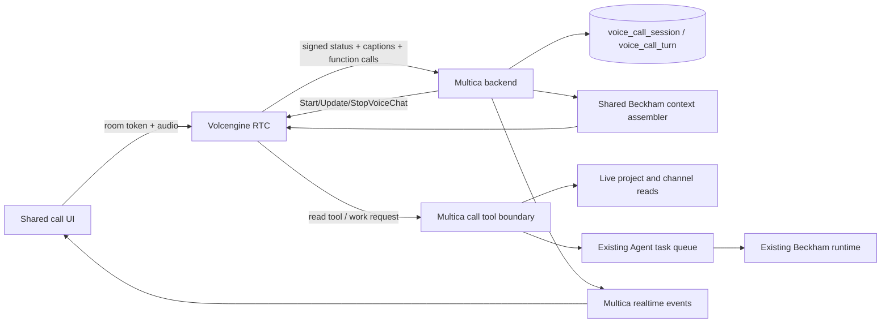

# Beckham realtime voice call plan

Date: 2026-07-23

## 1. Goal

Allow a workspace member to start an in-app, one-to-one audio call from
Beckham's DM and have a turn-based spoken conversation with interruption,
reconnection, live status, and optional captions.

The call must preserve Beckham's Multica identity, instructions, bounded
project context, user preferences, and ability to start real Multica work.
Provider credentials and provider-specific protocols remain server-side.

## 2. Product boundary

The first release includes:

- One human and one Agent in a DM call.
- Browser and desktop microphone input and speaker output.
- Connecting, listening, thinking, speaking, interrupted, reconnecting, ended,
  and failed states.
- Mute, speaker output, captions, and hang-up controls.
- Final user and Agent turns saved for audit and a single call record posted to
  the DM after the call.
- Read-only project queries and an explicit work-request tool that enqueues the
  existing Beckham runtime when the user asks Beckham to perform work.

The first release does not include:

- Group calls.
- Calling a telephone number or receiving PSTN calls.
- Camera input, avatar video, or a digital human renderer.
- Autonomous destructive actions based only on spoken confirmation.
- A separate voice persona, memory store, or project-context implementation.
- One normal DM message per partial transcript.

A future digital human joins the same call as a video participant. It must not
own speech recognition, conversation state, tools, or memory.

## 3. Architecture decision

Use Volcengine RTC AI audio/video interaction for the first production
transport and speech orchestration. Do not add LiveKit to the first release.
The server integration targets the current `2025-06-01` RTC OpenAPI contract;
the official demo's older default is not the implementation contract.

Reasons:

- Volcengine's current RTC product supplies China-oriented RTC transport,
  streaming ASR/TTS, VAD, interruption, captions, third-party or self-hosted
  LLM integration, Function Calling, status callbacks, and session updates.
- The project already uses and has tested Volcengine Speech credentials and
  binary speech protocols.
- LiveKit does not list a Volcengine STT or TTS plugin. Using it here would
  require custom STT and TTS adapters in addition to the call orchestration
  service.
- LiveKit Cloud's documented Asia region is Japan and Singapore. Self-hosting
  in Beijing would add an SFU, TURN, TLS, UDP firewall, capacity, and media
  observability surface before the Agent conversation has been validated.

This decision changes if one of these conditions becomes true:

- Volcengine cannot call the selected conversational model or Multica tool
  endpoint with the required streaming and idempotency contracts.
- Measured mainland call quality fails the acceptance targets after the
  documented RTC integration is correct.
- Provider independence, international routing, or self-hosted media becomes a
  release requirement rather than a future option.

Under those conditions, use LiveKit as the media plane and retain the Multica
call, context, tool, and persistence contracts defined below.

Official references:

- [Volcengine realtime audio/video documentation](https://www.volcengine.com/docs/6348/?lang=zh)
- [Volcengine StartVoiceChat API](https://www.volcengine.com/docs/6348/1558163?lang=zh)
- [Volcengine streaming ASR product contract](https://www.volcengine.com/docs/6561/1354871?lang=zh)
- [LiveKit pipeline comparison](https://docs.livekit.io/agents/models/pipelines/)
- [LiveKit Cloud regions](https://docs.livekit.io/deploy/admin/regions/region-pinning/)
- [LiveKit self-hosting requirements](https://docs.livekit.io/transport/self-hosting/deployment/)

## 4. Runtime model

The current Beckham runtime is a durable development executor. It starts
provider CLI processes, loads repository state, can call tools for minutes, and
publishes a completed channel response. It is not an audio conversation model
and must not be presented as an under-one-second path.

The call therefore has two execution classes:

1. **Conversational turn**
   - A low-latency streaming model receives Beckham's canonical identity and a
     bounded Multica context pack.
   - It answers questions, asks clarifying questions, queries approved read
     tools, and speaks the response through streaming TTS.
   - It cannot edit code or claim that long-running work is complete.
2. **Work request**
   - A typed Function Calling action creates an ordinary Multica task for the
     existing Beckham runtime.
   - The tool returns the created task/message reference.
   - The conversational model tells the user that work has started and names
     the real reference. Completion continues through the existing DM/task
     path, not inside the media session.

The conversational model and development executor may use different model
endpoints. They are both Beckham only because the server supplies the same
identity, instructions, scoped memory, permissions, project, and durable work
state. The UI and prompt must not imply that the low-latency model has already
performed filesystem or GitHub work.

## 5. Component map



Ownership:

- `server/internal/integrations/volcenginertc`: request signing and exact
  Start/Update/Stop provider protocol.
- `server/internal/service/voicecall`: provider-neutral call lifecycle,
  permissions, state machine, idempotency, context, and tool policy.
- `server/internal/handler/voice_call*.go`: authenticated HTTP and signed
  provider callback boundaries.
- `packages/core/voice-calls`: schemas, API functions, React Query keys,
  mutations, and realtime invalidation.
- `packages/views/voice-calls`: shared web/desktop call UI.
- `apps/web/platform` and `apps/desktop/.../platform`: only platform-specific
  audio-output or permission adapters that cannot live in shared packages.

## 6. Server contracts

### 6.1 Durable state

Add `voice_call_session`:

- `id`, `workspace_id`, `channel_id`, `agent_id`, `user_id`
- `provider`, `provider_task_id`, `room_id`
- `status`
- `started_at`, `connected_at`, `ended_at`
- `end_reason`, `error_code`
- `input_audio_ms`, `output_audio_ms`
- `created_at`, `updated_at`

Allowed status transitions:

```text
starting -> connecting -> active
active -> reconnecting -> active
starting|connecting|active|reconnecting -> ending -> ended
starting|connecting|active|reconnecting|ending -> failed
```

The user may hang up before media becomes active or while the SDK is
reconnecting. Those paths must still call the provider stop operation and
converge through `ending`; the UI must not wait for `active` before enabling
hang-up.

Add `voice_call_turn`:

- `id`, `call_session_id`, `sequence`
- `speaker` (`member` or `agent`)
- `transcript`
- `started_at`, `ended_at`
- `is_interrupted`, `spoken_duration_ms`
- `provider_turn_id`

Only final ASR turns are durable. Partial captions are realtime events. An
interrupted Agent turn stores the delivered spoken prefix and interruption
metadata, not text the user never heard.

Enforce one non-terminal call for a user and Agent DM pair. Provider callback
retries must be idempotent by provider event/turn identity.

### 6.2 Authenticated member API

Planned endpoints:

- `POST /api/workspaces/{workspace_id}/voice-calls`
- `GET /api/workspaces/{workspace_id}/voice-calls/{call_id}`
- `POST /api/workspaces/{workspace_id}/voice-calls/{call_id}/stop`

Create input names the existing DM channel and Agent. The server verifies:

- human login and workspace membership;
- access to the Agent and DM;
- the channel is the canonical DM for that member and Agent;
- no active call already exists;
- the feature and provider are configured.

Create returns only a call ID, provider room metadata required by the client,
and a short-lived room-scoped token. It never returns provider API keys,
account secrets, signing secrets, or reusable server credentials.

Stop is idempotent. Browser close, provider terminal callback, and the server
expiry sweep all converge on the same terminal transition; none may create a
second call record.

### 6.3 Provider callback boundary

The callback handler must:

- verify the provider's documented signature and timestamp;
- reject oversized or unknown payload shapes;
- keep raw audio and credentials out of logs;
- store provider request/log IDs for diagnosis;
- deduplicate retries before state or tool mutations;
- publish typed Multica realtime events after the database commit.

Do not infer call state from caption text.

### 6.4 Realtime events

Add typed events:

- `voice_call:updated`
- `voice_call:caption`
- `voice_call:tool`

`voice_call:updated` is durable-state invalidation. `voice_call:caption` is an
ephemeral partial/final caption. `voice_call:tool` contains only approved
started/completed/failed tool facts and a Multica reference when one exists.

React Query owns call state. Realtime events invalidate call queries and do not
write server state into Zustand.

## 7. Beckham context in a call

Do not build a voice-only prompt assembler.

Extract and reuse the existing channel/DM project context from
`server/internal/handler/channel.go`, `server/internal/handler/daemon.go`, and
the runtime-brief contracts. The call context pack is a bounded snapshot at
call start:

1. Agent identity and current system instructions.
2. Calling member identity and explicit collaboration preferences.
3. Workspace, DM, and linked project identity.
4. Reviewed Agent memory and member relationship memory allowed in this DM.
5. Bounded recent DM turns.
6. Current project summary and active work references.
7. Voice behavior: concise spoken sentences, no Markdown narration, state
   uncertainty, and never claim an unexecuted action.

Live project facts are read through tools during the call. They are not copied
into a second voice memory store. Final call turns become eligible input for
the same DM and memory-governance paths used by text conversations.

Context budgets, source labels, and truncation order must have deterministic
tests. A long project context cannot silently remove identity, permission, or
the current user turn.

## 8. Tool policy

First release tools:

- `get_project_status`
- `list_active_issues`
- `get_issue`
- `search_recent_messages`
- `create_work_request`

All tool calls carry `call_session_id`, authenticated member identity, Agent
identity, and an idempotency key supplied by the call service. The model never
supplies workspace authority.

Read tools call existing services or queries. `create_work_request` enqueues
the existing Beckham runtime and returns its task/message reference.

The first release excludes delete, merge, permission changes, billing, secret
access, and direct repository mutation. Later spoken mutations require the
same explicit confirmation and authorization contracts as UI actions.

## 9. User experience

Entry:

- A phone button appears in Beckham's DM header when the feature is configured.
- Clicking it opens a pre-call sheet with microphone permission and output
  device state.
- Failure before connection leaves the user in the DM and gives a specific
  retryable reason.

Active call:

- Full-height call surface using Beckham's existing avatar and identity.
- Call duration and one primary state label: connecting, listening, thinking,
  speaking, reconnecting, or ended.
- Controls: mute, audio output, captions, and hang up.
- A level visualizer reads actual microphone/remote audio energy. It is not a
  decorative fixed CSS waveform.
- Captions are optional and visually identify the member and Beckham.
- A real user utterance interrupts Agent playback. Playback stop target:
  p95 under 300 ms after provider interruption detection.
- Tool progress appears only after an accepted tool event. The UI does not
  invent a generic success or completion state.

End:

- Hang up returns to the DM.
- The DM receives one call card with duration, end reason, transcript
  availability, and any task references created during the call.
- Expanding the card shows final turns. Partial ASR text is never shown as a
  durable transcript.

Accessibility:

- Every control has a visible tooltip, accessible name, keyboard focus, and
  pressed/disabled state.
- Final captions use a polite live region; partial token updates do not flood
  screen-reader announcements.
- Reduced-motion users receive state changes without the level animation.

## 10. Failure behavior

- Microphone denied: do not create a provider task.
- Provider start rejected: mark the session failed and show the provider-safe
  error code.
- Network change: enter reconnecting and preserve the same call ID. If the RTC
  SDK cannot recover within the measured expiry window, stop the provider task
  and end explicitly.
- Incomplete ASR turn: do not call the model or a Multica tool.
- Slow model/tool: show the observed thinking/tool state. Do not play canned
  acknowledgement audio that suggests progress without an accepted event.
- Callback retry: return the prior result without running the tool twice.
- Browser crash: provider terminal callback or expiry sweep closes billing and
  records the end reason.
- Backend restart: recover non-terminal sessions from durable state and query
  provider task status before changing them.

## 11. Observability and privacy

Record per call and per turn:

- call ID, provider task/log ID, terminal reason;
- connect time;
- final ASR time;
- model first-token time;
- TTS first-audio time;
- interruption stop time;
- reconnect count;
- tool duration and typed result;
- input/output audio duration and provider usage.

Never log audio bytes, provider secrets, room tokens, full system prompts, or
unredacted callback authorization headers. Transcript retention follows the
DM retention policy and is deletable with the call record.

## 12. Acceptance targets

These are release targets, not provider promises:

- Call create success: at least 99% outside explicit permission/config errors.
- Click to active media: p50 below 2 s, p95 below 5 s on the production network.
- End of user speech to first Agent audio: p50 below 1.8 s, p95 below 3.5 s for
  turns without tools.
- Interruption detection to Agent audio stop: p95 below 300 ms.
- No duplicate work request under callback retries.
- No provider task remains billable 30 s after explicit hang-up.
- Final transcript and task references remain readable after backend restart.
- Web and desktop share the same call state and UI behavior.

## 13. Verification

Unit and contract tests:

- call state transition table;
- permission and DM binding;
- provider request signing and response/error redaction;
- callback signature, timestamp, size, and idempotency;
- context source order and byte budgets;
- tool authorization and duplicate delivery;
- interrupted-turn persistence;
- API response schema drift;
- frontend permission, connect, mute, reconnect, hang-up, and cleanup states.

Integration tests:

- mock Start/Update/StopVoiceChat provider;
- callback to database to realtime-event path;
- work request to existing Agent task queue;
- backend restart recovery;
- callback retry and out-of-order events.

Production smoke:

- one real call after deployment;
- confirm ASR final text, spoken answer, interruption, reconnect, hang-up, and
  one post-call DM card;
- inspect provider and Multica timing metrics by the same call ID;
- confirm the provider task is terminal.

Local media playback is not treated as production proof. The real RTC smoke
uses the deployed HTTPS origin and configured provider account.

## 14. Small-PR delivery order

Every item is an independent PR and keeps the user-facing entry disabled until
its required server contracts exist.

1. **Planning contract** — this document and the engineering-principle pointer.
2. **Call state** — migrations, transition service, and state tests.
3. **Volcengine RTC client** — exact signing plus Start/Update/Stop protocol
   fixtures; no HTTP routes.
4. **Call lifecycle API** — create/get/stop, permission checks, short token,
   feature/config gate.
5. **Provider callbacks** — verification, idempotent state/caption ingestion,
   and realtime event types.
6. **Shared Beckham context** — extract the existing assembler and add the
   bounded call snapshot without changing normal channel prompts.
7. **Read tools** — live project/issue/message query tools with call authority.
8. **Work-request tool** — enqueue the existing Beckham runtime and return a
   durable reference.
9. **Call UI shell** — DM header entry, pre-call permission, call surface and
   controls behind the disabled gate.
10. **RTC media** — room connection, microphone, remote audio, mute, output,
    interruption, reconnection, and cleanup.
11. **Captions and status** — typed call events, state display, accessible
    captions, timing instrumentation.
12. **Post-call record** — final turns, call card, transcript expansion, task
    references, retention/delete behavior.
13. **Deployment contract** — server-only credentials, provider callback URL,
    readiness, metrics, and production smoke instructions.

Dependent PRs are developed in sequence without waiting for manual merge.
After a parent PR is merged, rebase the next branch onto the latest `dev` and
force-push with lease so each PR shows only its own change. Merge order remains
the numbered order above.

## 15. External prerequisites

The existing Doubao Speech API key is not assumed to authorize RTC calls.
Before PR 3 can run a live test, obtain and configure the exact values shown by
the enabled Volcengine RTC AI product:

- RTC application ID and client token-signing credential;
- server-side Volcengine API access credential for Start/Update/StopVoiceChat;
- enabled AI audio/video interaction or realtime conversational AI service;
- ASR, TTS, and conversational-model resource selections;
- public HTTPS callback URL and the provider's callback verification contract.

All values go through the existing server deployment environment. No credential
is committed, returned to an untrusted client, or copied into frontend build
variables.
