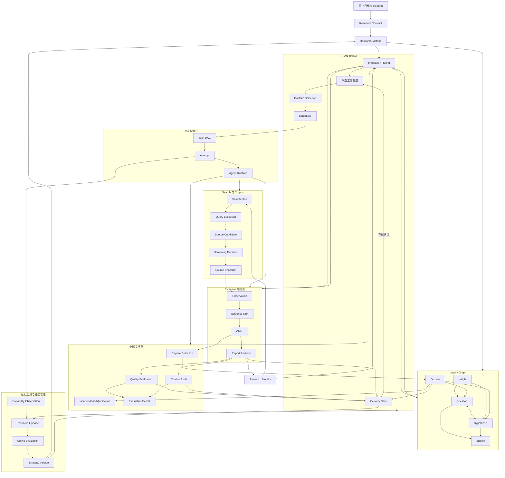

# 自主调研系统：目标架构与严格实现路径

状态：设计完成，尚未开始本规格的实现

日期：2026-08-05

适用范围：Research Run 后端。前端只消费后端投影，不承担研究状态判定。

## 1. 结论

现有 `research-run-v5` 已经解决持久任务、Attempt、证据出处、Claim 级证据标准、报告修订、独立评审、幂等提交和失败恢复。它仍有六个结构性缺口：

1. 计划主要在开局生成，后续新证据只能增加问题或任务，不能持续重组研究方向。
2. 多个智能体的结果进入同一证据账本，但没有专门的整合轮次把共同发现、缺口和新假设变成后续工作。
3. 冲突只表现为 Claim 上的支持或反对关系，没有争议对象、争议类型、独立复核和裁决记录。
4. 来源只在被接受后成为 Source Snapshot；检索式、候选来源、筛除理由和查询迭代无法审计。
5. Agent、模型、工具和来源适配度只在单次调度时使用，没有可验证的运行能力记录。
6. 运行结束后没有受评测约束的经验提取、策略候选、离线回放、升级和回退协议。

目标系统必须在每批可信结果后重新判断：已经知道什么、哪些结论互相冲突、哪些未知项最影响决策、下一组任务如何同时提高信息收益并降低重复劳动、现有人员和工具是否适合这些任务、何时已有证据足以交付。

实现顺序只表达数据库和运行依赖。下文全部条目都属于最终交付，不存在删减版运行路径。

## 2. 与普通多 Agent 群聊的产品区别

| 判断项 | 普通多 Agent 群聊 | Research Run 目标行为 |
| --- | --- | --- |
| 工作记录 | 消息 | 版本化 Contract、Inquiry、Task、Corpus、Evidence、Dispute、Report、Decision |
| 协作 | Agent 读消息后自行决定 | Agent 消费有类型的输入工件，结果经过服务端验收后进入共享状态 |
| 深挖 | 依赖 Agent 临场发挥 | 未知项、假设、争议、证据缺口持续生成候选探索 |
| 结果结合 | 最后写报告时总结 | 每批结果触发整合，整合结果可改写问题优先级、创建新分支或终止低价值分支 |
| 冲突处理 | 在聊天中讨论 | 建立争议对象，进行独立复核、方法审查和有出处的裁决 |
| 停止 | 负责人认为够了 | Contract 的交付要求、证据充分度、争议状态、结构化评审和边际收益共同决定 |
| 恢复 | 重读消息猜测进度 | 依靠持久状态、事件序列、lease、幂等键和 Attempt 恢复 |
| 改进 | 换 Prompt 或增加 Agent | 运行观测形成策略候选，经离线评测通过后产生新版本；运行中的版本保持固定 |

任何消息、画布节点、Agent 自报分数或自然语言“已完成”都不能推进 canonical 状态。

## 3. 完成定义

只有同时满足以下条件，才能宣称本规格完成：

1. 新证据可以在不重启 Run、不丢弃旧证据的情况下改变研究分支、任务优先级和团队分配。
2. 两个智能体给出冲突结果时，系统能建立一个持久争议，解释冲突类型，派发有区分度的复核工作，并记录解决、条件化解决或未解决结论。
3. 后续智能体读取的是已验收的多智能体合并状态，并能明确引用哪些 Question、Hypothesis、Insight、Claim、Source 和 Dispute 触发了当前任务。
4. 每个来源都能追溯到 Search Plan、Query Execution、候选来源、筛选决定、Snapshot、Observation、Claim 和报告段落。
5. 探索调度同时考虑决策影响、未知程度、争议严重度、证据缺口、来源独立性、方法适配度、预期成本和重复度；任何分数都保存策略版本和分项理由。
6. 失败分类能区分业务结果、方法问题、结构协议问题、权限、凭据、限流、网络、超时、工具、解析和运行时故障；不同类别有明确且有上限的处理方式。
7. 报告不能绕过未处理的必答 Question、阻断级争议、证据标准、结构化评审缺陷、引用审计和最新整合结果。
8. Agent、模型、工具和检索 Adapter 的选择有运行数据依据；单次成功不能自动修改生产策略。
9. Run 可从任意事务提交点后崩溃并恢复，不能重复创建 Task、Attempt、Source、Claim、Dispute、Report、Decision 或 Event。
10. 历史 V1–V5 Run 可读取、恢复和交付；新版本不改变历史 Prompt、结果解析和 Gate 语义。
11. 系统级评测在受控语料中证明主动发现、冲突发现、结果整合、报告可追溯和崩溃恢复达到本文门槛。
12. 本文实现清单、数据库迁移、内置 Research Fleet Skill、source map、权威后端设计和工程原则保持一致。
13. Contract 要求持续监测时，首次交付后进入持久 monitoring 状态；来源变化只在达到物质性阈值后开启增量研究，未变化也有可审计记录。

## 4. 研究模式不是固定模板

用户的目标先被解析成 Research Contract，再由 Research Method 组合多个方法模式。模式只提供方法约束和候选动作，不生成固定阶段。

| 方法模式 | 需要回答的问题 | 典型证据要求 | 特有动作 |
| --- | --- | --- | --- |
| 探索制图 | 领域里有哪些对象、关系、未知项 | 覆盖不同观点和来源类型 | 视角发现、概念聚类、未知项扩展 |
| 对比决策 | 选项在约束下如何取舍 | 可比较口径、同时间窗、决策权重 | 评价矩阵、敏感性分析、失效条件 |
| 事实核查 | 命题是否成立 | 原始记录、独立复核、时间和定义一致 | 溯源、反向搜索、版本核对 |
| 系统证据审查 | 现有证据总体支持什么 | 可复现检索、纳排标准、偏差检查 | 检索式、筛选记录、证据分层 |
| 因果与机制调查 | 结果为何发生、机制是否成立 | 时间顺序、替代解释、干预或自然实验 | 因果图、反事实、机制反证 |
| 风险与尽调 | 什么会造成损失或否决 | 负面证据、权限记录、财务或法律原始资料 | 红旗追踪、最坏情形、缺证警示 |
| 技术可行性 | 方案是否能在约束下实现 | 可运行产物、基准、版本、兼容矩阵 | 复现、实验、成本和运维分析 |
| 时间与事件重建 | 事件先后和版本变化是什么 | 带时间戳的原始记录和版本快照 | 时间线、冲突时间解释、变更检测 |
| 持续监测 | 哪些事实变化会推翻现有结论 | 可重复查询和变化触发器 | 监测计划、差异检测、增量复核 |

同一个 Run 可以组合模式。例如“选择海外支付供应商”可同时使用对比决策、风险尽调、事实核查和持续监测。Planner 必须写出选择理由、各模式作用于哪些 Question、证据标准和失败测试；不能只返回模式名。

## 5. 目标领域模型

### 5.1 已有实体继续保留

- Research Session
- Research Run
- Research Contract Revision
- Research Method Decision
- Research Question
- Research Task / Dependency / Attempt
- Source Snapshot
- Observation
- Claim / Evidence Link
- Research Decision / Run Event
- Research Report / Report Claim
- Evaluation Defect

### 5.2 新增 Inquiry 实体

#### Research Hypothesis

保存可被证伪的陈述、所属 Question、适用范围、预期可观察结果、削弱条件、当前状态、置信区间或有界置信度、创建来源和最后评估版本。状态为 `proposed | investigating | supported | weakened | refuted | conditional | obsolete`。

#### Research Branch

表示一个可独立推进或终止的探索方向。保存父分支、目标、进入条件、退出条件、预算份额、状态和终止原因。分支只组织研究方向，不复制 Task 状态。

#### Research Insight

表示整合多项已验收结果后形成的、能改变后续研究的问题结构或决策理解。每个 Insight 必须引用输入 Claim、Question、Hypothesis、Dispute 或其他 Insight；不能凭综合 Agent 的自然语言直接成立。

#### Inquiry Edge

保存 `decomposes | tests | explains | depends_on | competes_with | refines | invalidates | motivates` 关系。服务端验证允许的源/目标类型和有向环规则。

### 5.3 新增检索与语料实体

#### Search Plan

保存目标 Question/Branch、检索 Adapter、查询策略、时间窗、语言、域名或库范围、纳排条件、预期停止条件和策略版本。

#### Query Execution

保存实际查询、Adapter、参数、开始结束时间、结果游标、成本、状态、失败分类和父查询。查询改写必须形成子记录，不能覆盖原查询。

#### Source Candidate

保存查询返回但尚未接纳的来源、规范化标识、摘要、初步独立性 family、重复簇、风险标记和发现位置。

#### Screening Decision

保存接纳、排除或延后决定、规则、理由、操作者、目标方法版本和候选来源。接纳后才创建不可变 Source Snapshot。

### 5.4 新增整合与争议实体

#### Integration Round

保存触发原因、输入状态版本、输入工件集合、整合结果、服务器接受的状态变化、被拒绝的提议、负责 Agent、开始结束时间和幂等键。

#### Research Dispute

保存争议问题、影响范围、严重度、冲突类型、各立场、相关 Claim/Evidence、当前状态和交付义务。状态为 `open | investigating | conditionally_resolved | resolved | irreducible | obsolete`。

冲突类型至少包括：`fact | definition | scope | time | population | method | measurement | interpretation | source_identity`。

#### Dispute Position

保存一个可核验立场、关联 Claim、适用条件、提出者和当前证据充分度。裁决不能直接改写原 Claim；它通过 Claim 状态、Evidence Link 和 Dispute Decision 更新规范事实。

### 5.5 新增运行能力与经验实体

#### Capability Observation

以 Task Attempt 为最小单位记录所需能力、Agent、模型、provider、工具/检索 Adapter、任务模式、领域标签、成功、质量、成本、时延、重复度、失败分类和评审结果。该记录描述一次观测，不等于永久能力评级。

#### Research Episode

Run 完成一次交付周期或进入终态后生成的只读摘要，引用 Contract、Method、状态变化、重大决策、有效和无效策略、故障、成本、质量以及用户修改。它供离线评测读取，不能直接改变生产策略。

#### Strategy Version

保存探索打分、整合触发、团队路由、失败处理、Prompt、工具策略和停止策略的不可变版本。每个 Run 在开始时固定版本。

#### Evaluation Run / Promotion Decision

保存候选 Strategy 在固定任务集、多次随机种子和历史回放上的结果。只有满足样本量、非退化、安全约束和人工批准要求的候选才能成为新默认；必须保留上个版本并支持回退。

#### Research Monitor

保存用户批准的监测问题、复用的 Search Plan、频率、触发条件、物质性阈值、当前 baseline Report、下次执行时间和状态。首次报告交付后，有 Monitor 的 Run 进入 `monitoring`；每次检查形成 Monitoring Cycle。无变化写 Decision，有物质变化时创建增量 Question/Task/Integration/Report Revision，不能覆盖 baseline 历史。

### 5.6 工件护照

每个 Agent 可消费或产生的工件都要携带统一护照字段：

- entity kind、entity ID、schema version、content hash；
- workspace、session、run、contract、plan、strategy version；
- producing task、attempt、Agent、模型/provider；
- 输入工件引用；
- data access level：`raw | redacted | verified_only | evaluation_private`；
- created/accepted/superseded 时间和状态。

护照保存出处和访问范围，不复制 Question、Claim 或 Report 正文。

## 6. 关系图

这些关系使用 PostgreSQL 规范表、外键、唯一约束和事务实现。没有证据证明独立图数据库能改善当前查询或一致性，因此不引入第二套状态存储。

## 7. Module 与 Interface

`ResearchRun` 继续是外部唯一深 Module。Handler、Scheduler、CLI 和投影代码只能调用以下业务操作：

- `StartRun`
- `SubmitTaskResult`
- `ApplyUserSteering`
- `PauseRun` / `ResumeRun` / `CancelRun`
- `ReconcileRun`
- `GetRunSnapshot`
- `ProjectCommittedEvents`

不能向外暴露“把某 Task 改成 succeeded”“写一个 Claim”“创建一个 Dispute”等 CRUD Interface。

内部按职责形成以下深 Module：

| Module | 拥有的判断 | 对其他 Module 提供的 Interface |
| --- | --- | --- |
| Run | Contract、版本固定、生命周期、预算、事务顺序 | 启动、steering、控制、快照、reconcile |
| Inquiry | Question、Hypothesis、Branch、Insight 和关系合法性 | 应用一组已验证的 Inquiry 变化、查询当前未知项 |
| Corpus | 查询计划、查询执行、候选来源、筛选、Snapshot | 接受检索结果、提供可追溯语料视图 |
| Evidence | Observation、Claim、Evidence Link、证据标准 | 原子接纳证据批次、计算 canonical graph delta |
| Integration | 多结果去重、聚类、共同发现、缺口和后续提议 | 对一个固定输入版本生成并应用 Integration Round |
| Dispute | 冲突检测、立场、复核要求、裁决和报告义务 | 建立或更新争议、查询阻断级争议 |
| Exploration | 候选工作生成、分项评分、组合选择、停止判断 | 生成有版本理由的下一组 Task 提案 |
| Execution | Task DAG、Attempt、lease、dispatch、重试、取消、恢复 | 激活和执行已接受 Task，不解释研究语义 |
| Evaluation | 报告、Claim 覆盖、引用、缺陷、交付 Gate | 对当前状态产生结构化缺陷和 Gate 结果 |
| Capability | Attempt 观测、团队适配和路由证据 | 在约束下给出候选执行者及理由 |
| Evolution | Episode、离线评测、Strategy 候选、升级和回退 | 提供已批准 Strategy Version |
| Projection | Canvas、节点详情、消息、来源和报告投影 | 只消费 committed Event，不回写研究状态 |

实现 Locality 要求：

1. `engine.go` 不再同时构造 Prompt、分派、接纳证据、执行 Gate、处理故障和投影事件。
2. 当前包含数十个无关操作的 `Store` Interface 拆除。PostgreSQL 是 canonical 实现，事务脚本留在拥有业务不变量的 Module 内；测试优先使用真实 PostgreSQL。
3. 只为真实可替换项保留 Seam：执行运行时、检索 Adapter、时钟、事件发布和投影输出。内部 helper 不为 mock 便利创建 Interface。
4. 事务内更新 canonical state，提交后执行外部动作；每个外部动作都有 outbox 事实或可由状态重新推导。

Projection 的后端读模型必须给每个节点提供：节点用途、绑定的小目标、进入条件、方法、输入工件、实际动作、执行 Agent/Attempt、结构化结果、证据、Decision、失败分类、重试/替代动作、上游依赖和下游影响。前端只决定布局和文案，不能从摘要文本猜这些字段。

## 8. 每批结果后的主动研究算法

### 8.1 输入事件

以下事件会触发控制计算：

- Task Result 被原子接受；
- 用户修改 Contract；
- Attempt 失败、超时或取消；
- 新争议成立或裁决完成；
- Integration Round 到达数量、时间或高影响触发条件；
- 预算、provider 健康或团队可用性改变；
- Gate 返回可寻址缺陷；
- Frontier 没有可执行项但交付条件未满足。

### 8.2 持久处理顺序

1. 在一个短事务内验证 Result schema、身份、Attempt、版本、输入工件和数据访问级别。
2. 同一事务规范化并接纳 Search、Source、Observation、Claim、Evidence 和 Agent 提议。
3. 去除精确重复；标记来源 mirror、同一 independence family 和语义近重复候选。
4. 计算接纳前后的 canonical graph delta，写 Information Gain Decision。
5. 更新可确定计算的 Question/Hypothesis/Branch 状态，运行确定性冲突检测。
6. 需要语义判断的整合或冲突候选写为 Task/Integration Round，固定输入 event sequence、实体版本和输入工件 hash；事务提交后再 dispatch。
7. Integration Agent 异步生成严格结果：合并 Insight、重复组、失效假设、新问题、新分支、终止分支、争议和候选工作。
8. 接受 Integration Result 时，每项提议携带它依赖实体的前置版本。服务端逐项验证引用、权限、图关系、预算和前置版本；仍成立的提议原子应用，已变化的提议拒绝并保存原因。
9. Integration Round 的输入水位之后又有相关证据时，创建覆盖缺口的 catch-up Round；不能覆盖新证据，也不能因为全局 state version 变化而让无关提议永久饥饿。
10. Exploration Module 读取最新已接受状态生成候选任务，Portfolio Selector 选择下一组互补任务。
11. Execution Module 在短事务内激活满足依赖和资源约束的任务。
12. 每次状态变化都先写 Decision/Event 并提交；dispatch 与 Projection 在提交后执行并可恢复。

### 8.3 Integration Round 触发条件

满足任一条件即触发：

- 接受了高影响 Claim、Question answer 或 Hypothesis 状态变化；
- 新建或升级了阻断级 Dispute；
- 当前批次含来自两个以上独立任务的结果；
- 新增结果与最近报告使用的 canonical graph 不同；
- 未整合结果达到配置数量或最长等待时间；
- Frontier 只剩低收益项；
- Gate 发现覆盖、方法、争议或报告结构缺陷；
- 用户 steering 使部分旧分支失效。

数量和时间只控制最迟何时整合。高影响变化必须立即整合。

Integration Round 状态为 `pending | running | partially_accepted | accepted | superseded | failed`。`partially_accepted` 必须记录逐项接受/拒绝结果并安排 catch-up Round；不能静默丢弃失败提议。

### 8.4 候选任务类型

- 扩展：寻找未覆盖对象、观点、时间段或数据源；
- 深挖：解释高影响 Observation 背后的机制或上下文；
- 独立核验：使用不同来源 family、方法或工具复核；
- 反证：主动寻找能削弱目标 Claim/Hypothesis 的证据；
- 区分实验：选择最能区分两个冲突解释的查询、数据或实验；
- 范围拆分：把表面冲突按时间、定义、地区、人群或版本拆开；
- 复现：执行代码、计算、查询或基准；
- 语料修复：改写失败查询、切换 Adapter、补全文本或元数据；
- 整合：合并跨分支结果并产生新 Insight；
- 报告修订：只处理可寻址的报告或评审缺陷；
- 重新规划：Contract、Method 或 Task Graph 确实失效时使用。

### 8.5 Portfolio Selection

每个候选保存以下分项，禁止只保存总分：

- decision impact；
- uncertainty reduction；
- expected information gain；
- required-question coverage；
- dispute discrimination value；
- source independence gain；
- method requirement；
- novelty；
- expected success probability；
- time、token、tool 和人工成本；
- duplicate overlap；
- dependency and provider risk。

组合选择还要满足：

- 同一问题的并行工作必须采用有区分度的来源、方法或视角；
- 不选择互相完全重叠的候选；
- 高影响结论至少保留独立核验或反证路径；
- 预算留出整合、复核和报告修订份额；
- 并发度由问题可并行程度、Agent 可用性、provider 限制和预算共同决定；
- 任何硬约束失败都不能靠提高分数绕过。

评分公式是版本化策略，不宣称为真实概率。每次选择保存候选全集、分项、硬约束、选择结果和理由，允许离线重放比较新策略。

## 9. 动态结合多 Agent 结果

Agent 之间不以私聊内容作为 canonical 协作输入。每个任务输入包含：

- 当前 Contract、Method 和 Strategy Version；
- 目标 Question/Hypothesis/Branch/Dispute 的持久 ID；
- 已接受的输入工件护照；
- 与目标相关的 Claim、Evidence、Insight 和未解决争议；
- 明确排除的重复工作；
- 输出 schema、接受条件、工具/来源权限、预算和停止条件。

Integration Agent 的严格输出必须包括：

- 可由输入 Claim 支持的新 Insight；
- 同义、包含、依赖、冲突和范围不同的 Claim 组；
- 被新证据加强、削弱、推翻或条件化的 Hypothesis；
- 已回答、仍未知或需要拆分的 Question；
- 应建立、升级或解除的 Dispute；
- 应继续、暂停或终止的 Branch；
- 候选后续工作及其预期区分价值；
- 所有判断引用的持久 ID。

服务端检查引用和状态转换。Integrator 不能自行创建 verified Evidence、把 Claim 改为 supported、解除争议或通过 Gate。

上下文按目标图遍历和 token 预算构建，不能把整场 Run 全量塞给每个 Agent：

1. 先选任务直接绑定的 Question/Hypothesis/Branch/Dispute；
2. 再取支持这些对象的最新 Insight、Claim 和 Evidence 摘要；
3. 每个摘要保留可展开的工件护照和原始实体引用；
4. 过期、重复、无关或超出访问级别的工件不进入 Prompt；
5. 因预算未进入的高影响工件必须记录 omission reason，不能静默截断。

Claim 和 Insight 不做破坏性合并。语义重复通过 `equivalent_to | refines | supersedes` 关系和 canonical selection Decision 表示，原实体、证据和作者归属永久保留。

例子：三个 Agent 分别发现“官方价格低”“迁移成本高”“某地区条款禁止目标业务”。Integration Round 会生成“标价优势不能代表目标地区总成本”的 Insight，建立地区范围 Question，削弱“供应商 A 成本最低”的 Hypothesis，并创建条款核验和迁移成本敏感性分析任务。后续任务读取三项输入，不会再次从原目标开始泛搜。

## 10. 争议处理协议

### 10.1 建立争议

冲突检测分两层：

1. 确定性检测：同一实体、指标、时间窗和范围下出现逻辑不兼容 Claim；同一 Source Snapshot 被不同方式引用；版本或单位不一致。
2. Agent 候选检测：语义冲突、方法分歧、隐含定义差异。候选必须给出 Claim IDs 和冲突理由，服务端验证引用后才能建立 Dispute。

Embedding 相似度只提供候选，不能直接宣布冲突成立。

### 10.2 调查争议

1. 先检查定义、范围、时间、人群、单位、来源身份和版本是否不同。
2. 为每个立场生成独立核验任务；任务不得只读取对方结论摘要。
3. 选择能区分立场的原始资料、计算、实验或不同来源 family。
4. 方法争议增加 Methodologist 任务，检查测量、样本、偏差和可比性。
5. Adjudicator 只能读取已验收 Evidence、方法审查和争议立场，不能读取其他 Agent 的隐藏评分或评审 rubric 私有信息。

### 10.3 裁决结果

- `resolved`：证据足以支持一方、否定一方或证明两者可按范围合并；
- `conditionally_resolved`：不同条件下各自成立；
- `irreducible`：当前可获得证据不足或方法无法区分；
- `obsolete`：上游 Contract、Question 或 Claim 已失效。

阻断级 `open | investigating` Dispute 禁止交付。`conditionally_resolved | irreducible` 必须在报告中展示条件、残余不确定性和影响。

## 11. 动态团队与工具路由

角色是任务责任，不是固定人数。一次 Run 只实例化需要的角色：

- Research Director：维护 Contract/Method 理解和候选研究组合；
- Explorer：扩大视角和发现未知项；
- Specialist：处理领域方法或专业材料；
- Verifier：独立核验来源、Claim 或计算；
- Counterevidence Researcher：寻找反例和失效条件；
- Integrator：执行 Integration Round；
- Methodologist：检查方法、测量和可比性；
- Adjudicator：处理争议；
- Reporter：生成报告修订；
- Quality Reviewer / Citation Auditor：独立审查。

路由规则：

1. Task 声明能力、工具、来源访问和独立性要求，不能直接指定“最喜欢的 Agent”。
2. Capability Module 从当前 Fleet、权限、可用性和历史 Observation 产生候选，不跨工作区使用身份或私有内容。
3. 高风险核验可要求不同 Agent、不同模型/provider、不同检索 Adapter 或不同来源 family；独立性要求由 Method 决定。
4. Agent 不具备所需能力时，创建显式 capability gap。只有现有产品允许招聘或配置 Agent 时才执行；否则向用户报告阻塞，不虚构能力。
5. 一个 Agent 的失败不能立即判定永久不适合；至少按任务类型、领域、工具和样本量分组。
6. Agent Reach 或其他检索项目只能作为 Retrieval Adapter 接入。只有在目标来源可达性、可复现性、权限和成本评测优于现有 Adapter 时才启用，不能成为调研状态机的依赖。

## 12. 失败处理与运行健康

### 12.1 失败分类

| 类别 | 例子 | 系统动作 |
| --- | --- | --- |
| `research_negative` | 没找到支持证据、假设被推翻 | 接受为研究结果，更新 Inquiry；不能当运行故障重试 |
| `method_invalid` | 口径不可比、样本不适用 | 建立方法缺陷并定向修复或重新规划 |
| `contract_blocked` | 用户范围互相矛盾、缺少授权 | 暂停相关分支并请求用户决定 |
| `result_invalid` | schema、引用、版本、quote 不合法 | 拒绝结果；同 Attempt 有界修正，保留诊断 |
| `permission` / `credential` | 无访问权限、凭据失效 | 标记不可重试，暴露所需操作；不复制任务 |
| `rate_limited` | provider 限流 | 按 Retry-After 和全局并发控制重新调度 |
| `network` / `timeout` | 临时网络或执行超时 | 同 Attempt 策略下有界重试，超过上限后换 Adapter 或报告阻塞 |
| `tool_failure` | 浏览器、解析器、执行环境错误 | 记录工具版本和输入，按工具健康策略处理 |
| `provider_failure` | 模型/provider 不可用 | provider circuit state 生效，重新路由需记录 Decision |
| `runtime_lost` | Agent runtime 失联 | lease 到期后 reconcile，先按 dispatch key 查找旧执行 |
| `internal_invariant` | 状态机或数据库不变量破坏 | fail closed、报警、保留事务前状态，禁止自动补造数据 |

### 12.2 必须实现的运行保护

- Task/Attempt 状态机和数据库约束双重验证；
- 每 Run、Agent、provider、Adapter 的并发和速率限制；
- dispatch outbox、lease、heartbeat、timeout、cancel acknowledgment；
- request ID + payload hash 幂等；同 ID 不同 payload 拒绝；
- stale result、stale plan、stale Contract 和 stale integration input 拒绝；
- provider/Adapter circuit state 与恢复探测；
- bounded retry、指数退避、jitter 和总预算；
- Prompt injection：来源内容始终是数据，不能覆盖 Task Contract、工具权限或 Result schema；
- evaluation-private 数据与被评对象隔离；
- 所有查询按 workspace_id 过滤，任务凭据只能提交绑定 Attempt；
- 错误摘要限长并清除凭据、原始环境变量和不安全工具输出。

不得用“创建一个新 Task 再试一次”统一处理所有失败。修复动作必须由失败类别和当前 canonical state 决定，并按目标幂等复用。

## 13. 报告、评审与交付

报告由当前 Integration Snapshot 生成，必须记录：

- Contract、Method、Plan、Strategy 和 Integration Round 版本；
- 每个必答 Question 的答案或明确未解决说明；
- 使用的 Claim 和 exact report anchors；
- Claim 到 Evidence、Observation、Snapshot、Screening、Query 的出处；
- 条件化或未解决争议；
- 适用范围、时间、假设、限制和推翻条件；
- 决策建议及其依赖条件；
- 报告作者、输入工件和修订历史。

交付 Gate 依次检查：

1. Contract 和 Method 一致；
2. 必答 Question 完整；
3. 每个重大 Claim 满足自己的 Evidence Standard；
4. 阻断级 Dispute 已处理；
5. 报告基于最新 canonical graph 和 Integration Round；
6. Quality Reviewer 的维度分数和 Evaluation Defect；
7. Citation Auditor 的 Claim/section 全量审查；
8. 作者、Reviewer 和 Auditor 满足独立性要求；
9. 没有过期结果、未完成取消或未决高收益工作；
10. 用户确认只用于 Contract 规定的人类决定，不能代替质量检查。

每次报告修改都产生新 Revision。修改任务必须逐项引用 Evaluation Defect、Dispute 或 stale-graph 原因；不能只收到“重新写得更深入”。

## 14. 运行观测、评测和受控改进

### 14.1 在线观测

每个 Run 至少记录：

- Frontier 大小、分支数、争议数和状态变化；
- 接受/拒绝的 Result 与原因；
- 信息收益分项和重复任务比例；
- Search 查询、候选、筛除、全文获取和 Snapshot 成功率；
- Agent/model/provider/tool/Adapter 的成功、质量、成本和时延；
- retry、reconcile、stale result、circuit state 和取消完成时间；
- 报告修订次数、缺陷复发率、引用支持率和用户 steering 次数；
- token、工具调用、外部费用和总耗时。

指标用于诊断和策略评测，不能直接成为 Claim 证据。

### 14.2 系统级评测集

建立版本化评测集，至少覆盖：

- 行业/市场探索；
- 竞品和供应商决策；
- 技术选型与可运行验证；
- 政策或事实核查；
- 风险尽调；
- 学术或系统证据审查；
- 时间变化和持续监测；
- 混合模式任务。

受控语料要预埋：隐藏的高价值事实、重复镜像、错误权威来源、时间版本冲突、定义冲突、同一数据的不同解释、检索失败、provider 故障和 prompt injection。每项任务包含环境、允许工具、预期结构和可计算 grader。

评测指标：

- 必答结论覆盖率；
- verified Claim precision；
- 引用 entailment 与 exact-anchor 正确率；
- 隐藏高价值事实发现率；
- 已埋冲突发现和正确分类率；
- 冲突区分任务质量；
- 多 Agent 结果整合后产生的有效新问题率；
- 重复任务率；
- steering 后废弃工作停止率；
- 崩溃恢复后的状态哈希一致性；
- 交付缺陷复发率；
- 成本、时延和 token。

确定性不变量要求 100% 通过：租户隔离、身份绑定、幂等、DAG、版本固定、exact quote、访问级别、stale result 拒绝、取消和 crash replay。

以下数字是本产品的首个生产验收门槛，不是外部项目的公开基准。基线建立后允许上调；下调必须有新的评测证据和明确批准记录。

行为门槛在固定语料上要求：

- 已埋阻断级冲突发现率不低于 90%；
- 已报告重大 Claim 的引用支持正确率不低于 95%；
- Portfolio 去重后的完全重复 Task 不超过 10%；
- 用户 steering 后与新 Contract 冲突的待执行 Task 100% 停止；
- 任意故障注入点恢复后的 canonical state hash 与无故障执行一致；
- 相对当前 `research-run-v5` 基线，必答覆盖、冲突发现、引用支持和独立评审均不得下降。

LLM 行为评测至少运行多个种子。确定性 CI 门禁与非确定性离线评测分开，不能用偶然一次通过宣称完成。

### 14.3 Strategy 改进协议

1. 从已完成 Run 生成 Research Episode。
2. 分析失败、重复、成本和质量，生成 Strategy Candidate；候选不得直接写生产配置。
3. 在固定评测集和历史 Episode replay 上与当前版本比较。
4. 检查安全不变量、总体质量、各研究模式非退化、成本上限和最小样本量。
5. 产生 Promotion Decision，保存评测输入、结果和批准者。
6. 新 Run 才使用新 Strategy Version；运行中的 Run 继续固定旧版本。
7. 线上指标越界时回退 previous version，并保留问题版本供复盘。

## 15. 数据访问与安全

1. 外部来源默认不可信；网页、PDF、代码仓库和附件内容不能发出系统指令。
2. 工具按 Task Contract 采用最小权限。检索 Agent 无权修改 workspace、issue、Agent 配置或 Research Contract。
3. `raw` 工件只给有权限的执行者；普通综合读取 `verified_only`；评审 rubric 和隐藏 ground truth 使用 `evaluation_private`。
4. 用户私有来源不能进入跨 workspace Capability Observation、Episode 或评测语料。
5. Source Snapshot 有字节上限、内容哈希、MIME、检索时间和安全扫描结果；过大内容进入受控对象存储，数据库只保存有界摘录和 locator。
6. URL 规范化、重定向、DNS、内网访问和下载类型遵守现有安全设施；新增 Retrieval Adapter 必须通过 SSRF、凭据泄露和恶意内容测试。
7. Agent Result 的未知字段 fail closed；历史 schema 由 orchestrator version 精确选择。

## 16. 依赖有序的实现路径

每一项完成后更新本文复选框、故障记录、验证证据和 PR 链接，提交非草稿 PR 到 `dev`，然后继续下一项。所有项都需要完成。

协议切换规则：E–K 所需的数据模型和内部 Implementation 可以按依赖分别合并，但不能让生产创建半成品协议的 Run。完整 V6 Plan/Result/Prompt/Gate schema 在对外接线前一次冻结；只有 Inquiry、Corpus、Integration、Dispute、Portfolio、Report、恢复和系统评测全部通过时才允许将新 Run 默认版本切到 V6。V6 在生产接受首个 Run 后保持不可变，任何语义变化使用 V7。V1–V5 始终按已存 orchestrator version 读取。

当前 4.16 的单一 `Store` Interface 在 B 完成前仍是有效现状；B 的行为回放通过后，同一 PR 更新 4.16 的具体执行装置，不能让工程原则和代码长期冲突。

### A. 固定基线与可重复验收

- [ ] 把当前 V1–V5 计划、证据、报告、评审、重试、取消和恢复行为做成 golden fixtures。
- [ ] 从已出现的生产失败中提取脱敏回归：重复节点、403 task result、dispatch_failed 扩散、报告过早、评审意见丢失、低价值信息收益。
- [ ] 建立 canonical state hash 和 Event replay 工具。
- [ ] 建立最小系统评测框架、固定语料和 grader Interface。

退出条件：旧运行回放一致；故障注入后能比较状态；后续每项改动都有可见的基线差异。

### B. 深化 Module，缩小修改面

- [ ] 把 `engine.go` 的 Prompt、dispatch、result acceptance、failure、Gate、projection 拆到拥有对应不变量的内部 Module。
- [ ] 删除巨型 `Store` Interface；PostgreSQL 事务留在业务 Module 内。
- [ ] 固定外部 `ResearchRun` Interface，禁止 Handler 直接写子实体状态。
- [ ] 保持 V1–V5 字节级 Prompt/Result 兼容和行为回放一致。

退出条件：行为无变化；每个不变量只有一个 Implementation；新增研究状态不再要求修改一个千行 Engine 和一个全能 Store。

### C. 完成运行事务和故障语义

- [ ] 统一 Task/Attempt 状态机、dispatch outbox、lease、heartbeat、cancel acknowledgment 和 reconcile。
- [ ] 实现完整失败分类、provider/Adapter circuit state、有界重试和目标幂等修复。
- [ ] 增加并发、崩溃点、stale result、同 ID 异 payload、跨 workspace 和取消竞态测试。

退出条件：每个事务提交点都可故障注入并恢复；不存在靠复制 Task 掩盖未知 dispatch 结果的路径。

### D. 工件护照和数据访问级别

- [ ] 实现统一工件护照、输入引用、schema/hash、版本和 data access level。
- [ ] 所有 Task Context 只从护照选择可见工件；Prompt 不能读取无权数据。
- [ ] evaluation-private 与被评对象隔离。

退出条件：服务端可证明每项 Agent 输入和输出的出处、版本与访问权限；越权引用在提交前失败。

### E. Inquiry Graph

- [ ] 一次冻结完整 V6 Plan/Result/Prompt/Gate JSON schema 设计，覆盖 Inquiry、Corpus、Integration、Dispute、Report 和 Evaluation；此时不把 V6 接到新 Run 默认值。
- [ ] 增加 Hypothesis、Branch、Insight、Inquiry Edge schema、状态机和迁移。
- [ ] Planner 输出从“问题列表”升级为 Contract-bound Inquiry 初始图。
- [ ] 每批证据更新 Question/Hypothesis/Branch 的状态，保存 before/after 和理由。
- [ ] steering 只废弃受影响分支和任务，保留仍有效证据。

退出条件：新证据能加强、削弱或推翻假设，创建/终止分支，并让后续任务引用这些持久对象。

### F. Search 与 Corpus 谱系

- [ ] 增加 Search Plan、Query Execution、Source Candidate、Screening Decision。
- [ ] Retrieval Adapter 统一查询、结果、游标、全文、成本、失败和安全元数据。
- [ ] 实现 URL/content/independence family/镜像去重和人工可审计筛除理由。
- [ ] 现有 Source Snapshot 写入必须来自 accepted Screening Decision；非检索型直接证据要有明确 ingestion kind。

退出条件：报告中的每个来源可反向追到查询和筛选；重复镜像不能冒充独立支持；失败查询可被定向改写。

### G. 持续 Integration Round

- [ ] 实现 E 中已冻结的 V6 Integration Result schema 和严格校验，不在 G 中改写协议。
- [ ] 实现触发策略、固定输入版本、幂等执行和状态变化应用。
- [ ] 实现 Claim/Question/Hypothesis 近重复候选、合并建议和拒绝理由。
- [ ] 后续任务 Context 读取跨 Agent 的最新 Integration Snapshot。

退出条件：两个以上 Agent 的结果会产生可引用 Insight、更新 Frontier 并生成组合后的新工作；Integrator prose 不能绕过服务端状态转换。

### H. Dispute Graph 与独立裁决

- [ ] 实现 Dispute、Position、类型、严重度、状态机和交付义务。
- [ ] 实现确定性冲突检测和 Agent 冲突候选协议。
- [ ] 实现盲复核、Methodologist、区分任务和 Adjudicator 输入隔离。
- [ ] Gate 阻止未处理的阻断级争议，报告展示条件化和不可消解争议。

退出条件：固定冲突语料中能建立、调查、分类、裁决并在报告中追溯；不同范围的表面冲突不会被错误二选一。

### I. Exploration Portfolio

- [ ] 实现候选任务生成器和分项评分策略版本。
- [ ] 实现多候选组合选择、重复惩罚、来源/方法多样性和预算预留。
- [ ] 实现动态分支扩展、终止、饱和探测和停止判断。
- [ ] 每次选择写 Candidate Set、分项、硬约束、Decision 和 Event。

退出条件：系统能基于新 Insight/Dispute 主动生成深挖、独立核验、反证或区分任务；重复 Task 指标达到评测门槛。

### J. 动态团队和工具适配

- [ ] 实现 Capability Observation，记录 Agent/model/provider/tool/Adapter 的分组结果。
- [ ] 路由同时考虑能力要求、权限、独立性、可用性、成本和足够样本的历史表现。
- [ ] 实现 capability gap 和现有招聘/配置功能的 Adapter；不可满足时显式阻塞。
- [ ] 对 Agent Reach 等外部项目做离线 Adapter 对照评测，通过后才接生产流量。

退出条件：任务路由理由可审计；不能因一次成功自封能力；需要独立复核时能证明执行者或工具的差异。

### K. 报告整合、修订谱系与交付 Gate

- [ ] Reporter 只消费最新 Integration Snapshot 和允许的 verified 工件。
- [ ] 报告保存完整版本、输入工件、Claim anchor、争议和修订理由。
- [ ] 扩充 Evaluation Defect：方法遵循、范围偏移、证据充分度、冲突处理、校准、决策可用性和新鲜度。
- [ ] Quality/Citation 评审覆盖全部 Claim/section，修订逐项关闭缺陷。

退出条件：大量卡片不能再生成简陋结论；报告缺少整合、Claim 支持或争议说明时，Gate 给出可寻址缺陷并只创建对应修订工作。

### L. 持续监测

- [ ] 实现 Research Monitor、Monitoring Cycle、`monitoring` 状态和调度资格。
- [ ] 复用版本化 Search Plan，保存每次 Query Execution 和内容差异。
- [ ] 物质性变化触发增量 Inquiry/Integration/Report Revision；无变化写 Decision 后等待下一次。
- [ ] 用户 pause/cancel/steering、凭据失效、来源永久不可达和预算耗尽都有明确状态转换。

退出条件：监测不会重复执行完整调研，不会用无变化结果制造报告修订，也不会在用户取消后继续调度。

### M. Episode、离线评测和 Strategy Version

- [ ] 生成不含跨租户私有内容的 Research Episode。
- [ ] 实现评测任务、环境、grader、重复运行和对照报告。
- [ ] 实现 Strategy Candidate、Promotion Decision、新 Run 固定版本和回退。
- [ ] 建立线上质量/成本越界监测；禁止运行中自改 Prompt 或策略。

退出条件：任何生产策略变化都有离线证据、批准记录、版本和 previous version；移除评测或批准步骤时测试失败。

### N. 全量迁移、投影与生产验收

- [ ] 每个 schema 改动都有 up/down migration、新库迁移和 down/up 回放。
- [ ] 为历史 V1–V5 Run 建立只读投影和可恢复路径；不伪造历史 Inquiry/Search/Dispute 数据。
- [ ] 更新 Run Snapshot，使前端能展示 Question、Hypothesis、Branch、Integration、Dispute、Search 和修订详情。
- [ ] 运行全文所列系统评测、故障注入、安全测试、完整 Go 验证和生产影子流量对照。
- [ ] 更新内置 Skill、source map、后端设计、工程原则、指标和运维说明。

退出条件：完成定义 1–13 全部有测试或运行证据；生产默认切换有回退版本；不存在仅靠文档宣称已完成的条目。

## 17. 每个 PR 的固定验收格式

每个 PR 描述和本文记录必须包含：

1. 本 PR 对应上文哪个条目；
2. 修改前可复现的缺口或见红测试；
3. 新增/变更的领域实体、状态机和不变量；
4. schema、迁移和回退影响；
5. 真实用户是否能遇到途中发现的 Bug；能遇到则在同一责任范围修复；
6. Agent Prompt、Result schema、内置 Skill 和 source map 是否同步；
7. 单元、PostgreSQL 集成、并发/恢复、安全和系统评测结果；
8. 未完成项及其依赖，不能写成模糊“后续优化”；
9. 非草稿 PR 链接和目标分支 `dev`。

一个 PR 可以只实现一个可独立验证的能力，但不能引入第二条临时路径、双写、假数据或用 Prompt 代替服务端约束。

## 18. 禁止的实现方式

- 用更多角色名替代持久领域实体和状态机；
- 用长 Prompt 替代 schema、外键、事务、权限或 Gate；
- 固定学术论文阶段、固定来源等级或固定 Agent 数作为所有调研默认；
- 每次发现缺口都 replan 并作废仍有效工作；
- Agent 自报 coverage、confidence、information gain 后直接推进状态；
- 让综合 Agent 直接创建 verified Claim、解决 Dispute 或宣布交付；
- 以聊天历史、画布节点或前端状态作为恢复事实；
- 为处理失败批量复制任务或无限重试；
- 将历史运行静默升级到新 Prompt/Result/Gate 语义；
- 在线自改 Prompt、工具权限、评分或生产 Strategy；
- 为追求图形复杂度引入第二套图数据库或重复关系；
- 为了测试方便创建只有一个真实 Implementation 的浅 Interface；
- 把 Agent Reach、学术研究 Skill 或参考图整体搬入系统；只采用经过评测且符合通用领域模型的机制。

## 19. 外部依据与取舍

- [Anthropic 的 multi-agent research 说明](https://www.anthropic.com/engineering/multi-agent-research-system)记录了 lead/subagent 并行、独立上下文、结果整合和 Citation Agent，也记录了过量派发、重复搜索和成本显著上升的问题。本设计采用受预算控制的组合选择、整合轮次和独立引用审查，不采用无限扩张的 Agent 数。
- [STORM](https://github.com/stanford-oval/storm)与 [Co-STORM 论文](https://arxiv.org/abs/2408.15232)的视角发现、专家提问、主持人主动提出用户尚未想到的问题和动态 mind map 适合 Inquiry Graph 与 Integration Round；其输出仍需进一步验证，因此不能代替 Evidence Gate。
- [PaperQA2](https://github.com/future-house/paper-qa)的迭代查询改写、元数据感知检索、全文索引、重排、重复元数据获取、撤稿和冲突检查适合 Corpus Module；检索 Adapter 不能成为 canonical 研究状态。
- [Anthropic 的 Agent 评测说明](https://www.anthropic.com/engineering/demystifying-evals-for-ai-agents)把任务、环境、重复运行和 grader 分开，并指出多轮 Agent 错误会累积。本设计据此把确定性不变量测试与非确定性行为评测分开。
- [`academic-research-skills`](https://github.com/Imbad0202/academic-research-skills) 的 Mode Registry、typed handoff、检索策略、筛选理由、失败分类、来源核验、反方审查、数据访问级别、工件护照和修订轨迹可以通用化。FINER、PRISMA、IRB、APA、期刊阶段和固定 13 Agent 不进入默认协议。
- [Agent Reach](https://github.com/Panniantong/agent-reach)只作为待评测 Retrieval Adapter 候选；是否采用由目标来源覆盖、可复现性、权限、安全、成本和现有 Adapter 对照结果决定。
- CoForge 参考图中的组织图、任务图、运行图、知识图、能力图和经验改进关系被展开为 Research 专用的 Inquiry、Search/Corpus、Evidence、Dispute、Task/Runtime、Report/Evaluation 和 Capability/Episode 图。生产策略升级增加离线评测和版本回退，避免运行中自行修改。

## 20. 当前记录

- [x] 核对当前 `research-run-v5`、Engine、Store、Gate、信息收益、评审反馈和恢复实现。
- [x] 核对 `academic-research-skills` 的架构、模式、handoff、失败和质量协议。
- [x] 核对 Anthropic multi-agent research、STORM/Co-STORM、PaperQA2 和 Agent eval 公开资料。
- [x] 定义目标领域模型、关系图、Module、状态机和不变量。
- [x] 定义主动探索、多 Agent 整合、争议裁决和动态团队策略。
- [x] 定义运行健康、质量评测、Episode 和 Strategy 升级协议。
- [x] 定义依赖有序的实现路径、完成条件和 PR 验收格式。
- [ ] 按 A–N 实现并逐项记录证据。
