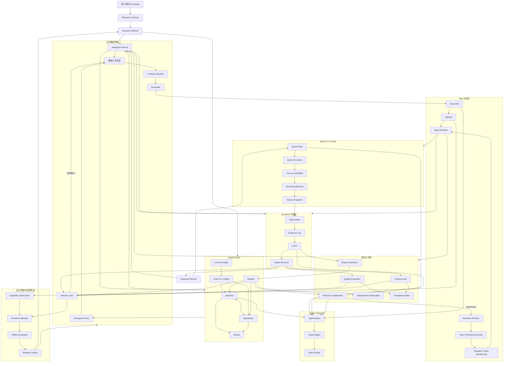

# 自主调研系统：目标架构与严格实现路径

状态：实现中；A–C 已完成，D 已部分实现并按 §15 退出清单闭合中，E–N 待实现

日期：2026-08-05

适用范围：Research Run 后端。前端只消费后端投影，不承担研究状态判定。

## 1. 结论

现有 `research-run-v5` 已经解决持久任务、Attempt、证据出处、Claim 级证据标准、报告修订、独立评审、幂等提交和失败恢复。它仍有六个结构性缺口：

1. 计划主要在开局生成，后续新证据只能增加问题或任务，不能持续重组研究方向。
2. 多个智能体的结果进入同一证据账本，但没有专门的整合轮次把共同发现、缺口和新假设变成后续工作。
3. 冲突只表现为 Claim 上的支持或反对关系，没有争议对象、争议类型、独立复核和裁决记录。
4. 来源只在被接受后成为 Source Snapshot；检索式、候选来源、筛除理由和查询迭代无法审计。
5. Agent、模型、工具和来源适配度只在单次调度时使用，没有可验证的运行能力记录。
6. 运行结束后没有受评测约束的经验提取、策略候选、离线回放、升级和回退协议。

目标系统必须在每批可信结果后重新判断：已经知道什么、哪些结论互相冲突、哪些未知项最影响决策、下一组任务如何同时提高信息收益并降低重复劳动、现有人员和工具是否适合这些任务、何时已有证据足以交付。

实现顺序只表达数据库和运行依赖。下文全部条目都属于最终交付，不存在删减版运行路径。

## 2. 与普通多 Agent 群聊的产品区别

| 判断项 | 普通多 Agent 群聊 | Research Run 目标行为 |
| --- | --- | --- |
| 工作记录 | 消息 | 版本化 Contract、Inquiry、Task、Corpus、Evidence、Dispute、Report、Decision |
| 协作 | Agent 读消息后自行决定 | Agent 消费有类型的输入工件，结果经过服务端验收后进入共享状态 |
| 深挖 | 依赖 Agent 临场发挥 | 未知项、假设、争议、证据缺口持续生成候选探索 |
| 结果结合 | 最后写报告时总结 | 每批结果触发整合，整合结果可改写问题优先级、创建新分支或终止低价值分支 |
| 冲突处理 | 在聊天中讨论 | 建立争议对象，进行独立复核、方法审查和有出处的裁决 |
| 停止 | 负责人认为够了 | Contract 的交付要求、证据充分度、争议状态、结构化评审和边际收益共同决定 |
| 恢复 | 重读消息猜测进度 | 依靠持久状态、事件序列、lease、幂等键和 Attempt 恢复 |
| 改进 | 换 Prompt 或增加 Agent | 运行观测形成策略候选，经离线评测通过后产生新版本；运行中的版本保持固定 |

任何消息、画布节点、Agent 自报分数或自然语言“已完成”都不能推进 canonical 状态。

## 3. 完成定义

只有同时满足以下条件，才能宣称本规格完成：

1. 新证据可以在不重启 Run、不丢弃旧证据的情况下改变研究分支、任务优先级和团队分配。
2. 两个智能体给出冲突结果时，系统能建立一个持久争议，解释冲突类型，派发有区分度的复核工作，并记录解决、条件化解决或未解决结论。
3. 后续智能体读取的是已验收的多智能体合并状态，并能明确引用哪些 Question、Hypothesis、Insight、Claim、Source 和 Dispute 触发了当前任务。
4. 每个来源都能追溯到 Search Plan、Query Execution、候选来源、筛选决定、Snapshot、Observation、Claim 和报告段落。
5. 探索调度同时考虑决策影响、未知程度、争议严重度、证据缺口、来源独立性、方法适配度、预期成本和重复度；任何分数都保存策略版本和分项理由。
6. 失败分类能区分业务结果、方法问题、结构协议问题、权限、凭据、限流、网络、超时、工具、解析和运行时故障；不同类别有明确且有上限的处理方式。
7. 报告不能绕过未处理的必答 Question、阻断级争议、证据标准、结构化评审缺陷、引用审计和最新整合结果。
8. Agent、模型、工具和检索 Adapter 的选择有运行数据依据；单次成功不能自动修改生产策略。
9. Run 可从任意事务提交点后崩溃并恢复，不能重复创建 Task、Attempt、Source、Claim、Dispute、Report、Decision 或 Event。
10. 历史 V1–V5 Run 可读取、恢复和交付；新版本不改变历史 Prompt、结果解析和 Gate 语义。
11. 系统级评测在受控语料中证明主动发现、冲突发现、结果整合、报告可追溯和崩溃恢复达到本文门槛。
12. 本文实现清单、数据库迁移、内置 Research Fleet Skill、source map、权威后端设计和工程原则保持一致。
13. Contract 要求持续监测时，首次交付后进入持久 monitoring 状态；来源变化只在达到物质性阈值后开启增量研究，未变化也有可审计记录。
14. Research Director 能依据新方向、能力缺口、独立性要求或新颖视角创建受预算和权限约束的 Agent；每次组队、失败和退出都有持久记录。
15. 产出冲突的 Agent 会进入有轮次上限的 Research Deliberation；无实质进展时自动升级给 Research Director，Director 只能基于证据解决、拆分范围、创建区分任务或保留未解决状态。
16. 每个 Research Task、Attempt、Result Artifact、Query、Source、Observation、Claim、Hypothesis、Insight、Integration Contribution、Dispute、Deliberation/Turn、Decision、Team Formation/Membership、Divergence Pass、Integration Round、Monitoring Cycle、Episode 和 Report Revision 都有稳定 Projection Node 与有类型的关系，支持前端分页重建、断线续传、增量动画、大图按需展开和完整详情。
17. Integration Module 能把叶子结果递归归纳为多层 Insight Derivation DAG；输入失效会让所有受影响的高层 Insight 变为 stale，并触发重新整合。
18. Exploration Module 在开局、重大意外、低收益停滞和交付前执行 Divergence Pass，为异质视角和反常方向保留受控预算；推测只能创建 Hypothesis/Branch，不能直接成为 Claim。
19. 每个 accepted Task Result 都有 Assimilation Check Decision；存在相关同类结果时，原产出 Agent 提交 Integration Contribution 参与归纳，存在冲突时进入 Research Deliberation，没有相关结果时也明确记录等待后续整合。

## 4. 研究模式不是固定模板

用户的目标先被解析成 Research Contract，再由 Research Method 组合多个方法模式。模式只提供方法约束和候选动作，不生成固定阶段。

| 方法模式 | 需要回答的问题 | 典型证据要求 | 特有动作 |
| --- | --- | --- | --- |
| 探索制图 | 领域里有哪些对象、关系、未知项 | 覆盖不同观点和来源类型 | 视角发现、概念聚类、未知项扩展 |
| 对比决策 | 选项在约束下如何取舍 | 可比较口径、同时间窗、决策权重 | 评价矩阵、敏感性分析、失效条件 |
| 事实核查 | 命题是否成立 | 原始记录、独立复核、时间和定义一致 | 溯源、反向搜索、版本核对 |
| 系统证据审查 | 现有证据总体支持什么 | 可复现检索、纳排标准、偏差检查 | 检索式、筛选记录、证据分层 |
| 因果与机制调查 | 结果为何发生、机制是否成立 | 时间顺序、替代解释、干预或自然实验 | 因果图、反事实、机制反证 |
| 风险与尽调 | 什么会造成损失或否决 | 负面证据、权限记录、财务或法律原始资料 | 红旗追踪、最坏情形、缺证警示 |
| 技术可行性 | 方案是否能在约束下实现 | 可运行产物、基准、版本、兼容矩阵 | 复现、实验、成本和运维分析 |
| 时间与事件重建 | 事件先后和版本变化是什么 | 带时间戳的原始记录和版本快照 | 时间线、冲突时间解释、变更检测 |
| 持续监测 | 哪些事实变化会推翻现有结论 | 可重复查询和变化触发器 | 监测计划、差异检测、增量复核 |

同一个 Run 可以组合模式。例如“选择海外支付供应商”可同时使用对比决策、风险尽调、事实核查和持续监测。Planner 必须写出选择理由、各模式作用于哪些 Question、证据标准和失败测试；不能只返回模式名。

## 5. 目标领域模型

### 5.1 已有实体继续保留

- Research Session
- Research Run
- Research Contract Revision
- Research Method Decision
- Research Question
- Research Task / Dependency / Attempt
- Source Snapshot
- Observation
- Claim / Evidence Link
- Research Decision / Run Event
- Research Report / Report Claim
- Evaluation Defect

### 5.2 新增 Inquiry 实体

#### Research Hypothesis

保存可被证伪的陈述、所属 Question、适用范围、预期可观察结果、削弱条件、当前状态、置信区间或有界置信度、创建来源和最后评估版本。状态为 `proposed | investigating | supported | weakened | refuted | conditional | obsolete`。

#### Research Branch

表示一个可独立推进或终止的探索方向。保存父分支、目标、进入条件、退出条件、预算份额、状态和终止原因。分支只组织研究方向，不复制 Task 状态。

#### Research Insight

表示整合多项已验收结果后形成的、能改变后续研究的问题结构或决策理解。每个 Insight 必须引用输入 Claim、Question、Hypothesis、Dispute 或其他 Insight；不能凭综合 Agent 的自然语言直接成立。

#### Inquiry Edge

保存 `decomposes | tests | explains | depends_on | competes_with | refines | invalidates | motivates` 关系。服务端验证允许的源/目标类型和有向环规则。

### 5.3 新增检索与语料实体

#### Search Plan

保存目标 Question/Branch、检索 Adapter、查询策略、时间窗、语言、域名或库范围、纳排条件、预期停止条件和策略版本。

#### Query Execution

保存实际查询、Adapter、参数、开始结束时间、结果游标、成本、状态、失败分类和父查询。查询改写必须形成子记录，不能覆盖原查询。

#### Source Candidate

保存查询返回但尚未接纳的来源、规范化标识、摘要、初步独立性 family、重复簇、风险标记和发现位置。

#### Screening Decision

保存接纳、排除或延后决定、规则、理由、操作者、目标方法版本和候选来源。接纳后才创建不可变 Source Snapshot。

### 5.4 新增整合与争议实体

#### Integration Round

保存触发原因、输入状态版本、输入工件集合、整合结果、服务器接受的状态变化、被拒绝的提议、负责 Agent、开始结束时间和幂等键。

#### Integration Contribution

保存某个原产出 Agent 对同一 Integration Round 的结构化贡献：已比较的工件、共同结论、独有发现、冲突、适用范围、遗漏、建议高层 Insight 和后续问题。它不能直接创建 Insight 或改变 Claim；Integrator 和服务端验收后才能应用。

#### Insight Derivation

保存一个高层 Research Insight 使用的输入 Claim/Insight、派生关系、层级、聚类指纹、整合轮次、价值变化和当前 freshness。Insight 层级由输入 DAG 计算，不能由 Agent 自报。任一输入被 refuted、superseded 或发生适用范围变化时，受影响的上层 Insight 进入 `stale` 并等待重新整合。

#### Research Dispute

保存争议问题、影响范围、严重度、冲突类型、各立场、相关 Claim/Evidence、当前状态和交付义务。状态为 `open | investigating | conditionally_resolved | resolved | irreducible | obsolete`。

冲突类型至少包括：`fact | definition | scope | time | population | method | measurement | interpretation | source_identity`。

#### Dispute Position

保存一个可核验立场、关联 Claim、适用条件、提出者和当前证据充分度。裁决不能直接改写原 Claim；它通过 Claim 状态、Evidence Link 和 Dispute Decision 更新规范事实。

#### Research Deliberation

保存一个 Dispute 中的参与 Agent、结构化轮次、立场变化、证据引用、质疑、让步条件、范围拆分提议、进展水位、成本和升级原因。状态为 `pending | discussing | converged | deadlocked | escalated | resolved | unresolved | cancelled`。消息可以作为投影显示，但只有验收后的 Deliberation Turn 能改变进展水位。

### 5.5 新增运行能力与经验实体

#### Capability Observation

以 Task Attempt 为最小单位记录所需能力、Agent、模型、provider、工具/检索 Adapter、任务模式、领域标签、成功、质量、成本、时延、重复度、失败分类和评审结果。该记录描述一次观测，不等于永久能力评级。

#### Team Formation Decision

保存 Research Director 因 `capability_gap | parallel_capacity | independence | novel_perspective | new_branch` 提出的组队判断。它绑定目标 Question/Branch/Dispute、所需能力、角色说明、工具和来源权限、预算、并发、预期工件、停止条件、Agent 保留策略和选择理由。状态为 `proposed | authorized | provisioning | active | blocked | failed | retiring | retired`。

#### Research Team Membership

保存 Agent 加入本次 Run 的原因、角色、授权范围、来源 Team Formation Decision、开始/结束时间和退出原因。底层 Agent 删除或离开后，Membership 和历史归属仍然保留。

#### Research Episode

Run 完成一次交付周期或进入终态后生成的只读摘要，引用 Contract、Method、状态变化、重大决策、有效和无效策略、故障、成本、质量以及用户修改。它供离线评测读取，不能直接改变生产策略。

#### Strategy Version

保存探索打分、整合触发、团队路由、失败处理、Prompt、工具策略和停止策略的不可变版本。每个 Run 在开始时固定版本。

#### Evaluation Run / Promotion Decision

保存候选 Strategy 在固定任务集、多次随机种子和历史回放上的结果。只有满足样本量、非退化、安全约束和人工批准要求的候选才能成为新默认；必须保留上个版本并支持回退。

#### Research Monitor

保存用户批准的监测问题、复用的 Search Plan、频率、触发条件、物质性阈值、当前 baseline Report、下次执行时间和状态。首次报告交付后，有 Monitor 的 Run 进入 `monitoring`；每次检查形成 Monitoring Cycle。无变化写 Decision，有物质变化时创建增量 Question/Task/Integration/Report Revision，不能覆盖 baseline 历史。

#### Divergence Pass

保存一次主动发散检查的触发原因、隔离上下文、视角候选、领域外类比、遗漏的利益相关者/地区/时间/方法、反常证据方向、建议 Hypothesis/Branch、被选择的探测任务和拒绝理由。状态为 `pending | running | accepted | partially_accepted | failed | obsolete`。

### 5.6 工件护照

每个 Agent 可消费或产生的工件都要携带统一护照字段：

- entity kind、entity ID、schema version、content hash；
- workspace、session、run、contract、plan、strategy version；
- producing task、attempt、Agent、模型/provider；
- 输入工件引用；
- data access level：`raw | redacted | verified_only | evaluation_private`；
- created/accepted/superseded 时间和状态。

护照保存出处和访问范围，不复制 Question、Claim 或 Report 正文。

## 6. 关系图

这些关系使用 PostgreSQL 规范表、外键、唯一约束和事务实现。没有证据证明独立图数据库能改善当前查询或一致性，因此不引入第二套状态存储。

## 7. Module 与 Interface

`ResearchRun` 继续是外部唯一深 Module。Handler、Scheduler、CLI 和投影代码只能调用以下业务操作：

- `StartRun`
- `SubmitTaskResult`
- `ApplyUserSteering`
- `PauseRun` / `ResumeRun` / `CancelRun`
- `ReconcileRun`
- `GetRunSnapshot`
- `ProjectCommittedEvents`

不能向外暴露“把某 Task 改成 succeeded”“写一个 Claim”“创建一个 Dispute”等 CRUD Interface。

内部按职责形成以下深 Module：

| Module | 拥有的判断 | 对其他 Module 提供的 Interface |
| --- | --- | --- |
| Run | Contract、版本固定、生命周期、预算、事务顺序 | 启动、steering、控制、快照、reconcile |
| Inquiry | Question、Hypothesis、Branch、Insight 和关系合法性 | 应用一组已验证的 Inquiry 变化、查询当前未知项 |
| Corpus | 查询计划、查询执行、候选来源、筛选、Snapshot | 接受检索结果、提供可追溯语料视图 |
| Evidence | Observation、Claim、Evidence Link、证据标准 | 原子接纳证据批次、计算 canonical graph delta |
| Integration | 多结果去重、聚类、共同发现、缺口和后续提议 | 对一个固定输入版本生成并应用 Integration Round |
| Dispute | 冲突检测、立场、复核要求、裁决和报告义务 | 建立或更新争议、查询阻断级争议 |
| Exploration | 候选工作生成、分项评分、组合选择、停止判断 | 生成有版本理由的下一组 Task 提案 |
| Execution | Task DAG、Attempt、lease、dispatch、重试、取消、恢复 | 激活和执行已接受 Task，不解释研究语义 |
| Evaluation | 报告、Claim 覆盖、引用、缺陷、交付 Gate | 对当前状态产生结构化缺陷和 Gate 结果 |
| Capability | Attempt 观测、团队适配和路由证据 | 在约束下给出候选执行者及理由 |
| Evolution | Episode、离线评测、Strategy 候选、升级和回退 | 提供已批准 Strategy Version |
| Projection | Canvas、节点详情、消息、来源和报告投影 | 只消费 committed Event，不回写研究状态 |

实现 Locality 要求：

1. `engine.go` 不再同时构造 Prompt、分派、接纳证据、执行 Gate、处理故障和投影事件。
2. 当前包含数十个无关操作的 `Store` Interface 拆除。PostgreSQL 是 canonical 实现，事务脚本留在拥有业务不变量的 Module 内；测试优先使用真实 PostgreSQL。
3. 只为真实可替换项保留 Seam：执行运行时、检索 Adapter、时钟、事件发布和投影输出。内部 helper 不为 mock 便利创建 Interface。
4. 事务内更新 canonical state，提交后执行外部动作；每个外部动作都有 outbox 事实或可由状态重新推导。

Projection 的后端读模型必须给每个节点提供：节点用途、绑定的小目标、进入条件、方法、输入工件、实际动作、执行 Agent/Attempt、结构化结果、证据、Decision、失败分类、重试/替代动作、上游依赖和下游影响。前端只决定布局和文案，不能从摘要文本猜这些字段。

### 7.1 Graph Projection Contract

每个 canonical 实体使用稳定 `(run_id, entity_kind, entity_id)` 形成 Projection Node ID。节点必须包含：

- `node_kind`、`node_subtype`、schema version；
- title、bounded summary、status、importance、freshness；
- contract/plan/strategy version；
- actor Agent、Task、Attempt、时间和成本；
- detail payload 与 canonical entity reference；
- created/updated/terminal event sequence。

V6 必须注册的 `node_kind` 至少包括：`task | attempt | result_artifact | search_plan | query_execution | source_candidate | screening_decision | source_snapshot | observation | claim | question | hypothesis | branch | insight | insight_derivation | integration_round | integration_contribution | dispute | dispute_position | deliberation | deliberation_turn | decision | team_formation | team_membership | divergence_pass | capability_observation | report_revision | evaluation_defect | monitoring_cycle | episode`。未知未来类型必须能以 generic node 降级显示，不能让旧客户端崩溃。

稳定边类型至少包括：

- `decomposes | tests | depends_on | triggered`；
- `produced | consumed | derived_from | integrates`；
- `supports | contradicts | refines | supersedes | invalidates`；
- `discussed_by | challenged_by | escalated_to | resolved_by`；
- `reported_in | reviewed_by | revised_by`；
- `staffed_by | created_for | retired_after`。

Projection Module 提供全量 Snapshot 和按 event sequence 的增量 Delta。相同 canonical state 重建出的 Node/Edge 集合和内容 hash 必须一致。前端可以保存布局、折叠和动画状态，不能修改节点事实、层级或关系。

### 7.2 无限画布投影协议

Snapshot 必须包含 `snapshot_id`、`through_event_sequence`、`graph_content_hash` 和稳定分页游标。一次逻辑 Snapshot 的所有分页必须固定在相同 `snapshot_id` 与 event sequence；分页期间到达的新事件只能进入后续 Delta，不能让前后页来自不同状态。

Delta 必须包含 `from_sequence_exclusive`、`through_sequence`、Node/Edge upsert、可见性 tombstone、受影响根节点和由 canonical Event 推导的 `transition_kind`。客户端按稳定 ID 幂等应用；重复 Delta 不产生重复节点，乱序 Delta 暂存到缺口补齐，缺口超时或服务端已清除所需历史时重新获取 Snapshot。WebSocket 重连必须携带最后成功应用的 event sequence，服务端只能连续续传或明确要求 resync，不能静默跳过事件。

`transition_kind` 至少覆盖：`branch_spawned | task_dispatched | result_accepted | integration_formed | insight_staled | dispute_opened | deliberation_progressed | lead_escalated | team_membership_changed | report_revised`。它只表达已经提交的语义变化和关联实体，不包含坐标、动画时长或视觉样式。前端据此表现扩散、融合、冲突、升级、失效和修订，但不能用动画事件推进研究状态。

大图不能要求浏览器一次载入整个 Run。Projection Module 提供有界 `Projection Slice`，至少支持 root node、方向、relation types、max depth、status、importance floor、cursor 和 limit；节点同时给出未加载邻居数、后代数和可继续展开标记。节点详情按稳定 ID 单独读取。相同 Snapshot 下相同 Slice 参数必须返回稳定顺序和内容。

前端可以把屏幕外或低层节点折叠成纯显示分组，也可以保存用户布局；显示分组不是 Research Insight，不能写回 canonical Graph。真正的节点融合只能由已验收 Insight Derivation 创建新 Insight，并保留所有输入节点和 `derived_from | integrates` 边。真正的扩散只能由 Question/Hypothesis/Branch/Task/Team Formation 等后端状态变化创建。

## 8. 每批结果后的主动研究算法

### 8.1 输入事件

以下事件会触发控制计算：

- Task Result 被原子接受；
- 用户修改 Contract；
- Attempt 失败、超时或取消；
- 新争议成立或裁决完成；
- Integration Round 到达数量、时间或高影响触发条件；
- 预算、provider 健康或团队可用性改变；
- Gate 返回可寻址缺陷；
- Frontier 没有可执行项但交付条件未满足。

### 8.2 持久处理顺序

1. 在一个短事务内验证 Result schema、身份、Attempt、版本、输入工件和数据访问级别。
2. 同一事务规范化并接纳 Search、Source、Observation、Claim、Evidence 和 Agent 提议。
3. 去除精确重复；标记来源 mirror、同一 independence family 和语义近重复候选。
4. 计算接纳前后的 canonical graph delta，写 Information Gain Decision。
5. 更新可确定计算的 Question/Hypothesis/Branch 状态，运行确定性冲突检测。
6. 需要语义判断的整合或冲突候选写为 Task/Integration Round，固定输入 event sequence、实体版本和输入工件 hash；事务提交后再 dispatch。
7. Integration Agent 异步生成严格结果：合并 Insight、重复组、失效假设、新问题、新分支、终止分支、争议和候选工作。
8. 接受 Integration Result 时，每项提议携带它依赖实体的前置版本。服务端逐项验证引用、权限、图关系、预算和前置版本；仍成立的提议原子应用，已变化的提议拒绝并保存原因。
9. Integration Round 的输入水位之后又有相关证据时，创建覆盖缺口的 catch-up Round；不能覆盖新证据，也不能因为全局 state version 变化而让无关提议永久饥饿。
10. Exploration Module 读取最新已接受状态生成候选任务，Portfolio Selector 选择下一组互补任务。
11. Execution Module 在短事务内激活满足依赖和资源约束的任务。
12. 每次状态变化都先写 Decision/Event 并提交；dispatch 与 Projection 在提交后执行并可恢复。

### 8.3 Integration Round 触发条件

满足任一条件即触发：

- 接受了高影响 Claim、Question answer 或 Hypothesis 状态变化；
- 新建或升级了阻断级 Dispute；
- 当前批次含来自两个以上独立任务的结果；
- 新增结果与最近报告使用的 canonical graph 不同；
- 未整合结果达到配置数量或最长等待时间；
- Frontier 只剩低收益项；
- Gate 发现覆盖、方法、争议或报告结构缺陷；
- 用户 steering 使部分旧分支失效。

数量和时间只控制最迟何时整合。高影响变化必须立即整合。

Integration Round 状态为 `pending | running | partially_accepted | accepted | superseded | failed`。`partially_accepted` 必须记录逐项接受/拒绝结果并安排 catch-up Round；不能静默丢弃失败提议。

### 8.4 候选任务类型

- 扩展：寻找未覆盖对象、观点、时间段或数据源；
- 深挖：解释高影响 Observation 背后的机制或上下文；
- 独立核验：使用不同来源 family、方法或工具复核；
- 反证：主动寻找能削弱目标 Claim/Hypothesis 的证据；
- 区分实验：选择最能区分两个冲突解释的查询、数据或实验；
- 范围拆分：把表面冲突按时间、定义、地区、人群或版本拆开；
- 复现：执行代码、计算、查询或基准；
- 语料修复：改写失败查询、切换 Adapter、补全文本或元数据；
- 整合：合并跨分支结果并产生新 Insight；
- 报告修订：只处理可寻址的报告或评审缺陷；
- 重新规划：Contract、Method 或 Task Graph 确实失效时使用。

### 8.5 Portfolio Selection

每个候选保存以下分项，禁止只保存总分：

- decision impact；
- uncertainty reduction；
- expected information gain；
- required-question coverage；
- dispute discrimination value；
- source independence gain；
- method requirement；
- novelty；
- expected success probability；
- time、token、tool 和人工成本；
- duplicate overlap；
- dependency and provider risk。

组合选择还要满足：

- 同一问题的并行工作必须采用有区分度的来源、方法或视角；
- 不选择互相完全重叠的候选；
- 高影响结论至少保留独立核验或反证路径；
- 预算留出整合、复核和报告修订份额；
- 并发度由问题可并行程度、Agent 可用性、provider 限制和预算共同决定；
- 任何硬约束失败都不能靠提高分数绕过。

评分公式是版本化策略，不宣称为真实概率。每次选择保存候选全集、分项、硬约束、选择结果和理由，允许离线重放比较新策略。

### 8.6 Divergence Policy

Divergence Pass 在以下时点强制执行：

- 初始 Method 接受后、第一批大规模任务创建前；
- 高影响意外、Hypothesis 被推翻或新 Dispute 建立后；
- 连续低信息收益、Frontier 同质化或来源集中度过高时；
- Gate 准备接受停止条件、Reporter 开始最终报告前；
- 用户要求扩大视角时。

执行 Divergence Pass 的 Agent 只读取 Contract、Method、明确安全/预算限制和有限已知事实，不读取多数结论、当前排名和其他 Agent 的评价。这样保留独立推理，降低锚定。它必须从以下维度提出候选：

- 未代表的利益相关者和反方激励；
- 不同地区、语言、时间窗、人群和版本；
- 不同来源生态与 independence family；
- 替代测量、方法和因果解释；
- 异常值、失败案例和否证方向；
- 领域外类比及其适用/失效条件；
- 用户没有提出但可能改变决策的问题。

Strategy Version 为发散探测保留有界 `exploration_reserve`。探索型 Run 的 reserve 必须大于零；用户可在 Contract 中显式设为零。Portfolio Selection 对具有合理影响路径的高新颖度候选至少选择一个有界 probe，除非权限、安全或剩余预算不允许，并保存拒绝理由。

Divergence Result 只能创建或建议 Hypothesis、Branch、Question 和 probe Task。未验证想法不能创建 supported Claim、解决 Dispute 或进入 Report。交付 Gate 要求当前 Contract/Plan 已完成交付前 Divergence Pass，并处理所有高影响候选或记录可审计的排除理由。

## 9. 动态结合多 Agent 结果

Agent 之间不以私聊内容作为 canonical 协作输入。每个任务输入包含：

- 当前 Contract、Method 和 Strategy Version；
- 目标 Question/Hypothesis/Branch/Dispute 的持久 ID；
- 已接受的输入工件护照；
- 与目标相关的 Claim、Evidence、Insight 和未解决争议；
- 明确排除的重复工作；
- 输出 schema、接受条件、工具/来源权限、预算和停止条件。

每个 accepted Task Result 都先执行 Assimilation Check：

1. 按目标 Question/Hypothesis/Branch/Dispute、实体、范围、时间、方法和语义近似查找已接受结果。
2. 没有相关结果时写 `assimilation_routing=no_related_artifacts` Decision，并把结果放入待整合水位；后续相关结果到达时重新触发。
3. 存在同类或互补结果时创建 `peer_synthesis` Integration Round，邀请原产出 Agent 提交 Integration Contribution。
4. 存在不兼容 Claim 时先建立 Dispute，再让原产出 Agent 作为 Position 参与者进入 Research Deliberation。
5. 原 Agent 已离线、退出或无权读取某项工件时，不伪造其 Contribution；记录缺席原因，由 Integrator 使用其已验收 Result Artifact 继续。
6. Research Team Membership 只有在该 Agent 的待处理 Contribution/Deliberation 和活跃 Attempt 全部结束后才能 retiring。

Integration Contribution 必须列出它实际比较的工件、相同点、差异、独有信息、适用范围和建议关系。原 Agent 不能仅回复“同意”或复述自己的旧结果。

Integration Agent 的严格输出必须包括：

- 可由输入 Claim 支持的新 Insight；
- 同义、包含、依赖、冲突和范围不同的 Claim 组；
- 被新证据加强、削弱、推翻或条件化的 Hypothesis；
- 已回答、仍未知或需要拆分的 Question；
- 应建立、升级或解除的 Dispute；
- 应继续、暂停或终止的 Branch；
- 候选后续工作及其预期区分价值；
- 所有判断引用的持久 ID。

服务端检查引用和状态转换。Integrator 不能自行创建 verified Evidence、把 Claim 改为 supported、解除争议或通过 Gate。

上下文按目标图遍历和 token 预算构建，不能把整场 Run 全量塞给每个 Agent：

1. 先选任务直接绑定的 Question/Hypothesis/Branch/Dispute；
2. 再取支持这些对象的最新 Insight、Claim 和 Evidence 摘要；
3. 每个摘要保留可展开的工件护照和原始实体引用；
4. 过期、重复、无关或超出访问级别的工件不进入 Prompt；
5. 因预算未进入的高影响工件必须记录 omission reason，不能静默截断。

Claim 和 Insight 不做破坏性合并。语义重复通过 `equivalent_to | refines | supersedes` 关系和 canonical selection Decision 表示，原实体、证据和作者归属永久保留。

例子：三个 Agent 分别发现“官方价格低”“迁移成本高”“某地区条款禁止目标业务”。Integration Round 会生成“标价优势不能代表目标地区总成本”的 Insight，建立地区范围 Question，削弱“供应商 A 成本最低”的 Hypothesis，并创建条款核验和迁移成本敏感性分析任务。后续任务读取三项输入，不会再次从原目标开始泛搜。

### 9.1 Recursive Integration

Integration Module 在一个 Round 中执行以下递归过程：

1. 按 Question、实体、范围、时间、方法和语义关系把新 Claim/Insight 放入候选 cluster。
2. 两个以上来自不同 Task 或 Branch 的输入可以形成一级 Insight；单一结果仍保留为 Claim，不能伪装成归纳。
3. 多个一级 Insight 可以形成跨主题二级 Insight；后续层级按同一规则继续，不设固定层数。
4. 每个新 Insight 必须产生至少一种可观察价值：新增解释或决策关系、消除有证据的重复、条件化/解决冲突、改变 Hypothesis、改变 Frontier、改变报告结论或压缩上下文且完整保留派生关系。
5. 只有文字更短或表达更抽象的候选以 `no_semantic_gain` 拒绝，不能制造装饰性“大节点”。
6. 递归在没有合格 cluster、无新增语义价值、预算耗尽或命中 Contract 停止条件时结束。

Insight Derivation 形成 DAG。层级由 `1 + max(input insight level)` 计算，Claim 视为 level 0。相同输入 hash、scope 和 relation 的候选按幂等键复用。任何输入被 refuted、superseded、范围改变或访问权限撤销时，依赖它的所有祖先 Insight 进入 `stale`；stale Insight 不能进入新 Task Context 或 Report，并创建最小范围的重新整合工作。

Projection Module 可以把 Claim/Observation 显示为叶子节点，把逐层 Insight 显示为越来越大的归纳节点。层级、父子关系、贡献 Agent 和失效传播来自后端事实，前端不推断。

## 10. 争议处理协议

### 10.1 建立争议

冲突检测分两层：

1. 确定性检测：同一实体、指标、时间窗和范围下出现逻辑不兼容 Claim；同一 Source Snapshot 被不同方式引用；版本或单位不一致。
2. Agent 候选检测：语义冲突、方法分歧、隐含定义差异。候选必须给出 Claim IDs 和冲突理由，服务端验证引用后才能建立 Dispute。

Embedding 相似度只提供候选，不能直接宣布冲突成立。

### 10.2 调查争议

1. 先检查定义、范围、时间、人群、单位、来源身份和版本是否不同。
2. 为每个立场生成独立核验任务；任务不得只读取对方结论摘要。
3. 选择能区分立场的原始资料、计算、实验或不同来源 family。
4. 方法争议增加 Methodologist 任务，检查测量、样本、偏差和可比性。
5. Adjudicator 只能读取已验收 Evidence、方法审查和争议立场，不能读取其他 Agent 的隐藏评分或评审 rubric 私有信息。

### 10.3 裁决结果

- `resolved`：证据足以支持一方、否定一方或证明两者可按范围合并；
- `conditionally_resolved`：不同条件下各自成立；
- `irreducible`：当前可获得证据不足或方法无法区分；
- `obsolete`：上游 Contract、Question 或 Claim 已失效。

阻断级 `open | investigating` Dispute 禁止交付。`conditionally_resolved | irreducible` 必须在报告中展示条件、残余不确定性和影响。

### 10.4 Research Deliberation 与升级

Dispute 绑定到两个以上 Position 后，Dispute Module 创建 Research Deliberation，并优先邀请产生冲突 Claim 的 Agent。每一轮只接受结构化 Deliberation Turn：

- 当前 Position 与适用范围；
- 新增或重解释的 Evidence IDs；
- 对某个 Position/Evidence 的具体 challenge；
- concession 或条件化成立范围；
- 建议的范围拆分、区分查询、实验或复现；
- `position_changed | evidence_added | scope_refined | no_change` 进展标记及服务端可验证依据。

服务端按 Position/Evidence/scope 的 canonical delta 计算进展，Agent 自报 `position_changed` 不能单独算进展。达到以下任一条件时停止同级讨论：

- 各方提交同一 Resolution Proposal；
- 连续策略规定轮次没有 canonical delta；
- 达到轮次、时间、token 或工具预算；
- 发现需要新外部证据，当前讨论无法继续；
- 参与 Agent 不可用或权限不再满足。

共识提议仍需服务端 Evidence Standard 和状态机验证。无进展形成 `deadlocked`，自动创建绑定 Research Director 的 `lead_adjudication` Task 并写 `escalated_to` 边。Research Director 只能选择：

1. 接受有充分 verified Evidence 的 Resolution Proposal；
2. 按定义、时间、地区、人群、版本或方法拆分 Position；
3. 创建最能区分各立场的新研究任务；
4. 将 Dispute 标为 `conditionally_resolved` 或 `irreducible` 并说明残余影响；
5. Contract 要求人类承担决定时，暂停相关分支并请求用户。

Research Director 不能用身份覆盖 Evidence Standard、删除反方证据或把缺证争议标为 resolved。讨论消息、轮次、升级和裁决都作为稳定节点和边投影给前端。

## 11. 动态团队与工具路由

角色是任务责任，不是固定人数。一次 Run 只实例化需要的角色：

- Research Director：维护 Contract/Method 理解和候选研究组合；
- Explorer：扩大视角和发现未知项；
- Specialist：处理领域方法或专业材料；
- Verifier：独立核验来源、Claim 或计算；
- Counterevidence Researcher：寻找反例和失效条件；
- Integrator：执行 Integration Round；
- Methodologist：检查方法、测量和可比性；
- Adjudicator：处理争议；
- Reporter：生成报告修订；
- Quality Reviewer / Citation Auditor：独立审查。

路由规则：

1. Task 声明能力、工具、来源访问和独立性要求，不能直接指定“最喜欢的 Agent”。
2. Capability Module 从当前 Fleet、权限、可用性和历史 Observation 产生候选，不跨工作区使用身份或私有内容。
3. 高风险核验可要求不同 Agent、不同模型/provider、不同检索 Adapter 或不同来源 family；独立性要求由 Method 决定。
4. Agent 不具备所需能力时，创建显式 capability gap。只有现有产品允许招聘或配置 Agent 时才执行；否则向用户报告阻塞，不虚构能力。
5. 一个 Agent 的失败不能立即判定永久不适合；至少按任务类型、领域、工具和样本量分组。
6. Agent Reach 或其他检索项目只能作为 Retrieval Adapter 接入。只有在目标来源可达性、可复现性、权限和成本评测优于现有 Adapter 时才启用，不能成为调研状态机的依赖。

### 11.1 Research Director 自主组队协议

`StartRun` 必须把该 Session 所属 Research Fleet 的 `lead_agent_id` 复制到 Run 的 `research_director_agent_id` 并固定身份版本；当前产品的 sealed Research Fleet lead 是罗纳尔多。只有身份与该字段相同且 Membership 有效的 Agent principal 能提交 Team Formation Proposal 或处理 `lead_adjudication`。普通 Agent 不能通过 Prompt、自报角色或消息内容获得 Director 权限。

运行开始后修改 Fleet lead 不得静默改写已有 Run。Director 不可用时，依赖 Director 的组队和裁决操作进入 `blocked` 并暴露原因；系统不能自动挑选另一 Agent 冒充。只有用户显式改派有效 Agent，服务端写入版本化 Director Reassignment Decision 后，新的身份才可执行后续 Director 操作，历史 Decision 仍归属于原 Director。

Research Contract 增加组队授权：

- `allow_agent_creation`；
- Agent 数、并发、token、工具和外部费用上限；
- 允许的工具/来源权限；
- 默认保留策略 `run_scoped | retain_for_user_review`。

Research Director 可以在新 Branch、新高影响 Question、capability gap、独立复核要求或当前团队容量不足时提交 Team Formation Proposal。Proposal 必须包含 Team Formation Decision 的全部字段，并给出现有成员不适合的可检查理由。

Capability Module 按以下顺序处理：

1. 检查 Contract 授权、workspace 权限、预算和安全策略；
2. 检查当前 Fleet 是否已有等价能力和空闲容量；
3. 检查待创建角色与现有任务/Agent 的重复度；
4. 选择现有招聘/配置 Interface 的 Adapter 创建 Agent；
5. Agent 可用后创建 Research Team Membership，再允许 Execution Module 分派；
6. provisioning 失败写分类诊断，不复制 Proposal 或假装 Agent 已加入；
7. 所有绑定任务结束、分支终止、Run 取消或预算撤销后进入 retiring；完成活跃 Attempt 处理后 retired。

`allow_agent_creation=false` 或缺少权限时，Decision 进入 `blocked` 并向用户展示所需授权；Research Director 不能绕过现有 Agent 权限。相同 target、capability、independence requirement 和 active lifecycle 的 Proposal 按幂等键复用。

Research Director 可以提出“自己的想法”，但必须具体化为 Question/Hypothesis/Branch、能力理由和预期工件。未经验证的想法不能成为招聘事实之外的研究结论。

## 12. 失败处理与运行健康

### 12.1 失败分类

| 类别 | 例子 | 系统动作 |
| --- | --- | --- |
| `research_negative` | 没找到支持证据、假设被推翻 | 接受为研究结果，更新 Inquiry；不能当运行故障重试 |
| `method_invalid` | 口径不可比、样本不适用 | 建立方法缺陷并定向修复或重新规划 |
| `contract_blocked` | 用户范围互相矛盾、缺少授权 | 暂停相关分支并请求用户决定 |
| `result_invalid` | schema、引用、版本、quote 不合法 | 拒绝结果；同 Attempt 有界修正，保留诊断 |
| `permission` / `credential` | 无访问权限、凭据失效 | 标记不可重试，暴露所需操作；不复制任务 |
| `rate_limited` | provider 限流 | 按 Retry-After 和全局并发控制重新调度 |
| `network` / `timeout` | 临时网络或执行超时 | 同 Attempt 策略下有界重试，超过上限后换 Adapter 或报告阻塞 |
| `tool_failure` | 浏览器、解析器、执行环境错误 | 记录工具版本和输入，按工具健康策略处理 |
| `provider_failure` | 模型/provider 不可用 | provider circuit state 生效，重新路由需记录 Decision |
| `runtime_lost` | Agent runtime 失联 | lease 到期后 reconcile，先按 dispatch key 查找旧执行 |
| `internal_invariant` | 状态机或数据库不变量破坏 | fail closed、报警、保留事务前状态，禁止自动补造数据 |

### 12.2 必须实现的运行保护

- Task/Attempt 状态机和数据库约束双重验证；
- 每 Run、Agent、provider、Adapter 的并发和速率限制；
- dispatch outbox、lease、heartbeat、timeout、cancel acknowledgment；
- request ID + payload hash 幂等；同 ID 不同 payload 拒绝；
- stale result、stale plan、stale Contract 和 stale integration input 拒绝；
- provider/Adapter circuit state 与恢复探测；
- bounded retry、指数退避、jitter 和总预算；
- Prompt injection：来源内容始终是数据，不能覆盖 Task Contract、工具权限或 Result schema；
- evaluation-private 数据与被评对象隔离；
- 所有查询按 workspace_id 过滤，任务凭据只能提交绑定 Attempt；
- 错误摘要限长并清除凭据、原始环境变量和不安全工具输出。

不得用“创建一个新 Task 再试一次”统一处理所有失败。修复动作必须由失败类别和当前 canonical state 决定，并按目标幂等复用。

### 12.3 执行失败、Circuit 与修复的实现契约

Agent Inbox 的 `taskfailure.Reason` 是 Agent/Runtime 执行失败的输入真值。Research Run 只把该持久原因映射为研究执行动作，不再对相同错误文本维护第二套正则分类器。dispatch 建立 Inbox 之前的失败必须由 Adapter 返回结构化 `FailureClass`；未分类错误进入 `unknown`，只能使用较小的重试预算，不能被假定为网络故障。

每个 Attempt 冻结实际执行目标：Agent、Runtime、model、provider、Adapter 和配置指纹。配置指纹只包含不可逆 hash，不保存凭据。目标在 dispatch 前改变时，本 Attempt 以 `target_changed` 结束；下一 Attempt 重新读取目标，旧 outbox payload 不允许原地改写。

Circuit 以 workspace 为安全边界，并分别维护以下目标：

- `agent`：只影响一个 Agent 的模型、进程、上下文和配置故障；
- `provider`：key 包含 Runtime 与 provider，避免一个 workspace 内独立凭据的 Runtime 互相熔断；
- `adapter`：影响同一接入实现，例如 `agent_inbox`；
- `runtime`：只影响已经失联或不兼容的 Runtime。

Circuit 使用持久 `closed | open | half_open` 状态、单调 generation 和带 token/过期时间的 probe lease：

1. `closed` 在同一统计窗口内达到该类别阈值后转为 `open`；单次 credential、缺配置、Runtime 不兼容或不存在等确定性故障可直接打开对应目标；
2. `open` 到达 `next_probe_at` 后只能由一个 owner 原子领取并转为 `half_open`；其他 Run/worker 继续跳过该目标；
3. probe 成功且配置指纹未改变时关闭 circuit、清零连续失败；probe 失败按类别重新打开并增加 generation；
4. probe owner 失联后，只有租约过期的 successor 能接管；旧 token/generation 的成功、失败和 release 均不得改写新 owner；
5. 目标配置指纹改变会关闭该目标上由旧配置造成的 circuit，并记录 `configuration_changed` Transition；不得删除历史失败；
6. `agent.provider_blocked_*` 继续作为额度锁定与 UI 状态事实，Research Run 读取它作为 Agent 不可调度条件，但 circuit 不复用这两个字段。

C2c 的调度与异步结算按以下路径实现，不允许把 probe owner 只保存在 worker 内存：

1. 一次批量评估同能力候选的 Agent、Runtime、provider、Adapter 四层 circuit。无 circuit、`closed` 或配置指纹已变化的候选可正常调度；`open` 未到期及未过期 `half_open` 候选不可调度；到期 `open` 或租约过期 `half_open` 只能作为 probe 候选；
2. 选择顺序为无 probe 的健康候选优先、到期 probe 候选其次。若同能力候选全部阻塞，Task 保持 `ready` 并把 `ready_at`/Run `next_reconcile_at` 推到最早 `next_probe_at` 或 probe lease expiry，写一次幂等等待 Event，不能制造新 Task 或忙轮询；
3. Attempt、冻结 outbox、全部所需 circuit probe claim 和 Attempt—Circuit Probe Binding 在同一事务提交。任一 circuit 在事务中已被其他 worker 领取则整体回滚，重新选择目标；Binding 保存 circuit、scope、token、generation、lease、配置指纹和结算状态，进程重启后仍能恢复；
4. 一个目标同时存在多个到期 circuit 时，同一 Attempt 可以原子领取多个 probe。结构化 Result 成功会关闭仍由本 Attempt 持有的全部 probe，并清理其他 `closed` scope 的短暂失败窗口；失败只按真实 FailureClass 重新打开对应 scope，其他已领取 scope 标记 `inconclusive` 并释放为可再次探测，不把 provider 故障伪造成 Agent/Runtime 故障；
5. 用户 pause/cancel/reassign 导致的取消确认会把仍持有的 probe 标记 `abandoned` 并重新开放探测，不增加目标失败计数；timeout 或 Inbox 终态失败仍按真实分类结算。旧 token/generation 已被 successor 取代时，旧 Attempt 的 circuit 结算标记 `lost`，不得使已接纳 Result 或已持久失败事务回滚；
6. probe lease 时长至少覆盖 Task timeout 与 stale/cancel 确认窗口。运行中的同 Task 及 `cancelling` Attempt 继续占用现有并发与重复派发约束，circuit 重路由不得绕过它们。

运行策略按持久失败原因决定：

| 输入原因 | Research FailureClass | 动作 |
| --- | --- | --- |
| `runtime_offline`、`runtime_recovery`、`queued_expired` | `runtime_lost` | Runtime circuit；旧执行按 lease/dispatch key 对账后有界重试 |
| `timeout`、`agent_error.agent_timeout` | `timeout` | Agent circuit 统计；取消确认后才允许同 Task 新 Attempt |
| `agent_error.provider_capacity_or_rate_limit` | `rate_limited` | provider circuit；优先使用 Retry-After，否则有 jitter 的有界退避 |
| `agent_error.provider_server_error`、`agent_error.provider_network` | `provider_failure` / `network` | provider circuit；达到窗口阈值后打开 |
| `agent_error.provider_auth_or_access`、`agent_error.provider_quota_limit` | `credential` | 直接打开 provider circuit；额度 reset 时间可作为 `next_probe_at` |
| `agent_error.missing_config`、`agent_error.model_not_found_or_unavailable` | `configuration` | 直接打开 Agent circuit；配置指纹变化后才立即恢复 |
| `agent_error.runtime_version_unsupported`、`agent_error.runtime_missing_executable` | `tool_failure` | 直接打开 Runtime circuit |
| `api_invalid_request`、`agent_error.context_overflow`、`agent_error.empty_or_unparseable_output` | `result_invalid` | 不打开 provider circuit；执行目标修复后再试 |
| `agent_error.process_failure` | `tool_failure` | Agent/Runtime circuit 统计，不归咎 provider |
| `iteration_limit`、`agent_blocked` | `contract_blocked` | 不自动复制 Task，生成可定位的 Decision/用户动作 |
| `agent_error.unknown` 或未知字符串 | `unknown` | 较小预算重试并记录原始持久原因；达到阈值后仅打开 Agent circuit |

目标修复必须有 `repair_key = session + task + goal_version + plan_version + failure_fingerprint + repair_kind`。相同 canonical failure 重算时复用已有修复记录；只有状态版本、目标配置指纹或失败类别改变才允许产生新修复。修复只执行分类允许的动作：等待/探测、换同能力健康 Agent、建立新会话、请求配置或权限、重新规划；不能统一创建相同 Task。每次分类、Circuit Transition、probe claim/result、repair decision 和最终动作都写入可投影事件，并绑定原 Attempt。

## 13. 报告、评审与交付

报告由当前 Integration Snapshot 生成，必须记录：

- Contract、Method、Plan、Strategy 和 Integration Round 版本；
- 每个必答 Question 的答案或明确未解决说明；
- 使用的 Claim 和 exact report anchors；
- Claim 到 Evidence、Observation、Snapshot、Screening、Query 的出处；
- 条件化或未解决争议；
- 适用范围、时间、假设、限制和推翻条件；
- 决策建议及其依赖条件；
- 报告作者、输入工件和修订历史。

交付 Gate 依次检查：

1. Contract 和 Method 一致；
2. 必答 Question 完整；
3. 每个重大 Claim 满足自己的 Evidence Standard；
4. 阻断级 Dispute 已处理；
5. 报告基于最新 canonical graph 和 Integration Round；
6. Quality Reviewer 的维度分数和 Evaluation Defect；
7. Citation Auditor 的 Claim/section 全量审查；
8. 作者、Reviewer 和 Auditor 满足独立性要求；
9. 没有过期结果、未完成取消或未决高收益工作；
10. 所有 Report 使用的 Insight Derivation 都是 fresh，递归整合已达到当前停止条件；
11. 阻断级 Research Deliberation 没有停在 `discussing | deadlocked | escalated`；
12. 当前 Contract/Plan 已完成交付前 Divergence Pass，高影响候选已调查或有可审计排除理由；
13. 用户确认只用于 Contract 规定的人类决定，不能代替质量检查。

每次报告修改都产生新 Revision。修改任务必须逐项引用 Evaluation Defect、Dispute 或 stale-graph 原因；不能只收到“重新写得更深入”。

## 14. 运行观测、评测和受控改进

### 14.1 在线观测

每个 Run 至少记录：

- Frontier 大小、分支数、争议数和状态变化；
- Team Formation Proposal、Agent 创建/失败/退出和 capability gap；
- Deliberation 轮次、canonical delta、deadlock、升级和解决时长；
- Insight 层级、cluster、递归深度、stale 传播和 `no_semantic_gain` 拒绝；
- Divergence Pass 候选、被选择 probe、来源/视角集中度和拒绝理由；
- 接受/拒绝的 Result 与原因；
- 信息收益分项和重复任务比例；
- Search 查询、候选、筛除、全文获取和 Snapshot 成功率；
- Agent/model/provider/tool/Adapter 的成功、质量、成本和时延；
- retry、reconcile、stale result、circuit state 和取消完成时间；
- 报告修订次数、缺陷复发率、引用支持率和用户 steering 次数；
- token、工具调用、外部费用和总耗时。

指标用于诊断和策略评测，不能直接成为 Claim 证据。

### 14.2 系统级评测集

建立版本化评测集，至少覆盖：

- 行业/市场探索；
- 竞品和供应商决策；
- 技术选型与可运行验证；
- 政策或事实核查；
- 风险尽调；
- 学术或系统证据审查；
- 时间变化和持续监测；
- 混合模式任务。

受控语料要预埋：隐藏的高价值事实、重复镜像、错误权威来源、时间版本冲突、定义冲突、同一数据的不同解释、检索失败、provider 故障和 prompt injection。每项任务包含环境、允许工具、预期结构和可计算 grader。

自主行为评测必须包括：

1. 新 Branch 需要当前 Fleet 不具备的能力：固定的 Research Director（当前产品为罗纳尔多）创建一个非重复 Agent，Agent 完成目标，Membership 可追溯并按策略退出；其他 Agent 使用相同 Proposal 时服务端拒绝。
2. 两个生产 Agent 给出冲突 Claim：系统邀请原作者讨论；无 canonical delta 后自动升级；Research Director 创建区分任务；新证据解决或条件化争议。
3. 一个 Run 覆盖 7.1 注册的全部 `node_kind`：全量 Snapshot 与 Event Delta 重建得到相同 Projection hash，每个节点详情字段完整，Team Formation、Integration Contribution、Deliberation Turn 和 Divergence Pass 不得退化成摘要消息。
4. 四个叶子结果先形成两个一级 Insight，再形成二级 Insight；一个叶子被 refuted 后，相关一级和二级 Insight 变 stale，重新整合后报告更新。
5. 初始来源全部来自同一观点生态：Divergence Pass 在隔离上下文中发现预埋的异质来源或利益相关者方向，并创建有界 probe；该方向未验证前不能进入报告 Claim。
6. 三个 Agent 完成同类小目标：每个结果写 Assimilation Check；三个原 Agent 提交非空 Integration Contribution；共同结果形成一级 Insight；其中两项冲突时自动转入 Research Deliberation。
7. 一个至少一万节点的 Run 使用分页 Snapshot 和多个 Slice 打开；客户端重放重复、乱序、断线续传和历史缺口场景，最终 hash 与服务端一致，重复节点为零，历史缺口会明确 resync，单次响应不要求返回全图。

评测指标：

- 必答结论覆盖率；
- verified Claim precision；
- 引用 entailment 与 exact-anchor 正确率；
- 隐藏高价值事实发现率；
- 已埋冲突发现和正确分类率；
- 冲突区分任务质量；
- 多 Agent 结果整合后产生的有效新问题率；
- 重复任务率；
- steering 后废弃工作停止率；
- 崩溃恢复后的状态哈希一致性；
- 交付缺陷复发率；
- 成本、时延和 token。

确定性不变量要求 100% 通过：租户隔离、身份绑定、幂等、DAG、版本固定、exact quote、访问级别、stale result 拒绝、取消和 crash replay。

以下自主行为也属于 100% 确定性门禁：Run 固定 Director 身份、非 Director 提交组队或裁决被拒绝、Director 改派只能来自用户并留下版本化 Decision、未授权 Agent 创建拒绝、重复 Team Formation Proposal 复用、每个 accepted Result 都有 Assimilation Check、相关原 Agent 的 Integration Contribution 不可被静默跳过、Deliberation deadlock 自动升级、Research Director 不能越过 Evidence Standard、Projection 重建 hash 一致、Delta 重复/乱序/断线重放一致、事件缺口强制 resync、Insight stale 传递、无语义收益的高层节点拒绝、交付前 Divergence Pass 存在。

以下数字是本产品的首个生产验收门槛，不是外部项目的公开基准。基线建立后允许上调；下调必须有新的评测证据和明确批准记录。

行为门槛在固定语料上要求：

- 已埋阻断级冲突发现率不低于 90%；
- 已报告重大 Claim 的引用支持正确率不低于 95%；
- Portfolio 去重后的完全重复 Task 不超过 10%；
- 用户 steering 后与新 Contract 冲突的待执行 Task 100% 停止；
- 任意故障注入点恢复后的 canonical state hash 与无故障执行一致；
- 相对当前 `research-run-v5` 基线，必答覆盖、冲突发现、引用支持和独立评审均不得下降。

LLM 行为评测至少运行多个种子。确定性 CI 门禁与非确定性离线评测分开，不能用偶然一次通过宣称完成。

### 14.3 Strategy 改进协议

1. 从已完成 Run 生成 Research Episode。
2. 分析失败、重复、成本和质量，生成 Strategy Candidate；候选不得直接写生产配置。
3. 在固定评测集和历史 Episode replay 上与当前版本比较。
4. 检查安全不变量、总体质量、各研究模式非退化、成本上限和最小样本量。
5. 产生 Promotion Decision，保存评测输入、结果和批准者。
6. 新 Run 才使用新 Strategy Version；运行中的 Run 继续固定旧版本。
7. 线上指标越界时回退 previous version，并保留问题版本供复盘。

## 15. 数据访问与安全

1. 外部来源默认不可信；网页、PDF、代码仓库和附件内容不能发出系统指令。
2. 工具按 Task Contract 采用最小权限。检索 Agent 无权修改 workspace、issue、Agent 配置或 Research Contract。
3. `raw` 工件只给有权限的执行者；普通综合读取 `verified_only`；评审 rubric 和隐藏 ground truth 使用 `evaluation_private`。
4. 用户私有来源不能进入跨 workspace Capability Observation、Episode 或评测语料。
5. Source Snapshot 有字节上限、内容哈希、MIME、检索时间和安全扫描结果；过大内容进入受控对象存储，数据库只保存有界摘录和 locator。
6. URL 规范化、重定向、DNS、内网访问和下载类型遵守现有安全设施；新增 Retrieval Adapter 必须通过 SSRF、凭据泄露和恶意内容测试。
7. Agent Result 的未知字段 fail closed；历史 schema 由 orchestrator version 精确选择。

## 16. 依赖有序的实现路径

每一项完成后更新本文复选框、故障记录、验证证据和 PR 链接，提交非草稿 PR 到 `dev`，然后继续下一项。所有项都需要完成。

协议切换规则：E–K 所需的数据模型和内部 Implementation 可以按依赖分别合并，但不能让生产创建半成品协议的 Run。完整 V6 Plan/Result/Prompt/Gate schema 在对外接线前一次冻结；只有 Inquiry、Corpus、Integration、Dispute、Portfolio、Report、恢复和系统评测全部通过时才允许将新 Run 默认版本切到 V6。V6 在生产接受首个 Run 后保持不可变，任何语义变化使用 V7。V1–V5 始终按已存 orchestrator version 读取。

当前 4.16 的单一 `Store` Interface 在 B 完成前仍是有效现状；B 的行为回放通过后，同一 PR 更新 4.16 的具体执行装置，不能让工程原则和代码长期冲突。

### A. 固定基线与可重复验收

- [x] 把当前 V1–V5 计划、证据、报告、评审、重试、取消和恢复行为做成 golden fixtures。
  - [x] A2a：统一 manifest 冻结 V1–V5 完整 Task Prompt 哈希、可接受 Plan Result 哈希和新 schema 拒绝行为。
  - [x] A2b：补齐 evidence、report、review、retry、cancel 和 recovery 的稳定语义 golden；跨运行随机 UUID、数据库时间和调度字段不进入比较。
- [x] 从已出现的生产失败中提取脱敏回归：重复节点、403 task result、dispatch_failed 扩散、报告过早、评审意见丢失、低价值信息收益。
  - 重复节点：`TestProjectRunV2GraphDeterministicReplay` 固定同一 Snapshot 的节点/边 ID 唯一、顺序和内容重放一致。
  - 403 task result：`TestResolveResearchResultInboxTaskIDAllowsActiveAgentCredentialDelivery` 使用真实 Agent credential lease 与 Research Attempt context 验证正常提交不被拒绝。
  - dispatch_failed 扩散：`TestNonRetryableDispatchFailureStopsRunWithoutRemediationLoop` 固定一个失败 Run、一个 `failed` plan Task、一个失败 Attempt 和零 replan。
  - 报告过早：`TestResearchRunV4RequiresVerifiedDeliveryPathForEveryRequiredQuestion` 与 `TestResearchRunV4RejectsDeliveryTaskOutsideValidatedPlanGraph` 拒绝绕过 required verification 的 synthesis。
  - 评审意见丢失：`TestV5EvaluationDefectsPersistAndReachRemediation` 固定 defect 从 Decision/Gate 到 revision objective/acceptance criteria 的完整传递。
  - 低价值信息收益：`TestProductionRegressionDuplicateEvidenceReachesMarginalGainSaturation` 在真实 Store 连续提交相同证据，固定零图增长、连续低收益计数和停止条件。
- [x] 建立 canonical state hash 和 Event replay 工具：`CanonicalState` 对同一 Run 的 V1–V5 规范表计算确定性哈希，`ListRunEvents` / `ReplayRunEvents` 按 workspace 和连续 sequence 重放投影 Event，拒绝冲突重复与序号缺口。
- [x] 建立最小系统评测框架、固定语料和 grader Interface。
  - `internal/researcheval` 将 Case 分成可见的 Task/Environment 与隐藏 Oracle；Executor 只接收 `SubjectInput`，不能读取 grader 期望。
  - `testdata/corpus_v1.json` 固定八种研究模式，并覆盖隐藏高价值事实、镜像重复、错误权威来源、时间版本冲突、定义冲突、同数据不同解释、检索失败、provider 故障和 prompt injection。
  - `FactConflictGrader`、`TraceabilityGrader`、`SourceDisciplineGrader` 分开判断事实/冲突、报告 Claim 出处和来源筛选；任一 grader 失败都会使 trial 失败。
  - Runner 按多个 seed 重复执行，执行错误按零分失败样本计入，输出按 trial/grader/overall 聚合的版本化 Report；Report 比较只允许相同 Corpus version，grader 缺失或任一分项退化即判退化。
- [x] 为自主组队、冲突讨论升级、图投影重建、递归 Insight、反茧房 Divergence、同类结果 Assimilation 和无限画布续传/大图分片建立上述七个见红 fixture。
  - `autonomy-team-formation` 固定 Director actor、组队授权、重复提案复用、Membership 激活/退出和越权禁止动作。
  - `autonomy-conflict-deliberation` 固定原作者讨论、无 canonical delta 的 deadlock、自动升级、区分任务和禁止身份覆盖 Evidence Standard。
  - `autonomy-projection-rebuild` 固定 7.1 的 30 种节点、typed edge、Snapshot/Delta hash 一致和每个节点 14 项实际详情字段，不能用 `details_complete=true` 自报通过。
  - `autonomy-recursive-insight` 固定四个叶子、两个一级 Insight、一个二级 Insight、输入 refuted 后的祖先 stale、最小范围重新整合和报告修订。
  - `autonomy-divergence` 固定隔离上下文、异质候选、有界 probe 和未验证方向只能成为 Hypothesis/Branch。
  - `autonomy-assimilation` 固定每 Result 的 Assimilation Check、三个原作者 Contribution、一级 Insight 和冲突转 Deliberation。
  - `autonomy-infinite-canvas` 固定一万节点、500 节点最大分页、重复/乱序 Delta、断线续传、历史缺口 resync、节点唯一和最终 hash。
  - `AutonomyGrader` 按 actor/kind/target/outcome、Node/Edge、实际详情字段和 Projection 测量评分；完整 fixture 在三个 seed 下通过，越权动作、缺边、缺详情和重复投影节点的反例均精确失败。

退出条件：旧运行回放一致；故障注入后能比较状态；后续每项改动都有可见的基线差异。

A1 边界：当前 `research_run_event` 是 committed state 到投影的日志，不包含从零重建全部规范表所需的完整 payload。Canonical state hash 用于比较同一 Run 在重试、恢复和故障注入前后的持久状态；Event replay 用于验证投影顺序和幂等。除非后续补齐所有状态转换的完整事件数据和重建验证，不得把它描述为完整 event sourcing。

A5 边界：七个场景已经冻结隐藏 Oracle 和可观察 Artifact 契约，`fixtureExecutor` 只验证评测器能识别完整正例和缺陷反例。生产 Research Run 尚未实现这些 V6 状态，也没有生产 Executor Adapter 接入该 Corpus；因此本项完成表示验收标准可执行，不表示七项生产能力已经完成。后续实现必须让真实生产 Adapter 生成同一 Artifact 并通过同一隐藏 Oracle，不能另写放宽版验收。

### B. 深化 Module，缩小修改面

- [x] 把 `engine.go` 的 Prompt、dispatch、result acceptance、failure、Gate、projection 拆到拥有对应不变量的内部 Module。
  - [x] B1：建立 `projectionModule`，只读取 committed Event，按顺序调用 Projection output，成功后确认，失败后按 durable attempt count 写退避时间，单次最多处理 500 条。`engine.go` 只保留到 Module 的调用，不再拥有 outbox 消费规则。
  - [x] B2：建立 `resultAcceptanceModule`，拥有 Attempt/Task/Inbox 绑定预检、版本化 Result 解码、计划能力检查和原子 `AcceptResult` 输入构造；Engine 只在成功接纳后触发 Reconcile。
  - [x] B3：建立 `taskPromptModule`，拥有 orchestrator version 选择、V1–V5 不可变 Prompt builder 和 Prompt 专用 JSON 规范化；五版本完整 Prompt hash 不变。
  - [x] B4：建立 `executionModule`，拥有运行态 Attempt 同步、依赖激活、取消确认、Ready Task 排序、能力路由、Attempt 创建、Prompt 调用、Inbox 分派与身份挂接；Engine 只传入当前 Run 状态并调用 Module。
  - [x] B5：建立 `failureModule`，拥有确定性 dispatch 错误分类、预算耗尽决策顺序、Run 失败转换、Attempt 取消和失败事件投影顺序，并阻止永久失败的计划或同一补救任务无限重建。
  - [x] B6：建立 `deliveryGateModule`，拥有 Gate 评估、最小补救路由、控制任务创建、并发目标变化、等待确认和最终确认；新补救任务的激活与派发仍由 `executionModule` 执行。
- [x] 删除巨型 `Store` Interface；Engine 只接受具体 `PostgresStore`，PostgreSQL 事务保留在 `researchrun` 内部，各业务 Module 只声明自己的窄持久化输入，没有新建同规模组合接口。
- [x] 固定外部 `ResearchRun` Interface，禁止 Handler 直接写子实体状态；`NewEngine` 只返回该接口，内部 `Start` 和单 Run reconcile 不对 Handler 暴露。
- [x] 保持 V1–V5 字节级 Prompt/Result 兼容和行为回放一致。
  - [x] B9：保留原有五版本完整 Prompt SHA-256 与 Plan Result canonical hash；新增 25 个固定 Result contract golden，逐版本覆盖 Plan、Evidence、Report、Quality Evaluation 和 Citation Audit，并验证旧版本拒绝未来 `hypotheses` 字段。相同 fixture 连续运行两次一致；真实 PostgreSQL 全包、race 和 vet 通过。PR [#2388](https://github.com/LRM-Teams/multica/pull/2388)。

退出条件：行为无变化；每个不变量只有一个 Implementation；新增研究状态不再要求修改一个千行 Engine 和一个全能 Store。

### C. 完成运行事务和故障语义

- [x] 统一 Task/Attempt 状态机、dispatch outbox、lease、heartbeat、cancel acknowledgment 和 reconcile。
  - [x] C1a：事务内同时创建 Attempt 与版本化 dispatch outbox，冻结请求 payload/V1 语义哈希；投递者以 45 秒租约领取、有界退避重试，并用原 dispatch key 重放。外部 Inbox 创建在 advisory transaction lock 内二次检查 key，已存在请求必须匹配哈希。外部提交后、outbox 确认前崩溃不会复制 Task/Attempt；确认数据库失败不取消可恢复的外部任务。
  - [x] C1b：冻结 Task/Attempt/Outbox 的合法转换矩阵，在全部写路径统一执行并增加非法转换穷举测试。PostgreSQL 的不可变判定函数是运行时单一真值，三个 `BEFORE UPDATE OF status` Trigger 阻止 Handler、后台任务或手工 SQL 绕过；应用方法保留更严格的业务前置条件。
  - [x] C1c：实现运行中 Attempt heartbeat/lease、明确 cancel acknowledgment、timeout 与 reconcile 的统一时间语义，并覆盖租约续期和进程暂停竞态。
    - [x] C1c-1：以 Agent Inbox provider start 和最新 delivery lease 作为 Attempt 执行事实；区分 dispatch、实际启动、取消请求、取消确认和失败结算，旧执行租约消失前禁止释放重试。
    - [x] C1c-2：为 Run reconcile claim 增加续租和 fencing token，使进程暂停超过 claim TTL 后的旧 owner 不能继续提交状态，并覆盖双 worker、长调用和进程暂停竞态。
- [x] 实现完整失败分类、provider/Adapter circuit state、有界重试和目标幂等修复。
  - [x] C2a：冻结 Attempt 执行目标，复用 Agent Inbox `taskfailure.Reason` 建立结构化 Research FailureClass/Disposition，未知失败不得伪装成瞬时网络错误。
  - [x] C2b：实现 workspace-bound Agent/Runtime/provider/Adapter 持久 circuit、失败窗口、带 generation 的 half-open probe lease、配置指纹恢复和 Transition 审计。
  - [x] C2c：让 dispatch 与 runtime reconcile 在选择、失败、成功路径驱动 circuit；有健康同能力 Agent 时换目标，无健康目标时等待最早 probe，不复制正在执行或取消中的 Task。
    - [x] C2c-1：批量读取候选实际存在的 Agent/Runtime/provider/Adapter circuit 与 provider lock；路由先选无 probe 的健康目标，再选到期 probe；全部阻塞时保持原 Task `ready`、记录幂等等待 Event，并把 Task/Run 唤醒时间设为最早 circuit 恢复时间。存量或本地 Adapter 没有 Runtime/provider 身份时只评估实际存在的层级，不伪造身份，也不拒绝正常 Result。
    - [x] C2c-2：migration 298 新增持久 Attempt—Circuit Probe Binding。Attempt、冻结 outbox、多 circuit claim、token/generation/lease 和 Event 在同一事务提交；领取竞争会整体回滚并重新评估目标。成功、真实分类失败、`inconclusive`、pause/cancel/steer/reassign 的 `abandoned` 和过期 owner 的 `lost` 均在原 Attempt 事务结算。旧 owner 即使稍后失败也不能按普通失败改写 successor circuit。
    - [x] C2c-3：完成 Engine 精确唤醒、目标选择竞争、迁移回滚、race/vet/全包与 Handler 回归，审查所有取消入口后提交非草稿 PR。
  - [x] C2d：实现按目标幂等的 repair record 与允许动作矩阵，覆盖配置修复、能力缺失、重复失败、重算和多 worker 竞态。
- [x] 增加并发、崩溃点、stale result、同 ID 异 payload、跨 workspace 和取消竞态测试。

退出条件：每个事务提交点都可故障注入并恢复；不存在靠复制 Task 掩盖未知 dispatch 结果的路径。

### D. 工件护照和数据访问级别

- [ ] 实现统一工件护照、输入引用、schema/hash、版本和 data access level。
- [ ] 所有 Task Context 只从护照选择可见工件；Prompt 不能读取无权数据。
- [ ] evaluation-private 与被评对象隔离。
  - [x] D-eval-1：Quality Gate/Citation Audit dispatch 使用 `evaluation` purpose，同时冻结同一 grader Agent 的 normal 与 evaluation-private 持久 grant；Stage Evaluation 私有 representation 只在 active evaluation grant、assigned Attempt 路径解码并进入 grader Prompt，普通任务继续 omission/fail-closed。完整 principal/revocation 矩阵仍由 §15.10/§15.23 退出测试收口。
  - [x] D-eval-2：Prompt 入口在进入任一 V1–V5 builder 前结构性剥离 `EvaluationPrivate`，只在 Quality Gate/Citation Audit 普通 Prompt 完成后追加授权 grader context；真实 subject/grader dispatch 对照证明 subject 序列化不含私有 ID、passport hash、metadata 或 content，grader 获得 manifest 冻结版本且不会吸收 dispatch 后新增的私有工件。§15.10 已收口；完整 principal/revocation 矩阵仍由 §15.23 收口。
  - [x] D-projection-1：Run Snapshot 通过内部 `artifactProjectionModule` 输出以 Passport ID 为实体 ID 的 bounded 投影；排序与 projection hash 稳定，未知 kind/access/lifecycle/provenance 降级且不暴露 content hash、representation、grant 或 omission。Human Snapshot 读取当前同 scope 投影，Attempt Snapshot 只投影冻结 Manifest 允许的 Passport（含 Manifest 自身），后续 live 工件不会进入旧 Attempt 投影。客户端 malformed 投影只降级为空投影，不丢弃整个 Run。§15.25 已收口；V6 全图以 Passport 权威替换兼容 `projectRunV2Graph` 仍属于 N。

当前实现状态：migration 318–335 已落地 Passport、不可变 Version、Result Artifact、
Context Manifest、Input Reference、Policy mutation ledger、canonicalization registry、
scoped FK、生命周期/验证/失效守卫和生产 dispatch/result 路径。migration 346 起，
每个新 task-execution Manifest 还会绑定一个持久、带 revision 的 Agent normal grant；
Manifest 不再仅依赖进程内硬编码 clearance。D 章尚未完成，最终状态以
`artifact_chapter_d15_exit_inventory_test.go` 的 26 项退出清单为准，不能以 migration
数量或 fixture 正例替代完整验收。

D-access-2 证据：human Session snapshot 拒绝 `attempt_id`，在读取 Session、Fleet、
legacy rows 或 Run snapshot 前 fail closed；冻结 manifest 与 grader-private context
只能经 Agent 专用路由的 principal、active Fleet membership 和 assigned Attempt 校验读取。
无 Attempt 的同 workspace human live snapshot 保留为正向对照；§15.23 其余 principal
surface 矩阵仍未完成。

退出条件：服务端可证明每项 Agent 输入和输出的出处、版本与访问权限；越权引用在提交前失败。

### E. Inquiry Graph

- [x] 一次冻结完整 V6 Plan/Result/Prompt/Gate JSON schema 设计，覆盖 Inquiry、Corpus、Integration、Dispute、Report 和 Evaluation；此时不把 V6 接到新 Run 默认值。
  - E1：`docs/contracts/research-run-v6.schema.json` 以独立四 envelope 和固定 SHA-256 冻结；`docs/research-run-v6-contract.md` 记录跨对象事务不变量与启用门。回归明确要求默认仍为 V5、V6 仍返回 unsupported；不能用共享 optional 字段放宽 V1–V5 strict decoder。
- [ ] 增加 Hypothesis、Branch、Insight、Inquiry Edge schema、状态机和迁移。
  - [x] E2a：migration 348 建立四类 canonical Inquiry 表、tenant/session scoped FK、状态约束、frontier 索引，并把四类实体加入 Artifact Passport fail-closed kind registry；V6 默认值保持关闭。写入命令、完整多态端点守卫、环检测和状态转换仍待 E2b。
  - [x] E2b-guard：migration 350 与 `inquiryModule` 冻结 Hypothesis/Branch/Insight 合法状态迁移，要求 Branch 终止理由，逐类验证多态端点，并禁止 `decomposes | depends_on | refines` 形成有向环；`dispute` 在 H 章实体落库前保持不可写。生产批量写命令、Artifact Passport 原子注册与 Run Event 仍待 E2b-write。
- [ ] Planner 输出从“问题列表”升级为 Contract-bound Inquiry 初始图。
- [ ] 每批证据更新 Question/Hypothesis/Branch 的状态，保存 before/after 和理由。
- [ ] steering 只废弃受影响分支和任务，保留仍有效证据。
  - [x] E5a：建立按 current state version fencing 的 selective steering 影响规划器；显式 affected branch 根扩展为后代闭包，只选择相交的 pending/ready/running Task，区分取消与允许完成，并保持终态 Branch/Task 为不可变历史。accepted Evidence 不属于可变计划输出。PostgreSQL 原子应用、typed HTTP 输入和 Event/Decision 仍待 E5b。

退出条件：新证据能加强、削弱或推翻假设，创建/终止分支，并让后续任务引用这些持久对象。

### F. Search 与 Corpus 谱系

- [ ] 增加 Search Plan、Query Execution、Source Candidate、Screening Decision。
- [ ] Retrieval Adapter 统一查询、结果、游标、全文、成本、失败和安全元数据。
- [ ] 实现 URL/content/independence family/镜像去重和人工可审计筛除理由。
- [ ] 现有 Source Snapshot 写入必须来自 accepted Screening Decision；非检索型直接证据要有明确 ingestion kind。

退出条件：报告中的每个来源可反向追到查询和筛选；重复镜像不能冒充独立支持；失败查询可被定向改写。

### G. 持续 Integration Round

- [ ] 实现 E 中已冻结的 V6 Integration Result schema 和严格校验，不在 G 中改写协议。
- [ ] 实现触发策略、固定输入版本、幂等执行和状态变化应用。
- [ ] 实现每 Result 的 Assimilation Check、peer_synthesis、原 Agent Integration Contribution 和离线/退出参与者处理。
- [ ] 实现 Claim/Question/Hypothesis 近重复候选、合并建议和拒绝理由。
- [ ] 实现 Insight Derivation DAG、服务端层级计算、递归整合停止条件和 stale 向祖先传播。
- [ ] 后续任务 Context 读取跨 Agent 的最新 Integration Snapshot。

退出条件：两个以上 Agent 的结果会产生可引用的多层 Insight、更新 Frontier 并生成组合后的新工作；输入失效会使祖先 Insight 过期；Integrator prose 不能绕过服务端状态转换。

### H. Dispute Graph 与独立裁决

- [ ] 实现 Dispute、Position、类型、严重度、状态机和交付义务。
- [ ] 实现确定性冲突检测和 Agent 冲突候选协议。
- [ ] 实现盲复核、Methodologist、区分任务和 Adjudicator 输入隔离。
- [ ] 实现 Research Deliberation Turn、进展水位、轮次/成本限制、deadlock 和 Research Director 自动升级。
- [ ] Gate 阻止未处理的阻断级争议，报告展示条件化和不可消解争议。

退出条件：固定冲突语料中能建立、讨论、deadlock 升级、调查、分类、裁决并在报告中追溯；不同范围的表面冲突不会被错误二选一，Research Director 不能无证据覆盖立场。

### I. Exploration Portfolio

- [ ] 实现候选任务生成器和分项评分策略版本。
- [ ] 实现多候选组合选择、重复惩罚、来源/方法多样性和预算预留。
- [ ] 实现动态分支扩展、终止、饱和探测和停止判断。
- [ ] 实现 Divergence Pass 隔离上下文、触发器、exploration reserve、异质视角候选和交付门禁。
- [ ] 每次选择写 Candidate Set、分项、硬约束、Decision 和 Event。

退出条件：系统能基于新 Insight/Dispute 主动生成深挖、独立核验、反证或区分任务，并能在同质来源条件下主动创建异质 probe；重复 Task 指标达到评测门槛。

### J. 动态团队和工具适配

- [ ] 实现 Capability Observation，记录 Agent/model/provider/tool/Adapter 的分组结果。
- [ ] 路由同时考虑能力要求、权限、独立性、可用性、成本和足够样本的历史表现。
- [ ] 实现 capability gap 和现有招聘/配置功能的 Adapter；不可满足时显式阻塞。
- [ ] 实现 Run 固定 Director 身份、Agent principal 授权检查、用户改派 Decision 和错误身份拒绝测试。
- [ ] 实现 Contract 组队授权、Team Formation Decision、Research Team Membership、创建幂等和 Agent 退出处理。
- [ ] 对 Agent Reach 等外部项目做离线 Adapter 对照评测，通过后才接生产流量。

退出条件：固定的 Research Director 能因新方向或自己的 Question/Hypothesis 创建受约束 Agent；非 Director 和未授权 Director 操作均被服务端拒绝；任务路由和 Agent 生命周期可审计；不能因一次成功自封能力；需要独立复核时能证明执行者或工具的差异。

### K. 报告整合、修订谱系与交付 Gate

- [ ] Reporter 只消费最新 Integration Snapshot 和允许的 verified 工件。
- [ ] 报告保存完整版本、输入工件、Claim anchor、争议和修订理由。
- [ ] 扩充 Evaluation Defect：方法遵循、范围偏移、证据充分度、冲突处理、校准、决策可用性和新鲜度。
- [ ] Quality/Citation 评审覆盖全部 Claim/section，修订逐项关闭缺陷。

退出条件：大量卡片不能再生成简陋结论；报告缺少整合、Claim 支持或争议说明时，Gate 给出可寻址缺陷并只创建对应修订工作。

### L. 持续监测

- [ ] 实现 Research Monitor、Monitoring Cycle、`monitoring` 状态和调度资格。
- [ ] 复用版本化 Search Plan，保存每次 Query Execution 和内容差异。
- [ ] 物质性变化触发增量 Inquiry/Integration/Report Revision；无变化写 Decision 后等待下一次。
- [ ] 用户 pause/cancel/steering、凭据失效、来源永久不可达和预算耗尽都有明确状态转换。

退出条件：监测不会重复执行完整调研，不会用无变化结果制造报告修订，也不会在用户取消后继续调度。

### M. Episode、离线评测和 Strategy Version

- [ ] 生成不含跨租户私有内容的 Research Episode。
- [ ] 实现评测任务、环境、grader、重复运行和对照报告。
- [ ] 实现 Strategy Candidate、Promotion Decision、新 Run 固定版本和回退。
- [ ] 建立线上质量/成本越界监测；禁止运行中自改 Prompt 或策略。

退出条件：任何生产策略变化都有离线证据、批准记录、版本和 previous version；移除评测或批准步骤时测试失败。

### N. 全量迁移、投影与生产验收

- [ ] 每个 schema 改动都有 up/down migration、新库迁移和 down/up 回放。
- [ ] 为历史 V1–V5 Run 建立只读投影和可恢复路径；不伪造历史 Inquiry/Search/Dispute 数据。
- [ ] 更新 Run Snapshot，使前端能展示 Question、Hypothesis、Branch、Integration、Dispute、Search 和修订详情。
- [ ] 实现稳定 Graph Projection Node/Edge schema、Snapshot/Delta、完整节点详情和重建 hash 测试。
- [ ] 实现固定 Snapshot 分页、Projection Slice、详情按需读取、WebSocket event sequence 续传和缺口 resync。
- [ ] 实现前端 Delta 幂等消费、乱序暂存、融合/扩散/冲突/失效 transition 映射、视口裁剪和显示分组；显示分组不得写回 canonical Graph。
- [ ] 使用至少一万节点 fixture 验证分页、Slice、重连、重复/乱序 Delta、缺口重建和浏览器不全量载入。
- [ ] 运行全文所列系统评测、故障注入、安全测试、完整 Go 验证和生产影子流量对照。
- [ ] 更新内置 Skill、source map、后端设计、工程原则、指标和运维说明。

退出条件：完成定义 1–19 全部有测试或运行证据；生产默认切换有回退版本；不存在仅靠文档宣称已完成的条目。

## 17. 每个 PR 的固定验收格式

每个 PR 描述和本文记录必须包含：

1. 本 PR 对应上文哪个条目；
2. 修改前可复现的缺口或见红测试；
3. 新增/变更的领域实体、状态机和不变量；
4. schema、迁移和回退影响；
5. 真实用户是否能遇到途中发现的 Bug；能遇到则在同一责任范围修复；
6. Agent Prompt、Result schema、内置 Skill 和 source map 是否同步；
7. 单元、PostgreSQL 集成、并发/恢复、安全和系统评测结果；
8. 未完成项及其依赖，不能写成模糊“后续优化”；
9. 非草稿 PR 链接和目标分支 `dev`。

一个 PR 可以只实现一个可独立验证的能力，但不能引入第二条临时路径、双写、假数据或用 Prompt 代替服务端约束。

## 18. 禁止的实现方式

- 用更多角色名替代持久领域实体和状态机；
- 用长 Prompt 替代 schema、外键、事务、权限或 Gate；
- 固定学术论文阶段、固定来源等级或固定 Agent 数作为所有调研默认；
- 每次发现缺口都 replan 并作废仍有效工作；
- Agent 自报 coverage、confidence、information gain 后直接推进状态；
- 让综合 Agent 直接创建 verified Claim、解决 Dispute 或宣布交付；
- 以聊天历史、画布节点或前端状态作为恢复事实；
- 为处理失败批量复制任务或无限重试；
- 将历史运行静默升级到新 Prompt/Result/Gate 语义；
- 在线自改 Prompt、工具权限、评分或生产 Strategy；
- 为追求图形复杂度引入第二套图数据库或重复关系；
- 为了测试方便创建只有一个真实 Implementation 的浅 Interface；
- 把 Agent Reach、学术研究 Skill 或参考图整体搬入系统；只采用经过评测且符合通用领域模型的机制。

## 19. 外部依据与取舍

- [Anthropic 的 multi-agent research 说明](https://www.anthropic.com/engineering/multi-agent-research-system)记录了 lead/subagent 并行、独立上下文、结果整合和 Citation Agent，也记录了过量派发、重复搜索和成本显著上升的问题。本设计采用受预算控制的组合选择、整合轮次和独立引用审查，不采用无限扩张的 Agent 数。
- [STORM](https://github.com/stanford-oval/storm)与 [Co-STORM 论文](https://arxiv.org/abs/2408.15232)的视角发现、专家提问、主持人主动提出用户尚未想到的问题和动态 mind map 适合 Inquiry Graph 与 Integration Round；其输出仍需进一步验证，因此不能代替 Evidence Gate。
- [PaperQA2](https://github.com/future-house/paper-qa)的迭代查询改写、元数据感知检索、全文索引、重排、重复元数据获取、撤稿和冲突检查适合 Corpus Module；检索 Adapter 不能成为 canonical 研究状态。
- [Anthropic 的 Agent 评测说明](https://www.anthropic.com/engineering/demystifying-evals-for-ai-agents)把任务、环境、重复运行和 grader 分开，并指出多轮 Agent 错误会累积。本设计据此把确定性不变量测试与非确定性行为评测分开。
- [`academic-research-skills`](https://github.com/Imbad0202/academic-research-skills) 的 Mode Registry、typed handoff、检索策略、筛选理由、失败分类、来源核验、反方审查、数据访问级别、工件护照和修订轨迹可以通用化。FINER、PRISMA、IRB、APA、期刊阶段和固定 13 Agent 不进入默认协议。
- [Agent Reach](https://github.com/Panniantong/agent-reach)只作为待评测 Retrieval Adapter 候选；是否采用由目标来源覆盖、可复现性、权限、安全、成本和现有 Adapter 对照结果决定。
- CoForge 参考图中的组织图、任务图、运行图、知识图、能力图和经验改进关系被展开为 Research 专用的 Inquiry、Search/Corpus、Evidence、Dispute、Task/Runtime、Report/Evaluation 和 Capability/Episode 图。生产策略升级增加离线评测和版本回退，避免运行中自行修改。

## 20. 当前记录

- [x] 核对当前 `research-run-v5`、Engine、Store、Gate、信息收益、评审反馈和恢复实现。
- [x] 核对 `academic-research-skills` 的架构、模式、handoff、失败和质量协议。
- [x] 核对 Anthropic multi-agent research、STORM/Co-STORM、PaperQA2 和 Agent eval 公开资料。
- [x] 定义目标领域模型、关系图、Module、状态机和不变量。
- [x] 定义主动探索、多 Agent 整合、争议裁决和动态团队策略。
- [x] 定义 Research Director 自主组队和受控 Agent 生命周期。
- [x] 定义冲突 Agent 讨论、deadlock 与 Research Director 自动升级。
- [x] 定义稳定 Graph Projection、递归 Insight Derivation 和 Divergence Policy。
- [x] 定义无限画布 Snapshot/Delta 续传、大图 Slice、动画语义与前后端职责。
- [x] A1 实现 V1–V5 canonical state hash、workspace-bound Event 读取和连续 replay；单测与真实 PostgreSQL `server/internal/researchrun` 回归通过。
- [x] A2a 实现 V1–V5 orchestrator contract golden manifest；五个版本的完整 Prompt、可接受 Plan 和新 schema 拒绝均有固定回归。
- [x] A2b 实现当前状态机行为 golden manifest；证据接纳、报告物化、结构化评审缺陷传递、有界重试、取消确认和结果幂等恢复均由真实 PostgreSQL 场景固定。测试发现任务自身永久失败被错误写为 `blocked`，已改为 `failed`；只有依赖终态导致的任务使用 `blocked/dependency_terminal`。历史 V1–V5 的协议边界由 A2a 分版本固定。
- [x] A3 把六类已发生生产故障映射到脱敏可执行回归；新增画布 Projection 内部身份唯一断言和真实 PostgreSQL 重复证据饱和测试，其余四类复用并标注现有生产路径回归。测试输入不含线上 workspace、Run、Agent、来源或用户内容。
- [x] A4 实现 `internal/researcheval` 评测契约、八模式固定受控语料、三个确定性 grader、重复 seed Runner、版本化聚合 Report 和同语料对照。当前装置是离线评测基础，不宣称已把生产 Research Run 自动执行器、LLM judge、Episode 或 Strategy Promotion 接入；这些仍属于 M。
- [x] A5 实现七个自主行为固定场景和 `AutonomyGrader`：Oracle 同时约束动作执行者、必需/禁用行为、30 种 Projection Node、typed edge、14 项节点详情、递归 stale、异质 probe、原作者 Contribution、一万节点分页及 gap resync。`go test ./internal/researcheval -count=1` 与 `go vet ./internal/researcheval` 通过；生产 Adapter 尚未接入，不能把 fixture 正例当作生产验收结果。
- [x] B1 把 committed Event 的 outbox 消费、顺序投影、成功确认、失败退避和 500 条批次上限迁入 `projectionModule`；Module 的持久化输入仅包含三项 Projection 操作，Projection output 仍使用现有 `Projector` Adapter。新增成功、失败、批次上限和禁用输出测试；该项没有改变 canonical Event schema 或生产投影 payload。
- [x] B2 把 Result 提交的运行/任务读取、Attempt 与 Inbox 绑定预检、V1–V5 解码、计划能力检查和 `AcceptResultInput` 构造迁入 `resultAcceptanceModule`；PostgreSQL `AcceptResult` 仍负责事务内的 Agent 身份、状态、幂等 replay 和物化验证。新增合法接纳、Attempt/Inbox 错配、能力缺失和未知版本测试；Engine 只处理成功后 Reconcile 及“已接纳但推进失败”的错误语义。
- [x] B3 把 orchestrator version 分派、V1–V5 Prompt builder 和 `compactJSON` 迁入 `taskPromptModule`；`engine.go` 不再包含 Prompt 文本。`TestOrchestratorContractsMatchGoldenFixtures` 明确执行五个版本并保持完整 Prompt SHA-256 不变，未知版本仍拒绝；该项不修改任何历史 Prompt 字节。
- [x] B4 把运行态 Attempt 检查、依赖激活、取消确认、Ready Task 选择、能力路由、Attempt 创建、Prompt Module 调用、Inbox 分派和身份挂接迁入 `executionModule`。已挂接 Attempt 只用 Inbox Task ID 检查；尚未挂接的历史 Attempt 用稳定 dispatch key 恢复。C1a 已把新 Attempt 改为先持久化 outbox 再派发：确认数据库失败时保留外部任务供幂等重放，只有并发控制动作已使 Attempt 终止时才取消外部任务。
- [x] B5 把确定性 dispatch 错误分类、预算耗尽后的 Gate 决策顺序、Run 失败转换、Attempt 取消和失败事件投影迁入 `failureModule`。未知或明确可重试的 dispatch 错误不修改 Run；能力缺失和不可重试错误才结束 Run。失败路径固定先提交 `MarkFailed`，再请求 Runtime 取消，取消未确认时不投影已静止的终态；预算事件必须先提交，随后才判断可交付或失败。模块测试覆盖可重试无状态修改、不可重试失败顺序、取消失败延迟投影、预算通过和预算失败；真实 PostgreSQL 的永久 dispatch 与计划耗尽回归继续通过。
- [x] B6 把交付 Gate 评估、finding 优先级、最小补救动作、question 绑定、控制任务创建、并发目标变化、等待用户确认和确认时复检迁入 `deliveryGateModule`。Module 只创建一个可寻址补救 Task 并把执行交回 `executionModule`；`ErrControlTargetChanged` 不失败 Run，而是在投影并等待一秒后用新状态重算。模块测试覆盖通过、目标补救、并发变化、预算转交、失败计划防循环和确认复检；真实 PostgreSQL 全流程、补救路由、V1–V5 golden 与竞态测试通过。`engine.go` 已不包含 Prompt 文本、Dispatcher/Attempt 状态组合、Result 接纳规则、失败转换、Gate 路由或 Projection outbox 算法。
- [x] B7 删除 `researchrun.Store` 的 44 方法全能接口。`NewEngine` 和 `Engine` 明确接受具体 `*PostgresStore`；`projectionEventStore`、`resultAcceptanceStore`、`executionStore`、`failureStore`、`deliveryGateStore` 分别声明各 Module 所需的最小方法集，并由编译期断言验证 `PostgresStore` 实现。没有创建包含这些接口的全能组合接口，模块测试继续使用最小替身，Engine 全流程只用真实 PostgreSQL 验证。
- [x] B8 新增固定 `ResearchRun` 外部用例接口，只暴露 Create/Snapshot/Fleet read、运行级生命周期命令、Steer/NodeCommand、task-scoped SubmitResult 和 scheduler ReconcileDue。`NewEngine` 返回该接口，Handler 字段不再持有 `*Engine`；内部 `Start`、`ReconcileSession`、Module、Store 和子实体写方法不在接口中。反射回归锁定 12 个方法，Handler 纯编译、`go vet`、真实 PostgreSQL 全包和竞态测试通过。
- [x] B9 新增 `legacy_result_contracts.json` 和统一 golden runner，固定 V1–V5 的 Plan、Evidence、Report、Quality Evaluation、Citation Audit 五类 canonical Result hash，并逐例拒绝未属于旧 schema 的未来字段。原有 Prompt hash、Plan hash、六类行为 golden、canonical state/重放和生产回归继续通过；没有修改生产 Prompt、Result schema、迁移或运行状态机。PR [#2388](https://github.com/LRM-Teams/multica/pull/2388)。
- [x] C1a 新增 `research_dispatch_outbox`，Attempt、冻结请求和 `task_dispatching` Event 在同一事务提交；创建事务以 Run→Task 顺序加锁并校验 `state_version`，并发 steering/replan 的旧 Prompt 不会入库。领取使用 `SKIP LOCKED` 与过期租约恢复；可重试投递失败不消耗 Attempt，八次投递后才进入原有有界 Attempt 失败路径。Inbox Adapter 对同 key 使用 advisory transaction lock，V1 指纹只覆盖不可变投递语义，未来扩展 Run/Task 字段不会破坏存量 outbox。pause/steer/reassign 同事务取消未交付 outbox；从未领取的请求直接确认无需外部取消，投递结果未知的请求继续 Inspect/Cancel。单元测试覆盖冻结请求重放、确认失败不误取消、可重试投递不消耗 Attempt 和 JSON 语义哈希；真实 PostgreSQL 覆盖旧状态版本原子拒绝、租约不可抢占/过期恢复、请求冻结、取消竞争及状态一致；Handler 集成测试覆盖同 key 同 payload 重放和异 payload 拒绝。PR [#2393](https://github.com/LRM-Teams/multica/pull/2393)。
- [x] C1b 新增 PostgreSQL Task/Attempt/Dispatch 三张合法转换矩阵和数据库 Trigger。穷举测试验证 81 个 Task、36 个 Attempt、25 个 Outbox 状态对，并分别执行真实非法终态重开，确认错误码和约束名。全量真实 Store 回归通过该 Trigger，证明现有正常写路径均在矩阵内。审计同时发现未交付 outbox 会被旧 Runtime stale reconcile 误判为 `dispatch_lost`：`ReconcileAttempts` 现只处理 `delivered` 或历史无 outbox Attempt，通用 Attempt 失败会在同一事务终止 pending/delivering outbox；回归把 `dispatched_at` 前移两小时并确认 Attempt 不被错误结束。旧测试用直接 `ready→blocked` 伪造计划耗尽不属于真实状态机，已改为创建 Attempt 后走 `FailAttempt` 生产路径。PR [#2395](https://github.com/LRM-Teams/multica/pull/2395)。
- [x] C1c-1 新增 migration 294 和 `cancelling` Attempt 状态，持久化 provider 实际启动、最近观测、delivery lease、取消请求、待结算失败和取消确认。Outbox 确认只表示 Inbox 已创建，Attempt/Task 仍为 `dispatching`；只有 `agent_inbox_event.started_at` 出现才进入 `running`，执行 timeout 从该不可变时间计算，排队时间不再消耗执行额度，旧观测不能回退 heartbeat/lease。超时只进入 `cancelling` 并请求停止；最新 Agent Inbox delivery lease 仍有效时不结束 Attempt、不释放 Task、不创建重试，lease 消失且 Inbox 终态后才原子写失败并按 attempt budget 释放 Task。相同 Task 在取消确认前禁止再次 dispatch/reassign，`cancelling` 计入并发额度；从未被 worker claim 的 outbox 由数据库事实直接确认取消。Attempt 画布节点已输出 Inbox/dispatch 标识、实际启动、最近观测、lease、取消请求/确认和待结算诊断，前端可直接展示。Attempt 合法转换穷举由 36 对扩为 49 对。migration down 会把正在取消的 Attempt 按持久失败原因结算，并同步恢复可重试 Task 或标记预算耗尽，避免部署回滚被活动数据卡死。单元、真实 PostgreSQL runtime/取消/重试竞态、Handler Adapter、Graph payload、全量 research、race、vet 和 migration lint 均纳入验证。PR [#2400](https://github.com/LRM-Teams/multica/pull/2400)。
- [x] C1c-2 新增 migration 295：`reconcile_lease_generation` 每次 fresh claim 单调递增，token/expiry 必须同时为空或同时存在。claim 与 Run snapshot 在同一事务提交；续租只允许当前 token+generation 且尚未过期的 owner，过期 owner 即使无人接管也不能复活；release 同样要求当前 generation 和未过期 lease，旧 worker 不能清除 successor 或覆盖 `next_reconcile_at`。Engine 以 45 秒 lease/15 秒 heartbeat 续租，续租失败立即取消 reconcile Context；测试发现正常退出与正在执行的续租 SQL 竞态会误报 `context canceled`，现已把正常 heartbeat 停止与失租分开。所有 canonical reconcile 写事务均先锁 Run 并验证 generation/token/数据库时间，覆盖 Event、Task/Attempt、取消确认、Gate、budget、dispatch outbox、Node command 和 Result acceptance；用户命令或 Agent Result 等外部 canonical 写入会先撤销旧 reconcile lease。进程暂停后恢复的旧 worker 可以重放幂等 Inbox dispatch/cancel，但其数据库确认、失败、重试和投影确认全部被拒绝。Projection 在调用 Adapter、写 legacy audit node、每个 Graph WS 节点、状态及报告通知前重新验证 lease；Graph payload 增加 Event sequence 和 reconcile generation，为前端拒绝跨 generation 乱序保留事实。Pause/Cancel/Archive/Confirm 不再绕过 lease 直接投影，而是提交 canonical 命令后重新领取 Run；已提交的 Result/Node command 遇到 ownership handoff 不向调用方误报失败。真实 PostgreSQL 覆盖双 worker、续租阻止接管、过期 owner 不可复活、generation 接管、stale 写回滚、stale release、用户撤销、慢 dispatch 跨 TTL、接管取消旧调用及 migration 295 down/up；全包连续三轮通过。PR [#2403](https://github.com/LRM-Teams/multica/pull/2403)。
- [x] 计划外诊断更正：共享 Handler 测试库出现 migration 257 已执行而 204/223 ledger 缺失。Git 历史证明 204、223 分别在 7 月 21/24 日进入仓库，257 在 7 月 31 日进入；正常迁移器会先执行 204/223。该状态只能由 ledger 损坏、手工挑拣迁移或长期残缺的开发库产生，不按真实正常部署 Bug 修改历史迁移。C1c 验证时一次未显式传入隔离 `DATABASE_URL` 的本地 down 命令命中该库并回滚了 ledger 中仍存在的 205–222；已依据命令日志只重放这 24 个刚回滚的 migration 并恢复原状态，没有补写原先缺失的 204/223，也没有把损坏 ledger 当作产品兼容目标。后续 294 down/up 由隔离数据库内的事务集成测试执行。若生产库出现同一状态，应先审计并修复该库迁移历史，不能用历史 migration 兼容损坏 ledger。
- [x] C1c-2 验证命令更正：未设置隔离 `DATABASE_URL` 的 Handler 包测试和 migration hook 测试再次命中上述损坏测试库；前者的 migration 223 在事务内因依赖表缺失而失败，后者在残缺的旧 schema 上报告缺列/缺索引，均未据此修改产品代码或历史 migration。相同 migration hook 测试显式切到完整隔离库后立即通过，证明失败来自共享测试库状态。Handler 编译改用 `go test -c`，数据库测试显式指向已完整迁移到 295 的隔离库并通过。后续命令继续显式携带隔离数据库地址。
- [x] C2a 新增 migration 296，在 Attempt 创建事务冻结 `execution_adapter`、Runtime、provider、model、配置指纹和原始 Inbox failure reason；数据库 Trigger 禁止事后改写执行目标。配置指纹只 hash Agent/Runtime 的模型、provider、runtime config、custom env/args、MCP、thinking level、pinned version 和 daemon provider fingerprint，不保存凭据，也不包含 heartbeat、状态或 `updated_at`，避免运行状态变化被误判为配置修复。新 dispatch request 的 target 参与语义 hash；历史无 target payload 的固定 hash 保持不变，已有 V1 outbox 可继续回放。Handler 在建立 Inbox 之前重新解析目标，模型/Runtime/provider/配置已改变时返回结构化 `target_changed`，不会把旧 Attempt 发给新配置。Research FailureClass/Disposition 复用 `taskfailure` 的 21 个持久原因，区分 runtime lost、timeout、rate limit、provider、network、credential、configuration、tool、result invalid、contract blocked 和 unknown；Agent Inbox 的 `retryable=false` 只能收紧动作，不能被 Research policy 覆盖。未知 dispatch 错误只允许两次 delivery，不能继续沿用“未知即瞬时故障”的八次假设。Attempt 画布 payload 同时输出执行目标、Research failure class、源 failure reason、诊断和现有 lease/cancel 时间。真实 PostgreSQL 验证了目标冻结、outbox 回放、不可变 Trigger、migration 296 down/up、完整 Research Run 和 race；Handler 验证了 target change、幂等重放、异 payload 拒绝和画布字段；`go vet`、Handler 编译、migration lint 与 migrate hook 通过。两次未带环境前缀的纯 Handler 定向命令仍命中已知损坏默认库并在 migration 223 失败，事务未迁移成功；相同命令显式指向隔离库通过，此结果没有触发产品代码或历史 migration 修改。PR [#2408](https://github.com/LRM-Teams/multica/pull/2408)。
- [x] C2b 新增 migration 297，在 Attempt 上分别冻结 Agent、Runtime、provider 配置指纹，并扩展不可变 Trigger，单独改写任一分层指纹都会被数据库拒绝。`research_execution_circuit` 以 workspace、scope、target key 唯一保存 `closed/open/half_open`、generation、失败窗口、冷却时间和唯一 probe token/lease；`research_execution_circuit_transition` 为每次失败、配置变化、probe 领取及结果、普通成功保存不可改写的审计记录。Agent/Runtime 使用稳定身份 key 与独立配置指纹，provider key 包含 Runtime、provider 和 provider 配置身份，Adapter 以 workspace 内 Adapter 为域；不同 workspace 不共享熔断状态。失败策略按持久 FailureClass 设置阈值、窗口和冷却时间，credential/configuration/runtime 安装缺陷及内部不变量可立即打开，未知失败只有较小窗口。相同 Attempt 的失败/成功观察由数据库唯一索引和事务行锁幂等；普通成功只能清理 `closed` 状态的短暂失败计数，不能关闭 `open/half_open`，只有持有当前 generation、未过期 token 的 probe 可以关闭；probe 过期后允许一个继任者接管，旧 owner 的结果被拒绝。配置变化只有在新的冻结 Attempt 成功或失败与 circuit key 匹配后才复位，单纯携带某个目标快照申请 probe 不能伪造配置修复。每个 Transition 同事务写 `execution_circuit_transition` Run Event，包含目标域、配置指纹、前后状态、原因、失败类别、原始原因、诊断、连续失败数及窗口/冷却/lease 时间；Handler 将其投影为画布 `agent_activity` 节点。审查发现初稿改写了 C2a 总配置指纹公式，会使部署前已冻结但未投递的 Attempt 被误判为 `target_changed`；现由共享 `FingerprintExecutionTarget` 同时计算分层指纹并保持原总指纹协议，回归测试固定该兼容性。真实 PostgreSQL 覆盖窗口阈值、重复失败幂等、并发单 probe、冷却前拒绝、probe 成功关闭、失败重开、过期接管、旧 probe 拒写、配置变化复位、冻结目标拒绝、stale reconcile lease 拒写、workspace 隔离和 migration 296/297 连续 down/up；完整 Research Run、定向 Handler、race、vet 和 migration lint 通过。C2b 只提供持久状态机和审计 API；dispatch/runtime reconcile 驱动、健康目标重路由与等待最早 probe 属于 C2c，尚未宣称生效。PR [#2414](https://github.com/LRM-Teams/multica/pull/2414)。
- [x] C2c 在 dispatch 前一次读取同能力候选的实际 Agent/Runtime/provider/Adapter circuit 和 provider lock，保留显式改派成员，先选择无 probe 的健康空闲目标，再选择已到期 probe；目标在领取时被其他 worker 抢占会回滚 Attempt、outbox、binding 和 Event，重新读取健康状态并改派。所有空闲候选不可用时原 Task 保持 `ready`，`ready_at`、Run `next_reconcile_at` 和 `task_waiting_for_execution_target` Event 使用最早恢复时间；恢复时间未知时五分钟后重查，不再因 `ready` Task 每十秒空转。健康候选只是正在执行其他任务，或旧计划工作暂时占满 Run 并发额度时，每十秒检查容量，不把 Task 错误延迟到另一个候选的 circuit 冷却时间，也不提前进入 Gate；重试退避或 circuit 设置的未来 `ready_at` 即使被其他 Event 提前唤醒，也会等待到最早可派发时间。migration 298 新增 Attempt—Circuit probe binding、单 circuit 活跃 owner 唯一索引和数据库 owner/不可变 Trigger；Attempt、冻结 dispatch、多个 probe token/generation/lease 与审计 Event 同事务提交。Result 成功只关闭当前 owner 的 probe；分类失败只给对应层级增加失败，其他层级立即标记 `inconclusive` 并释放；pause/cancel/steer/reassign 标记 `abandoned` 且不增加失败；过期 owner 标记 `lost`，迟到失败仍可结束旧 Attempt，但不能修改 successor circuit。存量或本地执行目标缺少 Runtime/provider 身份时只处理可证明存在的层级。审查全部 Research Attempt 取消写入口后，补齐运行转换、steer、改派和取消确认的 probe 处理。新增等待 Event 的 Handler 画布投影。回归测试覆盖健康改派、健康目标优先于到期 probe、无健康目标领取 probe、容量与 circuit 混合等待、旧计划占满容量、未来 `ready_at` 提前唤醒、最早唤醒、provider 无期限 lock、原子领取回滚、多个 probe 结算、暂停/改派释放、旧 owner fencing、数据库 owner/不可变约束和 migration 296–298 连续 down/up；完整 `internal/researchrun`、完整 Handler、race、vet、migration lint 均通过。新增改派测试复现了既有 `research_task.terminal_reason NOT NULL` 与 retry/reassign 写 `NULL` 的 500，两个入口现统一写空字符串并有直接回归。
- [x] C2c 迁移验证曾在专用隔离测试库执行一次 `migrate down`；该命令语义是持续回滚而非只回滚一版，因此从 298 回滚到受保护的 272 才停止。该库未连接共享或生产数据，随后立即按顺序重放 273–298；恢复后重新执行 Research 全包、296–298 down/up、Handler、race、vet 和 migration lint，全部通过。此操作没有触发历史 migration 兼容代码，也没有修改默认测试库或生产库。
- [x] 定义运行健康、质量评测、Episode 和 Strategy 升级协议。
- [x] 定义依赖有序的实现路径、完成条件和 PR 验收格式。
- [x] C2d 新增 migration 299 `research_target_repair`：一条记录代表"这个 Task 在这个状态版本上，对这个确切的执行失败已经决定了修复动作"。`repair_key = research-repair:session:task:goal_version:plan_version:failure_fingerprint:repair_kind`，`failure_fingerprint = sha256(failure_class, source_reason, target_config_fingerprint)`；`UNIQUE (workspace_id, repair_key)` 使重算幂等，只推进 `occurrence_count` 和 `last_attempt_id`/`last_observed_at`，不产生第二条补救路径。状态版本、冻结目标配置指纹或失败类别任一改变都会移动 key，因此配置修复后是真正的新修复而不是复用一个针对已不存在目标做出的决定。允许动作矩阵是不可变数据库判定 `research_repair_action_allowed(failure_class, repair_kind)` 并以 CHECK 约束执行，Handler、后台任务和手工 SQL 都无法持久化该分类未许可的动作；Go 侧 `allowedRepairActions` 只用于写前拒绝，数据库是运行时唯一真值。`research_negative`、`method_invalid` 和 `internal_invariant` 三类在矩阵中没有任何条目，因此不可能为它们记录修复：前两类是研究结果不是执行故障，第三类必须 fail closed 给人且禁止自动补造恢复数据。决定本身 append-only，Trigger 拒绝原地改写 `repair_key`/`repair_kind`/`failure_class`/`failure_fingerprint`/`target_config_fingerprint`/state 版本/`first_attempt_id`，并要求 `occurrence_count` 单调；换动作只能换 key，也就是换一行。记录写在 `failAttemptTx` 内，该函数是 dispatch 失败、Gate 失败、直接 `FailAttempt` 和运行态结算四条路径的唯一失败结算点，因此没有绕过入口。投影 Event 的幂等键就是 repair key，同一决定无论复发多少次只投影一次，Handler 投影为画布 `agent_activity` 节点。PR [#2442](https://github.com/LRM-Teams/multica/pull/2442)。
  - **已见红**：新增的漂移锁 `TestFailureDispositionOnlyChoosesAllowedRepairActions` 首轮即抓到矩阵初稿给 `internal_invariant` 许可了 `request_decision`，而 C2a 的 `failureDisposition` 对该类故意不给修复动作（§12.1 要求 fail closed、禁止自动补造数据）。收窄矩阵而不是放宽已发布的分类表。`TestEveryDurableInboxFailureReasonResolvesToAllowedRepair` 穷举 `taskfailure.AllReasons()` × retryable 两态；删掉 `credential → wait_for_target` 一格后它精确指出 `agent_error.provider_quota_limit` 选了未许可的 `wait_for_target`，证明该装置不是空转。每条"必须没有 X"断言都配了对照组：研究结果不记录 / 同一结算路径确实会记录执行失败；数据库拒绝未许可动作 / 同类允许动作被接受；决定不可改写 / 观测计数更新被接受。
  - **数据库 CI 门禁演进**：C2d 合并时 `.github/workflows/ci.yml` 只设置 `DATABASE_URL`，`internal/researchrun` 的 14 个集成测试文件、55 处守卫全部读取 `TEST_DATABASE_URL`，因此当时真实 PostgreSQL 测试全部 skip；PR #2456 为它创建隔离数据库 `multica_research` 并接入 backend gate。门禁首次执行即把 `internal/researchrun` 从 0.019s 提升到 8.587s，并抓到三项 C2d 测试装置错误及一个真实事件幂等冲突；测试装置按实际 retry/backoff 与单 Attempt 状态机修正，真实冲突由 PR #2481 修复：`target_repair_decided` 只在 repair 行首次创建时写，后续 occurrence 不再用同 decision key 重放新的 Attempt/diagnostics payload。CI run 31138016310 的 backend/frontend/frontend-test 全绿，真实 PostgreSQL `internal/researchrun` 6.678s；#2481 merge `ac3b970c` 后该门禁持续生效。
  - **CI 基线**：PR #2442 的 backend job 失败测试集与 base `dev@0328adf13` 自身 CI（run 31084602353）的失败集**逐项相同**（`TestAgentCredentialTransportA2AReplyKeepsInheritedExchange`、`TestAgentCredentialTransportAmbientManagerMaySpeakWithoutChatSession`、`TestBuiltinStickerSkillSeparatesStandaloneAndChannelDelivery`、`TestRestrictedPiExecutionNeverReusesPersistentChatRuntime`、`TestRunTask_ChatTransportSetupErrorsFailBeforeAgentExecution` 两个子测试、`TestUsesPersistentGrokChatRuntime/grok_chat`），`comm` 双向差集均为空，本条零新增失败。这些是 `internal/daemon` 与 agent credential transport 的既有红，不属于本条责任范围。
  - **部署后在真实共享库取得的证据（PR #2442 merge 为 `bb50d7085`，Deploy run 31087461312 成功，Aliyun frontend/backend 均为 `sha-bb50d70`，host-local `/readyz` 返回 `{"status":"ok","checks":{"db":"ok","migrations":"ok"}}`）**：8 项装置中有 2 项已由只读验证覆盖。①migration 299 前滚：`schema_migrations` 含 `299_research_target_repair`，表存在、16 个 `research_target_repair%` 约束、`research_target_repair_decision_immutable_guard` trigger、7 个索引俱在；`pg_get_constraintdef` 确认 `research_target_repair_action_allowed_check => CHECK (research_repair_action_allowed(failure_class, repair_kind))` 与 `UNIQUE (workspace_id, repair_key)` 按写的落地，矩阵确实由约束执行而不只是 Go 侧自律。②Go/SQL 矩阵逐对一致：对 17 个 failure class × 6 个 repair kind 共 102 对，在部署库上执行 `research_repair_action_allowed` 得到 22 对许可，与 Go `allowedRepairActions` 导出的 22 对用 `comm` 双向差集比对均为空、`diff` 为空；`research_negative`、`method_invalid`、`internal_invariant` 在真实库的许可集中出现次数为 0。
  - **C2d PostgreSQL 终验**：#2456/#2481 后，`repair_integration_test.go` 的幂等复用与 occurrence 计数、配置指纹变化拆分、研究结果不记录、Go/SQL 允许矩阵逐对一致、CHECK 拒绝未许可动作、决定不可改写、多 worker 收敛到单 repair、migration 299 down/up 已全部进入 CI。首次真实执行还证明多 worker 的实际竞争单位是“同一 Attempt 的重复结算”，而不是状态机禁止的“同一 Task 同时创建多个 Attempt”；回归按真实状态机修正。
  - **C 章最终竞态验收**：PR #2483/#2498 固定 generic Event 与 Result 同 ID 异 payload 冲突、Node Command semantic request hash/exact replay/changed payload 拒绝、超长 request ID 防前缀碰撞、replay 不重复 process-card/realtime 副作用、stale Result 仅保留旧版本 Source/Observation/Claim 而不改变当前 Question/Task/Report/Evaluation/Information Gain，以及 Node Command workspace mutation 隔离；真实 PostgreSQL `internal/researchrun` 分别通过 7.440s 与 8.270s。PR #2499 以正确见红证明两个取消 actor 会让 loser 误报 `cancellation attempts changed concurrently`，随后把已完成的同 Attempt + 精确非空 Inbox + failed/cancelled 状态识别为幂等成功，并以错误 Inbox、NULL Inbox、缺失 Attempt、非取消状态 marker 四个对照保持 fail closed；CI run 31146402967 全部 job 通过，`internal/researchrun` 8.493s。最终 dispatch crash fence 在原 `TestDispatchOutboxFreezesRequestRecoversExpiredLeaseAndHonorsCancellation` 中补齐：外部 Inbox 成功后旧 outbox token 即使迟到，也不能覆盖 successor lease 或绑定 Inbox；successor 仍以同一个已外部提交的 Inbox ID 和冻结请求完成唯一 ack。PR [#2751](https://github.com/LRM-Teams/multica/pull/2751) 把剩余 mutating boundary 迁入 fault runner；PR5（本 PR）补齐 32 个 `researchTxOperation` 的 PostgreSQL recovery matrix（`before_commit`/`after_commit`）、包级 AST 零 direct-commit 守卫、registry↔matrix 覆盖测试，并在 `engineering-principles.md` 登记可执行门禁。C 章 commit failpoint / recovery matrix 退出条件现已满足。
- [ ] 按 A–N 实现并逐项记录证据。
