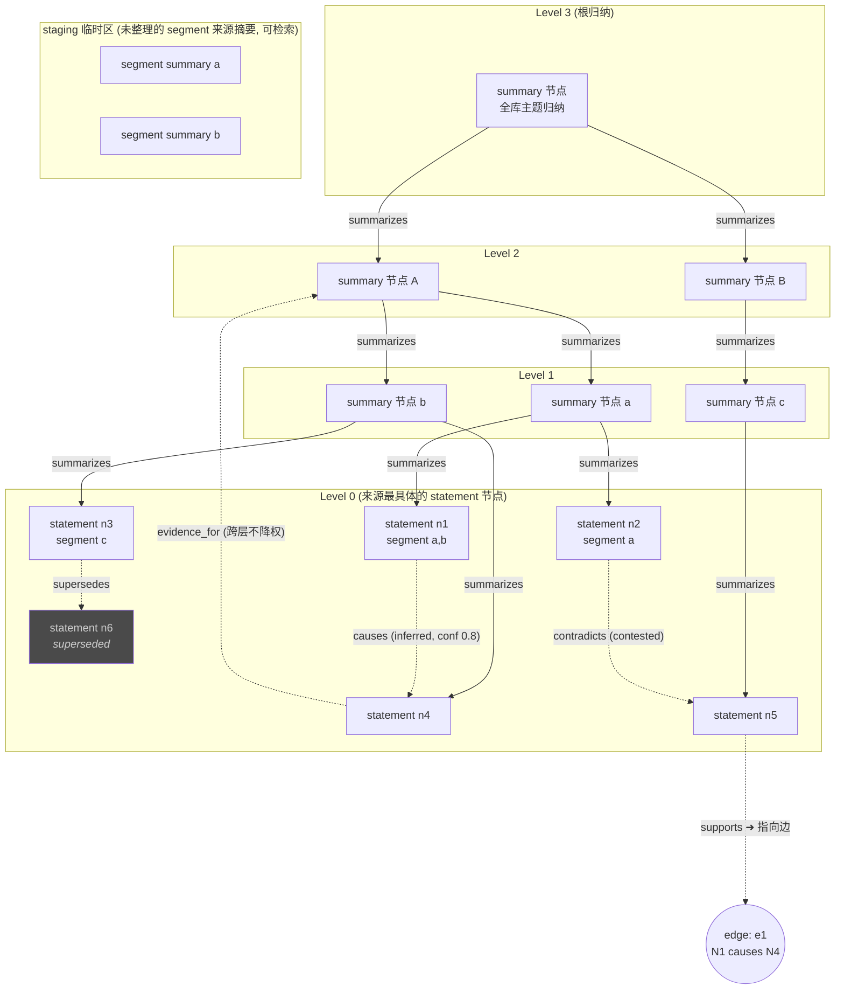
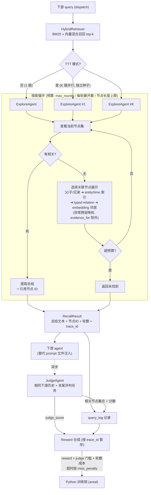
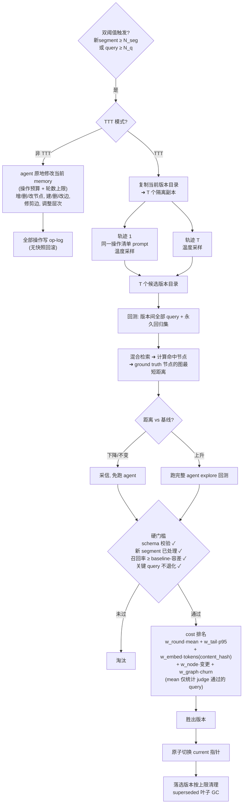

# Graph Memory Reviewer 设计文档

- 日期：2026-08-14
- 状态：已实现（feature/graph-memory-reviewer）；2026-08-14 设计评审调整 A1/A2/A3/A4/A6 已批准并落地（Q27 评判粒度、Q13 回测判定、Q10 触发兜底/退避、Q1/Q23 per-workspace reviewer.type、Q15 预算服务端强制）
- 决策记录来源：AReaL 工作区 `../coversation.md`（第一轮 + 第二轮问答，临时原始记录）；本文件是长期权威设计记录
- 影响面：`multica/server`（新增 graph memory 子系统，替代 memorycuration pipeline）、`areal` Python 训练侧（reward 回传）

## 1. 背景与目标

现有 memory 系统（`multica/server/internal/memorycuration/`）是文件式 pipeline：L1 日报 → L2 候选 → L3 路由分类，落到 `MEMORY.md`。使用侧同时存在两条 legacy 路径：`daemon/prompt.go` 暴露文件路径供 agent 自行读取，`daemon/scoped_memory.go` 则把有界的 scope memory 正文装入执行上下文。当前无任何检索 API（无 BM25、无向量索引）。

本设计新增 **graph reviewer**：层次化 DAG memory，支持配置开关与 legacy 切换：

```
reviewer.type = legacy | graph     # 整条 pipeline 切换，legacy 仅作回退备份
```

目标：

- segment 关闭后生成不可变的 staging 来源摘要；segment 与 graph 节点是多对多关系，整理 agent 决定修改既有节点或创建一个/多个新节点
- graph 节点每个一个 .md（一个 embedding chunk）；节点正文可跨 memory version 演化，版本快照与 op-log 保证可回测、可审计
- 层次结构：父节点是对子节点的归纳/抽象/induction；层数动态，`max_levels` 上限，扇出受限
- 检索：BM25 + 向量混合召回 → memory explore agent 沿图探索 → 返回总结文本 + 引用节点 ID
- TTT：查询时 K 路并行 explore（轮数 + 下游 judge 打分作 reward）；整理时多轨迹修改 + 历史 query 回测选版

## 2. 已确认设计决策（问答压测结论）

| # | 决策点 | 结论 |
|---|--------|------|
| Q1 | 切换边界 | 统一接口，`reviewer.type = legacy \| graph`，存储隔离；reviewer.type 为 per-workspace 设置（`graph_memory_profile` 表），覆盖 daemon/server 进程 env `MULTICA_REVIEWER_TYPE` 默认（A4） |
| Q2 | segment 与节点 | segment 来源记录不可变；segment 可关联多个节点、节点可引用多个 segment；修改既有节点还是新建节点由 memory agent 决定 |
| Q3 | 图模型 | 严格分层 induction DAG（`summarizes` 边）+ 正交 typed relation 边（可成环、稀疏） |
| Q4 | 关系语义 | 一律可撤销假设（`inferred`）；仅原始 segment 声明的为 `asserted` |
| Q5 | 跨层边 | 允许直接创建，检索默认降权，`evidence_for` 除外；记录 `level_delta`，异常跨层要求更高置信度 |
| Q6/7 | 节点/边 | 节点无互斥 kind，统一为 statement（角色由边推导）；**边是一等对象**（edge_id、status、confidence、证据可指向边） |
| Q9 | TTT 选版 | 质量硬门槛 + 成本最小化（不加权抵消） |
| Q10 | 整理触发 | 新 segment 数 + query 数双阈值；增加时间兜底（≥1 新 staging segment 且距上次成功整理 >24h 即触发）与失败退避（连续 3 次整理出错或未切换版本后暂停，直至 staging 总数超过退避水位）（A3） |
| Q11 | TTT 轨迹多样性 | 仅采样温度差异（prompt 固定列操作清单）；暂以 prompt 种子实现，`agent.ExecOptions` 无温度字段（待 P1-13） |
| Q12 | 版本存储 | 每版本完整目录拷贝；embedding cache 全局共享（版本目录外，content_hash 索引）；版本数上限 + 旧版清理 |
| Q13 | 回测 | 对候选版本跑与生产一致的混合检索（同 top-k / bm25_weight，无 embedder 时 BM25-only 但合并逻辑同一）；判定 ground truth 是否落在 top-k 命中节点的 n 跳无向邻域内，n = 原 query 采用路 explore 轮数（回归集用 `baseline_rounds`，旧文件缺省 2）；未覆盖 → 该 query 直接判失败（召回缺失且记回归），不跑 agent；已覆盖 → 接了 FullBacktestRunner 就跑完整 explore 回测，未接则按保守默认判通过；完整回测轮数 > 原轮数 + 容差（`BacktestRoundsTolerance`，默认 1）记回归（A2） |
| Q14 | 层次构建 | 限制扇出，层数动态，`max_levels` 上限 |
| Q15 | 探索预算 | 全参数化（max_rounds、每轮展开数、单节点最大长度），保守默认；预算服务端强制：轮数用尽后 /expand 返回 200 + `{"budget_exceeded":true,"candidates":[]}` 并将轨迹标记 budget-blown，blown 轨迹的 /submit 被记录但强制 Found=false，adoption 一律不采用（A6） |
| Q16 | 非 TTT 整理 | 原地修改无回滚；保留 op-log（追加写）供审计 |
| Q17 | 查询时 TTT | K 路独立探索，各自提交结果与轮数，轮数作 reward；不共享状态 |
| Q18 | ground truth | 异步评判 agent（与下游相同历史 + 末尾评判任务）对召回相关性打分；相关节点集合作回测 ground truth |
| Q19 | 整理终止 | 操作预算 + 轮数上限，agent 预算内自行决定提交 |
| Q20 | 边稀疏化 | agent 自主修剪；修剪决策写 op-log |
| Q22 | 实现位置 | Go 侧为主（multica/server）；reward 跨语言回传 Python 训练侧 |
| Q23 | 切换粒度 | 整条 pipeline 切换（替代 L1→L2→L3 与 prompt 注入检索）；切换按 workspace 生效（profile 覆盖 env，支持按工作区灰度）（A4） |
| Q24 | 叶子入库 | segment 关闭即建叶（`CloseSegmentForEvent` 钩子）→ 轨迹总结 → 临时区；整理时归入层次 |
| Q25 | explore 产出 | 总结文本 + 引用节点 ID 列表（替代 prompt 文件注入） |
| Q26 | 回测窗口 | 相邻版本间全部 query + 永久回归集（曾退化的关键 query） |
| Q27 | K 路评判 | 已确认：每 query 单 judge，分数广播到该 query 的全部 K 路轨迹（实现先行，文档追认；理由：K 路轨迹高相关、逐路评判成本不值；组内优势信号弱）（A1） |
| Q28 | 延迟 reward（暂定） | 轨迹按 query_id 暂存，judge 回写后合成完整 reward；超时按 miss_penalty |

### explore agent 复合 reward（用户补充）

```
reward(轨迹) =
    judge_score < τ   →  miss_penalty          # 比跑满轮数更差
    否则              →  base - w_round * explore_rounds
```

语义：正确性不可被成本抵消（同 Q9 哲学）。TTT 选版的 mean_explore_rounds 只在 judge 通过的 query 上统计。

## 3. 架构

```
┌──────────────────────────── multica/server (Go) ────────────────────────────┐
│                                                                              │
│  segment 关闭 ──► SegmentIngester ──► 临时区来源摘要 (.md + embedding)        │
│ (interaction_dag.go 钩子)         │                                          │
│                                   ▼                                          │
│  dispatch 查询 ──► HybridRetriever (BM25 + 向量, top-k)                      │
│                         │                                                    │
│                         ▼                                                    │
│                   ExploreAgent ×K (TTT: K 路并行, 独立种子)                  │
│                         │  沿 summarizes / relation 边探索, 预算受控          │
│                         ▼                                                    │
│                   总结文本 + 引用节点 ID ──► 下游 agent (替代 prompt 注入)    │
│                         │                                                    │
│                         ▼ (异步)                                             │
│                   JudgeAgent (相同下游历史 + 评判任务)                        │
│                         │  相关性打分 → ground truth 记录 / reward 分量      │
│                         ▼                                                    │
│                   RewardSink ──HTTP──► Python 训练侧 (areal)                 │
│                                                                              │
│  双阈值触发 ──► Consolidator (memory agent)                                  │
│                   TTT: 多温度轨迹 → 版本目录隔离 → 回测 → 硬门槛+成本选版     │
│                   非 TTT: 原地修改 + op-log                                  │
│                                                                              │
│  存储: versions/<vN>/{nodes/*.md, edges/*.jsonl, manifest.json}              │
│        shared/embeddings/ (content_hash 索引, 跨版本)                        │
│        query_log/ (query → 引用节点, judge 分, 基线图距离)                   │
│        op_log/  (整理操作审计)                                               │
└──────────────────────────────────────────────────────────────────────────────┘
```

## 4. 存储格式

### 4.0 memory 结构总览



图例：实线 = `summarizes` 严格分层 DAG（参与层级计算，探索主路径）；虚线 = typed relation 边（可成环、可跨层、可指向另一条边）。segment 来源摘要本身不可变；整理 agent 可让多个 graph 节点引用同一 segment，也可修改既有节点或创建新节点。节点角色（summary/evidence/claim）由边推导，节点本身无互斥类型。

### 4.1 目录布局

```
memory_graph/
├── current -> versions/v173/          # 原子切换指针（symlink 或文件）
├── versions/
│   └── v173/
│       ├── manifest.json              # 版本元数据：版本号、父版本、创建时间、创建者(agent|ttt)、统计
│       ├── nodes/
│       │   └── <node_id>.md           # 每节点一文件 = 一个 embedding chunk
│       └── edges/
│           ├── hierarchy.jsonl        # summarizes 边（严格 DAG）
│           └── relations.jsonl        # typed relation 边（可成环）
├── shared/
│   └── embeddings/
│       └── <content_hash>.vec         # 跨版本共享向量缓存
├── staging/
│   └── segments/
│       └── <segment_id>.md            # 不可变来源摘要；整理后仍保留 provenance
├── query_log/                         # 相邻版本间 query 记录（回测用）
│   └── <window_id>.jsonl
├── regression_set.jsonl               # 永久回归集（曾退化的关键 query）
└── op_log/
    └── <version>.jsonl                # 整理操作审计
```

### 4.2 节点文件（`<node_id>.md`）

Frontmatter + 正文。正文即 embedding chunk。

```markdown
---
node_id: "uuid"
content_hash: "sha256:..."        # 仅正文哈希；元数据变更不重 embedding
segment_refs: ["session-traj-1"]  # 来源引用；segment↔node 多对多
level: 0                          # 由整理维护；0 = 最具体 statement 层
epistemic_status: proposed | supported | accepted | contested | rejected | superseded
entity_refs: ["ent-abc"]          # 实体倒排索引键
observed_at: "2026-08-14T10:00:00Z"
valid_from: null
valid_to: null
refresh_after: null               # 到期需重新验证
temporal_status: current | stale | expired | unknown
tags: ["dispatch", "routing"]     # 内容域标签（非结构类型）
created_by: "ingester|consolidator"
created_version: 173
updated_version: 173
---

<正文：statement / segment 总结 / 子节点归纳>
```

约束：

- 节点无互斥 kind；summary/evidence/claim 角色由边推导（`summarizes` 出边 → summary 角色等）
- claim 原子性：只表达一个可独立验证的主命题；需要精确关系时拆独立节点
- segment 来源摘要不可变；graph 节点可由 memory agent 在候选版本中修改或新建，正文变化产生新 `content_hash` 并计入 embedding 成本
- 同一 segment 可关联多个节点；同一节点也可聚合多个 segment 的证据

### 4.3 边文件

`hierarchy.jsonl`（严格 DAG，参与层级计算）：

```json
{"edge_id":"e1","type":"summarizes","from":"<parent>","to":"<child>","created_by":"consolidator","created_version":173}
```

`relations.jsonl`（一等对象，可成环，不参与层级计算）：

```json
{
  "edge_id": "e42",
  "type": "causes|enables|prevents|contradicts|incompatible_with|counterexample_to|violates|supersedes|refines|invalidates|supports|evidence_for|derived_from",
  "from": "<node_id>",
  "to": "<node_id>|edge:<edge_id>",
  "status": "proposed|supported|accepted|contested|rejected",
  "epistemic": "asserted|inferred",
  "confidence": 0.82,
  "reason": "...",
  "source_refs": ["segment-x"],
  "source_level": 0,
  "target_level": 2,
  "level_delta": 2,
  "created_by": "consolidator",
  "created_version": 173
}
```

要点：

- 证据可指向节点，也可指向另一条边（`to: "edge:e42"`）——支撑「用新交互验证因果假设」
- 跨层规则：因果/冲突/演化同层优先，跨多层需更高置信度；`evidence_for` 跨层不降权
- 同一实体、时间先后不持久化为边（由 `entity_refs` / 时间字段索引推导）；embedding 邻居动态计算，不入权威图

## 5. 核心流程

### 5.1 segment 来源入库（segment 关闭即进入 staging）

1. `CloseSegmentForEvent`（`service/interaction_dag.go:171`）钩子触发
2. SegmentIngester：导出轨迹 → LLM 总结 → 写不可变 `staging/segments/<segment_id>.md` → 计算 embedding（content_hash 命中 `shared/embeddings/` 则复用）
3. staging 来源摘要立即可被检索，但尚不是正式 graph 节点
4. 整理周期由 Consolidator 消费 staging：memory agent 可修改已有 graph 节点，或创建一个/多个新节点，并写入对应 `segment_refs`、层级边与 relation 边

### 5.2 检索（explore agent）



要点：

1. HybridRetriever：BM25 + 向量混合召回 top-k（新建组件，Go 侧）
2. ExploreAgent（非 TTT 1 路 / TTT K 路并行，不同种子）：
   - 每轮：查看当前节点 → 判断相关则提取总结返回；否则选择关联节点展开（父/子/兄弟 → entity/time 索引 → typed relation → embedding 邻居，优先级递减）
   - 预算：max_rounds、每轮展开数、单节点最大长度，全参数化，保守默认；超预算返回未找到
   - 异常跨层边（|level_delta|>1 的因果/冲突/演化）检索降权；`evidence_for` 不降权
3. 返回：总结文本 + 引用节点 ID 列表（替代 prompt 文件注入，dispatch 集成）
4. 记录 query_log：query、各路径引用节点、轮数、时间戳

### 5.3 异步评判（judge）

1. 召回交给下游 agent 后，异步触发 JudgeAgent：与下游相同历史，末尾追加评判任务
2. 产出：相关性分数 + 相关节点集合 → 写回 query_log（该 query 的 ground truth + 基线图距离）
3. judge 失败/超时：该 query 不进回测集
4. reward 合成：explore 轨迹按 query_id 暂存，judge 回写后合成完整 reward（Q28 暂定；超时按 miss_penalty），经 HTTP 回传 Python 训练侧

### 5.4 整理（consolidation）



文字说明：

触发：新 segment 数 ≥ N_seg **或** query 数 ≥ N_q（双阈值）。

**非 TTT**：agent 在当前 memory 原地修改（操作预算 + 轮数上限内：增/删/改节点、建/删/改边、修剪边、调整层次），全部操作写 op-log，无快照回滚。

**TTT**：

1. 复制当前版本目录 → T 个隔离副本（Q12）
2. T 条轨迹并行：同一操作清单 prompt，仅采样温度不同（Q11）；各自在副本上整理，产出 T 个候选版本目录
3. 回测（Q13/Q26）：对版本间全部 query + 回归集：
   - 先做混合检索，计算命中节点 → ground truth 节点的图最短距离（≈ explore 轮次）
   - 距离下降/不变 → 直接采信，免跑 agent；距离上升 → 跑完整 agent explore 回测
4. 硬门槛（Q9）：schema 校验通过、新 segment 已处理、召回率 ≥ baseline（容差可配）、关键 query 不退化 → 未过门槛淘汰
5. 合格候选按 cost 最小化选版：

```
cost = w_round·mean_rounds + w_tail·p95_rounds + w_embed·norm(embedding_tokens)
     + w_node·norm(changed_nodes) + w_graph·norm(edge_churn)
```

   embedding 成本按 content_hash 计（元数据变更、移动层级不计；删除只计索引删除）
6. 胜出版本：原子切换 `current` 指针；落选版本按版本数上限清理；mean_rounds 仅统计 judge 通过的 query

### 5.5 垃圾回收

- `superseded` 节点：不再被任何保留版本 manifest 引用且超过保留期 → 删除（embedding cache 按引用计数保留）
- 旧版本目录：保留最近 V_max 个，超出删除

## 6. 接口（Go 侧，草案）

```go
// 统一切换接口
type MemoryReviewer interface {
    Retrieve(ctx context.Context, q Query) (RecallResult, error)      // 总结文本 + 节点 ID
    IngestSegment(ctx context.Context, seg SegmentExport) error       // 不可变来源摘要入 staging
    Consolidate(ctx context.Context, opts ConsolidateOptions) (ConsolidateResult, error)
}

type RecallResult struct {
    Summary  string
    NodeIDs  []string
    TraceID  string   // query_id，judge 回写与 reward 合成键
    Rounds   int
    AgentRuns []ExploreRun // TTT: K 路
}

type JudgeSink interface {
    Submit(ctx context.Context, traceID string, downstreamHistory []Message, recall RecallResult) error
}
```

配置（草案，最终落 `cli_args`/server config 时细化）：

```yaml
reviewer:
  type: legacy | graph
  graph:
    storage_dir: ...
    max_levels: 4
    max_fanout_per_node: 8
    retrieval:
      top_k: 10
      bm25_weight: 0.5
    explore:
      agents: 4            # TTT K 路；非 TTT = 1
      max_rounds: 3
      max_expand_per_round: 5
      max_node_chars: 2000
    judge:
      timeout_seconds: 300
      relevance_threshold: 0.6   # τ
    consolidation:
      trigger_segments: 50
      trigger_queries: 200
      op_budget: 50
      round_budget: 10
      ttt_trajectories: 4
      recall_tolerance: 0.02
      cost_weights: {round: 1.0, tail: 0.5, embed: 0.2, node: 0.1, graph: 0.05}
    versions:
      keep: 5
      superseded_retention_days: 30
```

## 7. 观测性

- 指标：检索命中率、平均 explore 轮数（judge 通过子集）、judge 通过率、回测免跑率（图距离代理命中比例）、整理 op 数、版本切换/回退事件
- 日志：query_log、op_log、版本 manifest 均落盘可审计
- stats：接入现有 stats_tracker / server metrics

## 8. 遗留项（实现前确定）

1. Go 侧 embedding 服务选型（本地模型 vs 远程 API）
2. BM25 实现选型（Go 库 vs DB 全文检索）
3. judge agent prompt 与评分量表（τ 标定方法）
4. Go→Python reward 回传接口细节（鉴权、重试、乱序到达）
5. K 路 judge 成本核算（Q27 暂定方案的预算上限）
6. 延迟 reward 的超时参数与训练 buffer 滞留策略（Q28 暂定方案）
7. legacy → graph 的数据迁移策略（存量 MEMORY.md 是否导入图为初始叶子）

## 9. 风险与缓解

| 风险 | 缓解 |
|------|------|
| Q11 仅温度采样 → 轨迹同质化 | 硬门槛淘汰雷同低质候选；操作清单 prompt 保证操作序列差异 |
| Q16 原地修改不可逆 | op-log 全量审计，可人工逆向；TTT 模式不受影响（版本目录） |
| 图距离 ≈ explore 轮次是近似 | 基线与回测统一存图距离口径；距离上升才触发真实 agent 回测兜底 |
| K 路 judge 成本 | judge 调用计入 TTT 预算；必要时降级为只评采用路（Q27 备选） |
| 跨层伪因果 | level_delta 记录 + 检索降权 + 高置信度要求 |
| 边爆炸 | agent 自主修剪 + op-log 审计 + 每节点 top-M 建议（Q20，agent 执行） |
