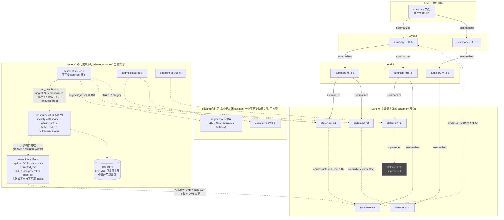
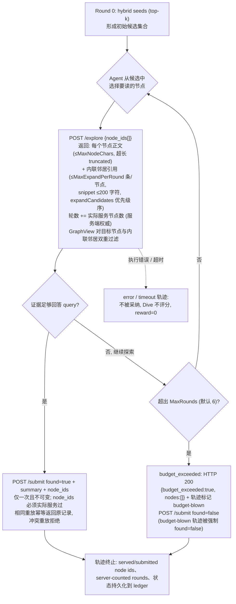
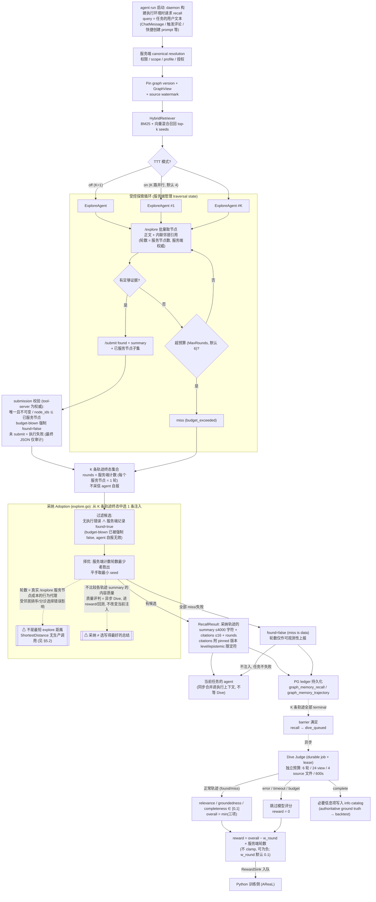

# Legacy Memory 与 Graph Memory：逐步对比

面向当前 `comet/graph-memory-dive-judge-build` 实现的工程对比：从记忆组织、触发与检索，到检索质量、训练反馈和整理/版本治理。

- **比较对象**：Legacy mode vs Graph mode
- **范围**：服务端与 daemon 执行路径
- **生成时间**：2026-08-20；2026-08-23 按 `/view`+`/expand` 合并为 `/explore` 协议与 D_q 预算联合集回测的重设计（2026-08-21 落地）复核修订，含 per-workspace 图布局、日报写入器、治理/训练接口

> **阅读边界。** 这里的"Legacy"指现有 agent-root 文件记忆与 `memorycuration` 管道；"Graph"指当前完成分支的服务器权威 Graph Recall / Explore / Dive / Consolidation 管道。两者由 workspace 的 `memory_type=legacy|graph` 选择。Graph 模式仍允许用户/agent 范围的 legacy 记忆（user/member scope，以及除 legacy 日报外的 agent scope——日报由图接管），与 graph 注入**合并**而非替换；但不会在 Graph Recall 失败时回退到 legacy 的项目、频道、日报、workspace 或 team 记忆。首次激活 graph 时起空图，不迁移、不改动任何 legacy 文件（empty-start 契约）。

## 一页结论

| 问题 | Legacy Memory | Graph Memory |
| --- | --- | --- |
| **核心抽象** | 按 scope 划分的 Markdown 文件；执行时按优先级拼接、去重、截断。 | 带来源、可见性、时间与认识状态的版本化图；节点、边、来源、查询、轨迹和打分分别可审计。 |
| **检索** | 没有 query 驱动的 BM25/向量检索 API；把有限文件正文提前注入上下文，或让 agent 按路径自行读取。 | 任务开始时由 server 解析权限/范围/版本，BM25+向量取种子，再由 Explore 沿图做受预算约束的检索。 |
| **对当前任务的影响** | 固定记忆片段与当前 prompt 一起交给 agent。 | 同步返回受限的总结、引用与轮数；Dive 之后不会改写已经注入当前任务的内容。 |
| **质量判断** | 主要是整理候选的置信度/敏感性与人工/LLM 路由；不产生检索相关性、证据性、完整性分数。 | 混合检索排名 + Explore 成功/轮数 + 异步 Dive 的相关性、groundedness、completeness；结果进入 reward、ground truth 与回测。 |
| **整理与演化** | 日报 -> review 候选 -> 路由/提升 -> 过期清扫/文本去重；直接修改文件。 | 不可变 source 入库 -> staging -> 图整理；TTT 时并行候选版本、以 D_q 预算联合集回测硬门槛淘汰、按成本选胜者并原子切换。 |

## 1. 记忆组织形式与结构

### Legacy：按路径/范围分桶的文件集合

```
MULTICA_AGENT_ROOT/
├── memory/MEMORY.md         # 跨项目 agent 记忆
├── memory/STATE.md          # agent 当前状态
├── memory/daily/YYYY-MM-DD.md
├── memory/REVIEW.md         # 待审候选
├── users/<member>/{USER,RELATIONSHIP}.md
├── projects/<project>/{MEMORY,STATE,DECISIONS}.md
└── channels/<channel>/CONTEXT.md
```

- 文件本身既是持久化单元，也是注入单元；内容是 Markdown bullet/block。
- scope 由目录决定：user、agent、project、channel，以及 server-memory 的 workspace/team 等。
- 文件有单项来源/过期等元数据约定，但不是可遍历的知识图，也没有版本快照图。
- 执行内存上限为 `16 KiB`：按优先级装配，内容哈希去重，超额截断。

### Graph：每 workspace 分 scope 的物理图 + 版本化分层 DAG + 关系图

```
<workspaces_root>/<workspace-id>/memory_graph/
├── projects/<project-id>/       # project 图；channels/<channel-id>/ 结构相同
│   ├── .graph_identity.json     # 不可变身份标记 {workspace_id, kind, owner_id}
│   ├── protocol                 # 协议代际标记（gen 2 = /explore 协议；旧代际 Init 时整图 wipe，gen 更新则 fail-closed）
│   ├── shared/sources/          # 不可变 level -1 segment/file 来源
│   ├── versions/vN/
│   │   ├── manifest.json        # 版本、父版本、source watermark
│   │   ├── nodes/<id>.md        # 一个节点 = 一个 embedding chunk
│   │   └── edges/{hierarchy,relations}.jsonl
│   ├── current                  # 原子指向当前版本
│   ├── query_log/               # 窗口 query 日志（regression_set.jsonl 已随 gate 4 一并删除）
│   └── op_log/                  # 整理、拒绝、选版审计
└── channels/<channel-id>/       # channel 图，结构同上
```

- **level -1：** 不可变 segment/file source；文件按"图 scope + attachment ID"标识，blob SHA-256 只复用字节，不合并节点身份。
- **level 0+：** 描述/原子 statement 和更高层摘要。节点包含正文、来源、时间、可见性、认识状态、版本、实体索引与 extraction 元数据。
- **两类边：** `summarizes` 为严格分层 DAG；typed relation 可跨层、可成环，且边是一等对象，可被证据指向。
- **物理布局是 canonical per-workspace 分 scope 布局**：只存在 `<root>/<ws>/memory_graph/{projects|channels}/<owner-id>`，无 root 级或 workspace 级回退；每个图根带不可变 `.graph_identity.json`，身份不匹配 fail-closed（`graph_identity_mismatch`）。
- 节点与 segment 携带 scope 与单调递增的 provenance；每次检索逐步施加 GraphView 可见性过滤。
- 图原生日报节点（`daily:<agent>:<project>:<channel|none>:<YYYY-MM-DD>`）在 Graph 模式接管日报记忆，见第 7 节。
- 每个图版本使用 source watermark，历史版本看不到之后新发布的 source；查询与整理均可追溯到固定版本。

### 记忆层次、来源与关系结构图（源自旧设计 §4.0，已补充当前实现的多模态来源层）



> 实线是严格分层的 `summarizes` DAG；虚线是可跨层、可成环的 typed relation。staging 中每个文件是**一个已关闭 segment 的摘要**（LLM 总结，失败时退化为确定性抽取摘要；写入后不可变），可立刻检索但尚未成为正式图节点；segment 原文是 level -1 来源层的不可变 segment source（图中 SEGa/b/c），摘要经 provenance 可回溯到原文。
>
> **多模态附件的组织（当前实现）：** 每个附件是一个不可变 level -1 file source 节点，身份为“图 scope + attachment ID”；字节经 SHA-256 blob 寻址，跨 scope 只复用字节、从不合并节点身份。segment source 与 file source 之间由 ingest 专有的 `has_attachment` provenance 边连接——整理操作不能新增/修改它，也不计入 fanout/relation degree 限制。媒体内容由服务端异步、有界地提取（caption / OCR / transcript / extracted_text），产物按 generation 不可变追加（`shared/sources/artifacts/<source>/<kind>/gen_N.json`），提取失败或格式不支持不阻塞 source 入库；Dive 评判时可在预算内（默认 4 个 source 文件）经服务端 source 工具查证原始媒体。channel 图中的 file source 可经授权提升（promote）到 project 图。

## 2. 检索时机：什么时候取记忆？

| 阶段 | Legacy | Graph |
| --- | --- | --- |
| **任务启动前/执行环境构建** | 调用 `prepareExecutionMemory`：读当前 user/project/channel/agent/daily 文件及 server memories，排序、去重、截断后注入。 | daemon 向 authenticated recall endpoint 提供 canonical task/runtime/daemon/trace + query；调用者携带的 graph scope、版本、profile、K、training-mode 仅是诊断字段，不能授权。 |
| **任务执行中** | 没有服务端 query 检索循环。Agent 可按运行时指引自行打开已知文件路径；是否读、读多少由 agent 决定。 | server 同步完成 Recall/Explore 后，才把 bounded injection 交给下游业务任务；不是让 daemon 自己在本地挑路径。 |
| **任务执行后** | 后续 curation 定时/按阶段运行，更新日报、候选与文件；不对本次检索结果作在线评价。 | 所有 Explore 轨迹结束后才排队异步 Dive；Dive 是训练/审计/ground truth 的反馈，不阻塞当前任务，也不改写该任务的注入。 |
| **失败语义** | 文件缺失通常只是不注入对应片段；其他 scope 仍可参与装配。 | Graph recall 失败不让业务任务失败，也不回退到 legacy 的 project/channel/daily/workspace/team 记忆；白名单仅保留 user/member scope 与 agent scope（排除 legacy 日报，日报由图接管），且是与 graph 注入**合并**，从不替换 legacy user/agent 快照。 |

## 3. 检索流程：从 query 到下游注入

### Legacy 流程：固定装配，而非检索

1. **解析 task scope** — user / project / channel / agent
2. **读取固定路径** — MEMORY、STATE、DECISIONS、CONTEXT、日报等
3. **排序与去重** — 优先 user，再 project、channel、agent/daily；内容 hash 去重
4. **16 KiB 截断** — 按剩余预算裁剪
5. **注入执行上下文** — 下游 agent 直接获得拼接片段

> 它没有"query -> 候选文档 -> 重排序 -> 图探索"的独立检索链路。质量主要取决于文件维护质量、scope、优先级和预算。

### Graph 流程：服务器权威的 Recall -> Explore -> Injection，渐进式披露

1. **Canonical resolution** — 读 task、workspace profile、agent training mode、路由/授权与 graph identity
2. **Pin snapshot** — 固定一个 graph version、view 与 source watermark；同次调用不换图
3. **Hybrid seeds** — BM25 + vector，默认 top-k 10；每步重新施加 GraphView 可见性
4. **Explore × K** — TTT off = 1；on = 保存的每次 recall K；轨迹彼此独立
5. **Adopt & inject** — 选成功且轮数最少的轨迹；返回有界 summary + citations + rounds

> 注入上限：summary 4,000 chars、citation 16 条。重放相同 trace 读取已持久化 ledger（PostgreSQL `graph_memory_recall` / `graph_memory_trajectory` 表），不重新调用 provider。Explore 消费的是服务端下发、按 workspace profile 解析的**每次调用生效 profile**（resident/channel 消息路径与 claimed-task 路径均下发），而非 daemon 进程级配置。

### Graph Explore 的受控循环

1. **Round 0** — hybrid seed candidates 形成第一个候选集合
2. **/explore** — 一次批量调用 `{trajectory_id, node_ids[]}`：返回每个目标节点的完整正文（截断到 MaxNodeChars）**加内联邻居引用**（id/via/level/snippet，≤MaxExpandPerRound 条，沿用 `expandCandidates` 优先级：hierarchy 父子 -> entity 共现 -> typed relation -> embedding 邻居）；**轮数 = 实际服务的节点数**（服务端权威计数，agent 自报轮数被忽略）
3. **/submit** — 提交 found/summary/已服务节点子集；服务端接受唯一最终 submission；budget-blown 轨迹被强制 found=false



### /explore 的合并语义（2026-08-21 协议重设计）

旧协议的 `/view`（读正文，消耗 per-batch view 配额）与 `/expand`（看邻居 snippet，消耗轮次）已合并为单一 `/explore`（`handleExplore`）：一次调用同时返回目标节点正文与内联邻居引用。

- **一次调用 = 正文 + 邻居。** agent 看到一个节点时同时看到其邻居引用（id/via/level/snippet，snippet ≤ 200 字符）；要读某个邻居的全文，需对该邻居再调一次 `/explore`。
- **轮数与真实成本对齐。** 旧协议轮数衡量的是“展开次数”（`/view` 免费、`/expand` 计轮），agent 能免费读大量节点、只把轮数花在展开上，轮数信号与工具调用耦合；新协议 **1 个服务节点 = 1 轮**，批量调用按实际返回节点数线性计轮、不绕预算，服务端权威计数，agent 自报轮数被忽略。
- **两个独立上限保留**：正文 `MaxNodeChars=2000`（超长置 `truncated`）+ 邻居条数 `MaxExpandPerRound=5`，不合并成单一上限，防高度节点撑爆 agent 上下文。
- **预算硬约束在服务端**：轮数耗尽后 `/explore` 返回 HTTP 200 `{"budget_exceeded":true,"nodes":[]}`，轨迹标记 budget-blown，`/submit` 强制 `found=false`；超预算轨迹不被采纳。
- **可见性语义与旧协议一致**：GraphView 过滤同时作用于请求的目标节点与内联邻居（channel-only 节点不能经 project 视图泄漏），不可见节点与“不存在”同形（fail closed）；staging 段不可 expand。

便宜的邻居 snippet 分诊 + 读全文计轮的组合不变，这个分诊决策仍是探索质量训练的对象；`submitted_node_ids ⊆ served_node_ids` 的可审计链与服务/提交状态分离持久化、轨迹可逐步回放均保持。

每条轨迹持久化 `served_node_ids` 与 `submitted_node_ids`（后者是前者的子集）、server-counted rounds（= 服务节点数）、状态和模型元数据。agent 的最终 JSON 响应仅作审计；权威结果是 tool-server 记录的唯一 submission--未 submit 的轨迹视为执行失败。超预算、超时或执行错误不会被采纳；正常 found/miss 都会进入后续 Dive。

### Recall / Explore / Dive 全流程（当前实现）



> 此图按当前实现绘制：旧设计中的 Outcome Judge（相同下游历史 + 末尾评判、固定 miss_penalty）已被服务器权威的异步 Dive Judge 取代。Dive 不阻塞当前任务的注入，也不改写已注入内容；其产出的必要信息项成为后续 candidate backtest 的权威 ground truth。

### Explore 的总结如何返回频道群聊里的 agent（端到端通路）

> 回答一个常见问题：explore agent 找到足够信息并 `/submit found=true` 后，summary **会**返回给频道群聊里的那个 agent——但形式是"召回记忆注入进它的运行时 prompt"，**不是**以一条消息发到群聊时间线；群内其他成员看不到这段 summary。

1. **频道消息派发时盖章 profile** — server 在 channel 消息 delivery 上附工作区生效的 graph memory profile（`handler/channel_message_delivery.go` → `applyGraphMemoryProfileToDelivery`，`handler/graph_memory_profile.go:398`）。
2. **daemon 发起召回** — 执行该任务的 daemon 用**用户消息原文**作为 query（`graphRecallQuery`：ChatMessage / 触发评论 / 快捷创建 prompt 等），调 `POST /api/daemon/graph-memory/recalls`（`daemon/graph_memory.go:34`）。daemon 从不本地解析图路径或运行 Explore（server-authoritative，spec §14）。
3. **服务端入口与账本** — `handler/graph_memory_recall.go` 的 `RequestGraphMemoryRecall`：要求 daemon capability；`Begin` 先落 recall ledger（新召回 202、幂等重放 200、冲突/已终结 409）；随后 `GraphMemoryRecallExecutor.Execute` 同步运行 Explore。
4. **/submit 与采纳** — 轨迹的最终提交不可变、提交的节点必须实际经 `/explore` 服务过、超预算轨迹被强制 `found=false`；采纳所有 `found=true` 轨迹中轮数（= 服务节点数）最少的一条。
5. **injection 组装** — `graphMemoryRecallInjection`（`service/graph_memory_recall_execute.go:258`）把采纳轨迹的 summary（截断 4,000 字符）+ citations（≤16 条）拼成 injection 文本块，随 HTTP 响应返回（`found` / `summary` / `citations` / `rounds` / `injection`）。
6. **daemon 注入执行环境** — `found=false` 或 injection 为空 → 静默降级、不注入任何内容、任务不失败（"recall miss is data"，spec §1）；否则包装为一条 `MemoryContextForEnv{Name: "Graph memory recall"}`，由 `renderPromotedMemorySnapshot`（`daemon/execenv/runtime_config.go:962`）渲染进群聊 agent 的运行时 prompt。agent 随后在群里的回复基于这些召回内容。

召回通路的边界行为：

| 场景 | 行为 |
| --- | --- |
| Explore 全部未找到 / 出错 | `found=false`，daemon 不注入，任务照常运行 |
| 工作区未启用 graph memory | 返回 `{"status":"disabled"}`，不注入 |
| 无图作用域（no scope） | 返回 `{"status":"no_scope"}`，不注入 |
| 相同 trace 重放 | 幂等 200，直接返回已持久化的 injection，**不再运行 explore agent** |
| 冲突 / 已终结的重放 | 409 `RECALL_CONFLICT` / `RECALL_FINALIZED`，零 provider 调用 |
| 非 daemon token 调用 | 403（机器端点，裸用户 token 不可用） |

## 4. 检索质量如何打分？

| 层面 | Legacy | Graph |
| --- | --- | --- |
| **候选/排序分** | 无 query 排名分。仅按 scope priority、文件顺序、去重和预算决定哪些文本进入上下文。 | 每个候选文档的生产检索分：`final = w × normalized(BM25) + (1−w) × vectorSimilarity`；默认 `w=0.5`；cosine 被映射到 [0,1]；无 embedder 时退化为 normalized BM25。 |
| **检索/回答质量分** | 没有针对"本次记忆是否帮助回答 query"的相关性、证据性或完整性评分，也没有 reward 回路。 | Dive 对每个正常完成的 Explore trajectory 输出三个连续分数，均在 [0,1]：**relevance**、**groundedness**、**completeness**。它读取 pinned version、trajectory summary、served/submitted nodes，并可在限制内检查 source evidence。 |
| **overall 与 reward** | L3 的 0.80/0.90 阈值是"候选是否被自动路由/丢弃"的整理安全阈值，不是 retrieval quality reward。 | `overall = min(relevance, groundedness, completeness)`；`reward = overall − w_round × server_counted_explore_rounds`，`w_round` 默认 0.1（workspace profile 可调，服务端封顶）。reward 不 clamp，可为负；error/timeout/budget trajectory 跳过模型评分，reward=0；不使用固定 miss penalty 或 score pass/fail 阈值。 |
| **长期质量/ground truth** | 可记录 L3 review trace、置信度、敏感性、路由和去重，但没有由每个 query 导出的权威检索 ground truth。 | 完整 Dive 生成必要信息项（necessary information items）：跨 item 为 AND，单 item 内等价节点为 OR。incomplete/judge_failed 仅审计，不能成为权威 backtest ground truth。 |

| **训练对接** | curation 的 review trace 不进入训练管道。 | 每次 recall 的 K 条 Explore 轨迹与 Dive 结果持久化于 PG ledger；offline export 以 NDJSON 逐行给出 eligible/excluded（带机器可读排除原因）；online RL 由 RL session 服务持久化 AReaL session 映射，Dive worker 完成时将 reward 经 RewardSink 入队。 |

> 因此要区分三件事：① Hybrid 分数负责"先找哪些种子"；② Dive 分数负责"这次 Explore 的质量与训练 reward"；③ candidate-version backtest 负责"整理后的图能否被提升为 current"。

## 5. 当前实现检查：最短距离上界、回测与 TTT 选版

> **结论先行。** 当前实现**不**把“检索种子到 ground-truth 的最短图距离”的平均值作为 TTT 唯一或直接优化目标。`Graph.ShortestDistance` 目前只由图单测调用。2026-08-21 重设计后，候选回测先按 **D_q 变化度**做预算分配：每个候选独立选出变化最大的 top-B query，所有候选在**各候选 top-B 的并集**上实测（结构覆盖检查 + 可用 Runner 时的真实 `/explore`）；永久回归集与 gate 4 已整体删除。最终版本选择仍是“硬门槛先过滤，再多目标成本最小化”。

### 5.1 回测样本、结构覆盖与 D_q 预算分配

**回测样本。** `BacktestQueries` 读取每个 query-log window 中 version 落在 `(previousVersion, currentVersion]` 的全部 trace（按 TraceID 去重，含尚未异步判定的条目）；永久回归集已随 gate 4 删除，没有独立的“latest batch”目标函数。窗口 query-log **条目总数**（不只已判定条目）另用于冷启动判定（§5.3）。

**结构覆盖检查（每条实测 query）。** 以与生产同配置的 hybrid retriever 取非 staging 的 top-k seed 集 `S_q(G)`；`n_q` 取该 query 记录的 baseline Explore rounds（无记录时默认 2）；hierarchy 与 relation 边按**无向**邻接遍历得到 `N≤n_q(S_q)`；ground truth 取 query-log 记录的 `RelevantNodes`，**非空且全部落入该 n-hop 邻域**才算 covered：

```
S_q(G) = topK_hybrid(q, G)
n_q = recorded baseline Explore rounds (default 2)
Covered(q,G) ⇔ RelevantNodes(q) ≠ ∅ ∧ RelevantNodes(q) ⊆ N≤n_q(S_q(G))
```

未覆盖的 query 不跑 Explore（结构不可达，跑了也白跑），记 `Covered=false` 并进 recall 统计；baseline 曾成功则记回归。

**D_q 变化度评分**（`backtest_budget.go`；预算分配信号，不是检索质量分）。对候选 `G` 与 baseline、逐 query 计算：

```
D_q(G) = L1 + L2 + ε·L3        (ε = 0.2)
L1 = Jaccard 距离(检索命中节点 id 集, 候选 vs baseline)      # seed 变化
L2 = closure 内节点正文 hash 差异比例与边 churn 比例的均值     # 结构邻域变化; closure 半径 = ExploreMaxRounds
L3 = Jaccard 距离(expand 邻居 id 集, 候选 vs baseline)        # 邻居列表变化; 复用 expandCandidateRefs 的优先级与截断
```

两个快照完全一致时 `D_q = 0`。注意与本文旧稿中“用于解释覆盖检查的理论最短距离 `D_q(G)=max_j d_qj`”区分：那个距离代码从不计算或持久化；如今持久化计算的 `D_q` 是**候选相对 baseline 的变化度**，用途是把 Explore 预算花在“最可能回归”的 query 上。回测闭包半径取 workspace profile 解析出的 `explore_max_rounds`（与生产同源），保证 D_q 的 L2 与真实 Explore 的预算一致。

**预算分配：每候选独立 top-B + 并集实测。**

- 每个候选**独立**按 D_q 降序取 top-`B`（`B = min(窗口 query 数, 16)`；同分按 query 文本字典序破平，可复现）；窗口 ≤ B 时退化为全量实测、无跳过。
- **实测集合 = 各候选 top-B 的并集**，且**所有候选都在并集上实测**。不同候选改动的子图区域不同，全局排序会测大量无关 query；而若各候选各测不同 query 集，`MeanRounds`/`P95Rounds` 在不同样本上计算，`SelectWinner` 的 Cost 比较失真。并集保证同样本、同分母；成本上界 = |并集| × T（T = 候选数，默认 4），候选改动区域重叠多时并集远小于 T·B。
- **跳过的诚实语义。** 未入并集的 query 不跑 Explore，记 `Rounds=0`、`skipped=true`、保留 D_q 值与跳过原因；跳过的 query **不进 Mean/P95、不进 recall**，不冒充实测。无 Runner 模式（T ≤ 1）维持 `AcceptedWithoutExplore` 现状，跳过逻辑不适用。

### 5.2 "图距离 = Explore 步数上界"应如何严谨表述？

| 说法 | 是否准确 | 原因 |
| --- | --- | --- |
| "当前代码计算并最小化最短距离。" | **不准确** | 没有生产调用 `ShortestDistance`，也没有 distance 的平均损失、梯度或排序项。 |
| "n-hop coverage 是图距离与 Explore rounds 的结构代理。" | **准确** | 候选证据须落入从检索 seed 出发、半径为历史 `n_q` 的无向邻域；它检查在该 hop 预算内是否存在结构路径。 |
| "最短图距离是实际 Explore 所需轮数的严格上界。" | **不准确** | 最短路径只说明存在一条理想路径，通常是实际工具交互/agent 决策成本的乐观下界或可达性代理；邻居排序、分诊选择错误、relation 语义、提交规则均可能让真实 Explore 更慢或失败。 |
| "若 GT 全部位于 n-hop 邻域内，agent 必能在 n_q 轮找到全部事实。" | **不准确** | 这是必要的结构可达性证据，不是充分的行为保证。真实 Explore 才验证 agent 在候选图、模型和预算下是否 `found`。 |

更准确的工程措辞是：**n-hop coverage 用历史 Explore rounds 作为半径，测试候选图是否至少保留了预算内的结构可达性；它是 optimistic reachability surrogate，不是实际 Explore rounds 的等式或保证。**（新协议下 rounds = 服务节点数，半径含义从“展开次数”变为“访问节点数”，取值来源不变。）

### 5.3 回测的两层验证与当前 hard gates

1. **结构层：** 构建 candidate version 的 hybrid retriever，计算 top-k seeds 与 n-hop 邻域；ground truth 未覆盖时该 query 直接 candidate miss，baseline 曾成功则记为回归。
2. **行为层：** 若结构覆盖且安装了 `FullBacktestRunner`，`ExploreBacktestRunner` 会为 candidate version 重建 retriever、pin 该版本，并跑一次真实 `/explore`。它返回 server-counted rounds（= 服务节点数）和 found/miss；失败或 rounds 超过 baseline + tolerance 都可形成回归。
3. **无 Runner 的兼容语义：** 若没有 Runner，coverage 暂时作为 pass signal（`AcceptedWithoutExplore`，rounds 记为 n）；因此结构代理不能被误报为已经做过行为验证。
4. **全局门槛（gate 1–3）：** gate 1 图 schema/校验；gate 2 staging 覆盖（每个新 segment 至少被 1 个节点引用）；gate 3 聚合 recall ≥ baseline − `RecallTolerance=0.02`（只在实测并集上计算，skipped 不进分母）。**gate 4（回归集单 query 零容忍否决）与 `regression_set.jsonl` 已整体删除**：回归集只增不减、基线轮数绑定旧工具协议，且单点慢性回归由 gate 3 聚合（带 tolerance）兜底。另有逐 query 轮数回归信号：实测 `rounds > baseline + RoundsTolerance(1)` 且 baseline 曾成功则记 `Regressed`。
5. **冷启动降级（2026-08-21 新增，显式实现而非自然退化）：** 窗口 query-log **条目总数**（全部条目，不只已判定）低于 `ColdStartThreshold=20` 时，跳过 gate 3 与轮数回归信号（薄窗口下比率与历史基线不可信），**只保留 gate 1/2 结构门**；达到阈值自动恢复全量门。`select_version` 审计记录 `cold_start`、`window_queries` 与 `judged_queries`。

`MeanRounds`/`P95Rounds` 只从**实测并集**中 judge 通过（`JudgeScore ≥ 0.6`）且 `Found` 的 query 汇总；skipped 与 coverage-only 的 `n_q` 估计不计入。这说明当前 selection 中的 round 项是行为层观测，不是最短距离的平均值。

### 5.4 当前 TTT 选版目标：硬约束 + 多目标成本

候选先经过上述 gates；仅 surviving candidates 进入 `SelectWinner`。默认权重下，代码计算：

```
Cost(G) = w_round·MeanRounds(G) + w_tail·P95Rounds(G)
        + w_embed·minmax(EmbedBytes(G))
        + w_node·minmax(ChangedNodes(G))
        + w_graph·minmax(EdgeChurn(G))
```

默认权重为 `(1.0, 0.5, 0.2, 0.1, 0.05)`；embedding/node/graph 三项只在 gate survivors 中做 min-max normalization；成本相同按较低 version 破平局。故"降低平均 Explore 距离"最多对应理论上希望降低 `MeanRounds` 的部分直觉，不能替代当前的 tail、embedding、变更规模、edge churn 和不可补偿的质量门槛。

回测样本不是全量历史，也不是独立定义的“最新 batch”。`BacktestQueries` 读取每个 query-log window 中 version 落在 `(previousVersion, currentVersion]` 的**全部** trace（按 TraceID 去重，含未判定条目）；2026-08-21 起不再叠加永久 regression set，实测范围进一步由 D_q 预算分配收敛到各候选 top-B 的并集（§5.1）。它是**相邻版本窗口 + 预算联合集**，没有独立的“latest batch”目标函数。

### 5.5 流程图：当前实现的整理 / TTT 选版

> 回测样本不是全量历史，也不是独立定义的“最新 batch”，而是**相邻版本窗口内的全部 query-log trace**；实测范围再由 D_q 预算分配收敛到各候选 top-B 的并集（永久 regression set 已删除）。当前候选从 current 图复制而来，但代码没有显式 Bayesian prior、posterior 或“旧图先验”项。

#### 当前实现：D_q 预算联合集 + 行为回测 + 多目标选择

1. **current 作为父版本** - 每个 candidate 由 current copy；changed-node / edge-churn 相对 parent 计算
2. **同一相邻窗口 cohort** - `(previousVersion,currentVersion]` 全部 trace（去重，含未判定条目）；窗口条目总数 < `ColdStartThreshold=20` 时进入冷启动降级
3. **样本携带 ground truth 与基线** - query-log 记录的 `RelevantNodes`、baseline rounds/found 与 judge 分；judge 通过（≥0.6）的才进 mean/p95
4. **PlanBudget 预算分配** - 每个候选独立计算 D_q = L1+L2+ε·L3 变化度排序，取 top-B（B = min(窗口, 16)）；实测集合 = 各候选 top-B 的并集；未入并集的 query 记 `skipped=true, Rounds=0`，不进统计
5. **Candidate hybrid seeds** - top-k + 无向 n-hop neighborhood（n = baseline_rounds，缺省 2）
6. **覆盖** - `RelevantNodes` 非空且全部落入 n-hop 邻域；未覆盖不跑 Explore、进 recall、baseline 曾成功记回归
7. **真实 Explore** - Runner 存在时，`ExploreBacktestRunner` 对 candidate `RebuildForVersion` + `PinVersion`，traces 不落库；默认 Agents=1、MaxRounds=6（与生产同源解析 profile）。轨迹经 `/explore`/`/submit`，`rounds = 服务节点数（服务端权威，自报忽略）`，budget-blown 强制 `found=false`；采纳无 Error 且 `found=true` 中轮数最少者。`err`/miss 或 `rounds > n+容差`（默认 1）且 baseline 曾成功则记回归（冷启动跳过）
8. **不可补偿 hard gates** - 图有效、staging 全覆盖、recall ≥ baseline − tolerance（冷启动跳过）；gate 4 与回归集已删除
9. **SelectWinner** - MeanRounds + P95Rounds + normalized embed/node/edge costs；mean/p95 仅取实测并集中 judge 通过且 Found 的 query
10. **switch / audit / GC** - 写 select_version op-log（含 `cold_start`、`window_queries`、`judged_queries`）；切 current；落选版本删除；不维护回归集

> current 图是候选生成的**初始化/父版本**，而非概率模型中的先验；其“保守性”只通过 hard gate、变更/edge-churn 成本与（窗口内的）回归信号体现。

#### 当前实现：Consolidation / TTT 选版流程图

```mermaid
flowchart TD
    TRIG{"双阈值触发 (ShouldConsolidate)?<br/>新 staging segment ≥ 50<br/>或 query ≥ 200"} -->|"是"| LOAD["加载 current 版本 + staging 摘要<br/>+ 图统计"]
    LOAD --> MODE{"TTV 轨迹数 T?<br/>(TTT 关闭时强制 T=1, dev 线)"}

    MODE -- "T ≤ 1 (单轨迹)" --> INP["单条轨迹原地编辑 current<br/>同一操作清单 prompt"]
    INP --> VAL["逐操作校验后应用<br/>失败跳过并记录 rejected_management<br/>无快照回滚, op-log 即审计"]

    MODE -- "T > 1 (TTT, 默认 4)" --> COPY["CreateVersionFrom(current)<br/>➜ T 个隔离候选版本"]
    COPY --> T1["T 条并行轨迹:<br/>同一 prompt + 各自采样指令 (温度)<br/>操作校验 + persistGraph"]
    T1 --> CAND["T 个候选版本"]
    VAL --> DONE1["WinnerVersion = current<br/>Switched = false"]
    CAND --> BQ["BacktestQueries:<br/>(prev, current] 窗口全部 trace (无回归集)<br/>ground truth = RelevantNodes<br/>窗口条目总数 < 20 → ColdStart"]
    BQ --> PLAN["PlanBudget 预算分配:<br/>每候选独立 D_q = L1+L2+ε·L3 (ε=0.2) 排序<br/>取 top-B (B = min(窗口, 16))<br/>实测集合 = 各候选 top-B 的并集<br/>并集外 query: skipped=true, Rounds=0, 不进统计"]
    PLAN --> SGATE{"逐候选结构硬门槛<br/>图 Validate ✓ (gate 1)<br/>staging 全覆盖 ✓ (gate 2)"}
    SGATE -- "未过" --> DROP["淘汰 (记录 gate_failures)"]
    SGATE -- "过" --> QEVAL["逐并集 query: evalQuery"]

    QEVAL --> HYB["候选版 HybridRetriever.Search<br/>去掉 staging id<br/>KHopNeighborhood(hits, n)<br/>n = baseline_rounds (缺省 2)"]
    HYB --> COV{"Covered?<br/>RelevantNodes 非空<br/>且全部 ∈ n-hop 邻域"}
    COV -- "否" --> UNC["不跑 Explore<br/>Found=false<br/>Regressed = BaselineFound"]
    COV -- "是" --> HASR{"FullBacktestRunner<br/>已接入?"}
    HASR -- "否" --> ACC["AcceptedWithoutExplore<br/>Found=true · Rounds=n"]
    HASR -- "是" --> PIN["ExploreBacktestRunner.RunExplore<br/>RebuildForVersion(candidate)<br/>PinVersion(candidate)<br/>traces=nil (不落 query-log / 无 reward)"]

    subgraph XBT["真实 Explore 回测 (Explorer.Explore, 新协议)"]
        PIN --> SEED["Hybrid 检索 seeds<br/>(可含 staging; 整次钉在 candidate 版本)"]
        SEED --> TS["启动 ExploreToolServer"]
        TS --> AG["并行 Agents 条轨迹<br/>整理回测默认 Agents=1 · MaxRounds=6"]
        AG --> LOOP["每条轨迹 backend.Execute<br/>prompt 含 seeds + /explore /submit"]
        LOOP --> EXPLORE["POST /explore: 批量节点正文 + 内联邻居<br/>轮数 += 实际服务节点数 (服务端权威)<br/>邻居序: hierarchy -> entity -> relation -> embedding<br/>超 MaxRounds -> budget_exceeded + 空结果"]
        EXPLORE --> MORE{"agent 继续探索?"}
        MORE -- "是, 未超预算" --> EXPLORE
        MORE -- "提交 / 结束" --> PARSE["解析最终 JSON found/summary/node_ids<br/>rounds = 服务节点数 (服务端权威, 自报忽略)<br/>budget-blown 强制 Found=false<br/>执行失败 / 超时 / 非法 JSON -> Error"]
        PARSE --> ADOPT["采纳: 无 Error 且 Found=true 中轮数最少<br/>平手取最低 seed<br/>全 miss / 全 Error -> Found=false"]
    end

    ADOPT --> JUDGE{"evalQuery 回测判定<br/>(ColdStart 跳过轮数回归)"}
    JUDGE -- "err 或 !found" --> EXMISS["Found=false<br/>Regressed = BaselineFound"]
    JUDGE -- "found 且 rounds ≤ n+容差 (默认 1)" --> EXOK["Found=true<br/>Rounds=实际轮数"]
    JUDGE -- "found 且 BaselineFound<br/>且 rounds > n+容差" --> EXREG["Found=true<br/>但仍 Regressed"]

    UNC --> QGATE{"行为硬门槛 (不可补偿)<br/>gate 3: recall ≥ baseline − 容差 ✓<br/>(仅实测并集; ColdStart 跳过)"}
    ACC --> QGATE
    EXMISS --> QGATE
    EXOK --> QGATE
    EXREG --> QGATE
    QGATE -- "未过" --> DROP
    QGATE -- "过" --> COST["SelectWinner 最小成本:<br/>w_round·mean + w_tail·p95<br/>(仅实测并集中 judge 通过且 Found)<br/>+ w_embed·norm(EmbedBytes) + w_node·norm(ChangedNodes)<br/>+ w_graph·norm(EdgeChurn)<br/>min-max 归一, 平局取最低版本"]
    COST --> WIN{"有候选幸存?"}
    WIN -- "否" --> KEEP["保留 current 版本"]
    WIN -- "是" --> SW["原子切换 current -> 胜出版本<br/>(回归集已删除, 无并入操作)"]
    SW --> GC["落选版本目录立即删除<br/>select_version op-log + GC(VersionsKeep)<br/>审计含 cold_start / window_queries / judged_queries"]
```



> 此图按当前代码（`consolidate.go` / `backtest.go` / `backtest_budget.go` / `backtest_runner.go` / `explore.go` / `explore_tools.go`）绘制。样本为 `(prev, current]` 窗口的全部 query-log trace（无回归集）；`PlanBudget` 以每候选独立的 D_q 变化度（L1 seed Jaccard + L2 closure 正文/边变化 + ε·L3 邻居 Jaccard，closure 半径 = profile 的 `explore_max_rounds`）选 top-B，实测集合为其并集，并集外 query 诚实记 skipped。结构覆盖要求 `RelevantNodes` 全部落入 hybrid top-k（去掉 staging）的 n-hop 邻域（n = `baseline_rounds`，缺省 2）；未覆盖不跑 agent。covered 且 Runner 存在时由 `ExploreBacktestRunner` 对 candidate `PinVersion` 后跑真实 `/explore`（整理回测默认 Agents=1、MaxRounds=6，traces 不落库）；轮数 = 服务节点数（服务端权威），budget-blown 强制 `found=false`；`err`/miss 或 `rounds > n+容差`（默认 1）且 baseline 曾成功则记回归。仅 Runner 缺失才记 `AcceptedWithoutExplore`。硬门槛不可补偿，gate 3 与轮数回归在冷启动（窗口条目 < 20）时跳过；选版成本中 mean/p95 只统计实测并集中 judge 通过且 candidate `Found` 的 query；平局取最低版本号；不维护永久回归集。

### 5.6 对“旧 query / 新 batch / 先验”的判定

| 你的理解 | 判定 | 根据 |
| --- | --- | --- |
| 旧版目标是“所有旧 query 的平均 Explore steps 最小化”。 | **不完整，严格说不正确。** | 旧版是相邻版本窗口的全部 query + 永久 regression set（后者已于 2026-08-21 随 gate 4 删除），而不是全部历史 query；选版是硬门槛后成本最小化，成本含 p95、embedding、changed nodes、edge churn。mean rounds 只统计 judge 通过 query。 |
| 新版目标是“以旧版 Graph Memory 为先验，优化最近一批 query 的平均 Explore steps”。 | **不正确。** | 新版确实 copy current 生成 candidates，但没有显式 prior / posterior / prior penalty；样本是相邻版本窗口 + D_q 预算联合集，不是独立定义的最近 batch；选择目标仍是 hard gates 后的多目标成本。 |
| 更接近的说法。 | **正确。** | 两版均以 current 图为候选起点，在相邻版本 query window 上防止质量退化（旧版靠窗口 + 永久回归集，新版靠窗口 + D_q 预算联合集、聚合 recall 门与冷启动降级）；新版以实际 full Explore 的 mean/p95 行为成本与图变更成本共同选版。 |

## 6. 从 EM 算法视角的理论推导：广义类比，不是标准 EM

> **结论。** Graph Memory 的"Dive 产生必要信息标签 -> Consolidator 产生多个候选图 -> backtest/gate/cost 选版"可以用 alternating latent-structure optimization 来理解；但当前实现不是标准 EM，也没有 E-step/M-step 最大化同一个 likelihood 或 ELBO 的单调改进保证。

### 6.1 可用的抽象

令观测数据为历史 query、server-counted Explore traces、viewed/submitted evidence、source、Dive score 和管理成本；令图版本为 `G`。可把每个 query 的必要事实分组、等价节点集合、证据对齐、潜在有效探索路径视为隐变量 `Z`：

```
Observed: X = {q, trace, evidence, source, Dive scores}
Latent/structured state: Z = {necessary items, equivalent nodes, grounding alignment, useful paths}
Model state: G = {node content, hierarchy, typed relations, source links}
```

**E-like（固定图、解释数据）：** Dive 在 pinned graph version 和真实 trajectory evidence 上给出 relevance/groundedness/completeness，并在 complete 时把必要信息项、等价节点和证据写入 catalog。它相当于为后续优化构造高价值的结构化监督/标签；但这些是 judge 的离散输出，不是 `p(Z|X,G)` 的显式后验分布。

**M-like（固定标签、修改图）：** Consolidator 从 current 派生离散 candidate graphs，回测以已沉淀的权威 item 和行为结果评估候选，先剔除不满足约束者，再按多目标成本选择 current。它相当于在受图约束、操作预算和候选采样限制下的黑盒结构更新；不是对一个共享的可微参数模型做 MLE。

### 6.2 与标准 EM 的差异

| 标准 EM 必需成分 | 当前 Graph Memory 是否具备 | 影响 |
| --- | --- | --- |
| 明确的联合概率模型 `p(X,Z|θ)` | 没有。 | 没有可计算的 complete-data likelihood。 |
| E-step：算 posterior / expectation | 没有；Dive 产出 judge 标签、分数与 catalog item。 | 标签可有噪声、不可微且无 posterior 校准语义。 |
| M-step：最大化同一个 Q 函数或 ELBO | 没有；用 hard gates、semantic confirmation、real Explore 和成本函数选离散候选。 | 选择目标是约束优化/工程治理，而非 likelihood maximization。 |
| 每轮 ELBO/likelihood 单调不降 | 没有保证。 | 候选采样、runner 失败、预算、semantic judge 与多目标权重都可能使迭代不具单调性。 |

因此推荐称其为**"带 authority gate 的广义 EM 式交替优化"**或**"evidence-grounded alternating graph-structure search"**，不要称为"已经实现标准 EM"。其中安全性来自 fail-closed authority、预算联合集的诚实跳过、版本 pin 和 hard gate（回归集已删除，2026-08-21 起由聚合 recall 门 + 冷启动降级兜底），而非 EM 的理论单调性。

### 6.3 若要把"距离最小化"明确加入理论目标

可把前述理论最短距离（记 `D_q^dist(G) = max_j d_qj`，与 §5.1 已实现的预算分配变化度 `D_q` 同名不同义）明确作为辅助结构指标，而不把它混同为真实 agent 成本。例如，在权威 cohort `Q` 上先施加 `D_q^dist(G)≤B_q`、schema、必要信息、回归等约束，再最小化：

```
min_G  λ_d·mean_q D_q^dist(G) + λ_r·mean_q R_q^Explore(G)
     + λ_t·P95_q R_q^Explore(G) + λ_e·EmbedCost(G)
     + λ_n·ChangedNodes(G) + λ_g·EdgeChurn(G)
```

这里 `D_q^dist` 是可达性/路径短度的 prescreen 指标，`R_q^Explore` 是真实 server-counted 行为成本。当前实现已具备 coverage gate 和后者的部分多目标项（已实现的 `D_q` 变化度只用于预算分配，不进选版目标），但**尚未**计算或优化 `mean D_q^dist`；若未来加入，应保留 full Explore 作为行为验证，而不以距离代理取代它。

## 7. Memory 整理流程：从新信息到长期记忆

### Legacy：文件式 L1–L4 整理

1. **Agent self-review（可选/默认 all 的阶段）：** 目标 agent 基于本地文件与 DB evidence 维护自己的 memory/notes/drafts；写入须经路径/大小等校验。
2. **L1 Daily：** 把 work-log、scratchpad 和当日 DB evidence 编成 `memory/daily/YYYY-MM-DD.md`，带 activity、stable facts、preferences、temporary state、evidence index 和阶段时间戳。
3. **L2 Review：** 从日报抽 preference、stable fact、temporary candidate，写入 `memory/REVIEW.md`；按 hash 与语义去重。
4. **L3 Promote/route：** 对 eligible candidate 由 reviewer 路由为 memory / skill / split / discard。敏感或不确定者 defer；普通动作默认需 confidence ≥0.80，discard 至少 0.90。提升时把带 `[type]`/`[source]`/`[evidence]` 的 block 追加到目标 Markdown。
5. **L4 Curator：** 清除过期 review/state、对 MEMORY/STATE/DECISIONS 文本块去重并记录审计。

> 这些阶段可单独调用；文件就是当前状态，通常没有候选版本、生产回放和原子"选版本"环节。

### Graph：source/staging -> consolidation -> version governance

1. **Ingest：** segment 关闭时发布不可变 level -1 segment source（经 registry 路由、带 scope 感知的 segment provenance）；附件建立 immutable file source 与 `has_attachment` provenance edge。提取/描述可异步，失败或不支持不阻塞 source ingest。
2. **Staging：** 新的 source/segment 摘要可立刻被检索，但尚未成为正式的 versioned graph node。
3. **Daily 写入：** 图原生日报节点（`daily:<agent>:<project>:<channel|none>:<YYYY-MM-DD>`）接管日报记忆；`DailyUpdater` 对未封盘日期就地合并事件，封盘（对 `sealed_at` 的 CAS，一次封掉所有过去日期）后节点不可变，迟到事件改写入当前开放日报并带 `late_for_date` provenance。
4. **写入目标路由：** channel 图的当前写入目标由服务端在单事务内锁定 channel 行与 route 行解析，lineage generation 不可变递增；客户端携带的 scope/版本建议不作为授权依据。
5. **触发：** 默认新 staging segments ≥50 *或* 自上次整理 queries ≥200 时整理（另有手动整理 API，见第 8 节）；服务端还可配置预算、层级深度、fanout 和 relation-degree 限制。手动/定时整理的 run 记录落库时初始状态种子为 `queued`（migration 438；此前 status 列 NOT NULL 无默认值导致每次启动即 500，goroutine 转入 `running` 前记录无法持久化）。
6. **Consolidate：** agent 通过受限操作清单 add/update/delete node、加/删/改/修剪 edge、relevel、submit；每次操作经过图约束验证（保留节点 scope、拒绝原地可见性变更），应用与拒绝都进入 op-log。
7. **Non-TTT（TTT 关闭）：** 在当前版本原地更新；无 snapshot rollback，但保留审计 op-log。2026-08-22 起 TTT 开关同时管控整理侧：`ttt_enabled=false` 时调度器与手动整理服务均强制 `TTVTrajectories=1`（单轨迹原地整理），`true` 时取 profile 并发数（默认 4）--TTT 开关统一治理 test-time training 的两半（召回 K 与整理 T）。
8. **TTT：** 复制 current 为 T 个隔离 candidate，T 条整理轨迹并行；对每个 candidate 用与生产一致的 hybrid retrieval 和需要时的 full Explore backtest，先经 D_q 预算分配收敛到各候选 top-B 的并集（§5.1），再检查覆盖、召回/轮数回归等硬门槛（回归集与 gate 4 已删除；冷启动窗口跳过统计门）。
9. **Promote/GC：** 只在门槛通过的候选中按 round、tail、embedding、node change、edge churn 成本选最小者，原子切换 `current`；清理落选/过旧版本，但保留被 Recall/Dive lease 钉住的版本和仍被 source/version 引用的 blob。select_version 审计记录 `cold_start`/`window_queries`/`judged_queries`，不再维护永久回归集。

> 日报更新、整理、版本切换等图变更由 `GraphMutationCoordinator` 按图持有 PostgreSQL advisory lock 串行化。另设**协议代际 wipe**：每个图根带 `protocol` 标记（当前 gen 2 = /explore 协议），`Init` 遇到旧代际数据整图 wipe 后冷启动（旧协议的轮数基线不兼容），遇到更新的代际 fail-closed 拒绝启动；不可变的 `.graph_identity.json` 在 wipe 中保留。

## 8. 治理、配置与训练接口（Graph 新增面）

Legacy 没有对应物；以下为当前 Graph 实现新增的服务端接口与服务：

- **Profile API**（`GET/PUT /api/workspaces/{id}/graph-memory/profile`，PUT 带 CAS）：workspace 可调项为权威业务参数--TTT K（默认 4）、Explore 轮数（`explore_max_rounds`，2026-08-21 起默认 **6**：新协议按服务节点计轮，migration 418 把列默认与存量旧默认 3 一并升到 6；合法域 1–20，daemon 侧 `MULTICA_GRAPH_EXPLORE_MAX_ROUNDS` 同源默认 6）、Dive 预算（6 轮 / 24 view / 4 source 文件 / 600s）、`w_round`（默认 0.1）、层级 fanout / relation 度数上限、source 媒体预算（单文件 20 MiB、总量 50 MiB、PDF 50 页、音视频 600s、图片 40MP）等。服务端以 `MULTICA_GRAPH_MEMORY_DEFAULT_*` / `MULTICA_GRAPH_MEMORY_MAX_*` 环境变量提供默认值与硬上限，上限只能低于存储层 CHECK 约束（本分支 profile 表迁移为 346），不能调高。回测闭包半径、整理回测 MaxRounds 与生产 Explore 均从该 profile 同源解析，保证 D_q 的 L2 与真实 Explore 预算一致。
- **状态 API**（spec §10）：per-workspace 图治理状态（版本、current、staging、整理就绪度）。
- **手动整理 API**（spec §10）：带 run records 与 readiness gate 的手动 consolidation 触发；run 记录初始状态为 `queued`（migration 438 修复了 status 列无默认导致的启动 500），执行 goroutine 再转入 `running`，手动触发同时受 workspace profile 的 `ttt_enabled` 约束（off -> 单轨迹原地整理）。
- **审计 API**：query / judge / backtest 汇总审计视图（文件 ledger + PG 权威账本）。
- **版本租约**：`GraphMemoryLeaseService` 管理图版本 retention lease，GC 不得回收仍被 Recall/Dive 引用的版本。
- **Offline export**：训练导出为 NDJSON 行，每行是可训练 trajectory 或带机器可读原因的 excluded 记录；单次上限 1000 行；AReaL session id / proxy key 不出现在导出行中。
- **Online RL session**：`GraphMemoryRLSessionService` 持久化 AReaL session 映射（fenced opening intent + generation），实现 `arealrl.RewardStore`，Dive worker 的 reward 经 RewardSink 进入训练侧。
- **观测脱敏**：`graph_memory_redact` 在诊断/审计输出中移除凭据与不安全诊断字段。

## 9. 逐步骤对照表

| # | Legacy 每一步 | Graph 对应步骤 | 关键差异 |
| --- | --- | --- | --- |
| 1 | 按 task 选择已有 scope 文件。 | 加载 canonical task、workspace profile、routing、授权、training mode 和 graph identity。 | Graph 不信任 daemon 对 scope/version/profile 的建议；Legacy 主要依赖本地路径与 scope。 |
| 2 | 读文件正文，按优先级装配。 | 固定 graph version、GraphView 与 source watermark，并获得 hybrid seed candidates。 | Graph 把"读哪个版本/可见什么"固定在本次 recall 生命周期中。 |
| 3 | 内容 hash 去重，受 16 KiB 总预算截断。 | BM25/vector 打分、top-k、逐步 GraphView 过滤；seed 形成初始候选集合。 | Legacy 是静态拼接；Graph 是 query-sensitive ranking。 |
| 4 | 把片段直接给 agent；agent 自主决定是否继续读文件。 | 1 或 K 个 Explore agent 通过 /explore、/submit 在 server 管理的 traversal state 中探索。 | Graph 把轮数预算（= 服务节点数）、budget-blown、submitted/served 证据变成可验证的服务端状态。 |
| 5 | 没有"多轨迹择优"的 recall 机制。 | 采用 found=true 中 rounds 最少的轨迹（同轮以 seed 排序）；返回 summary、citation、rounds。 | Graph 显式平衡"找到"与"少走轮数"，但当前任务的 injection 不等 Dive。 |
| 6 | 本次任务之后通常没有检索质量回评。 | K 条轨迹 terminal 后入 durable Dive queue；正常 found/miss 各自评分，异常轨迹 reward=0。 | Dive 是异步且可恢复的审判/训练流程，不阻塞业务任务。 |
| 7 | 通过 L3 reviewer 的 confidence、sensitivity 和路由记录控制"什么可写入"。 | 将 Dive score/reward、必要信息项、evidence、job/retry/export eligibility 写入 ledger/catalog；权威 item 进入 candidate backtest。 | Legacy 的质量控制偏写入治理；Graph 的质量控制覆盖 retrieval、reward 和后续图版本选择。 |
| 8 | L1–L4 修改同一批 Markdown 文件，清理过期/重复文本。 | Consolidator 处理 staging，构建或修改图；TTT 候选必须过回测硬门槛，才会切 current。 | Graph 提供可回放的版本演化；Legacy 更像直接维护一组摘要文件。 |

## 10. 不应混淆的概念

### Recall TTT 与 Consolidation TTT：两个不同的机制，一个开关

**Recall TTT** 是一次 query 的 K 条 Explore 轨迹，TTT off 时 K=1；它为当前任务选出一个注入结果，并将所有正常轨迹交给 Dive。
**Consolidation TTT** 是整理时创建 T 个 graph version candidates，分别整理、回测，再选择一个版本晋升。
两者机制不同（per-query 轨迹 vs 版本候选），但自 2026-08-22 起由同一个 workspace TTT 开关统一管控：`ttt_enabled=false` 时召回 K=1 且整理强制 `TTVTrajectories=1`（单轨迹原地），`true` 时 K 与 T 取 profile 值（默认 4）。TTT 开关的提示文案也已明确覆盖两半，不再表述为“只管召回”。

### "质量"至少有四层

1. Hybrid rank：候选 seed 的检索排序；
2. Explore：是否找到、证据节点、服务端轮数（= 服务节点数）；
3. Dive：相关性/证据性/完整性与 reward；
4. Backtest：新版本是否覆盖必要信息且不造成回归（2026-08-21 起：D_q 预算联合集实测、gate 1–3 + 轮数回归、冷启动降级、无回归集）。

## 11. 结论：适用边界

- **Legacy 更适合：** 小规模、scope 明确、人工/agent 直接维护的"固定上下文文件"。其优势是简单、可读、无需索引或异步评判；限制是内容与 query 的匹配主要依靠人工结构与截断预算。
- **Graph 更适合：** 需要来源追溯、权限过滤、query-aware retrieval、复杂证据关系、连续训练信号、可回测版本治理与多模态 source 的长期记忆。
- **切换不是双重叠加：** Graph 模式接管 project/channel/daily 等共享业务记忆；保留的 user/agent legacy 记忆（agent scope 中排除 legacy 日报）是有意的白名单兼容，以合并而非替换的方式注入，而不是 Graph 失败时的共享记忆回退。

## 12. 实体知识图谱（Semantica 风格）与当前 Graph Memory：更新成本、效果与组合

> **结论。** 不能把两者都理解为“一次写入一条边”。若只比较已有 canonical entity 上的三元组增量写入，实体知识图谱通常更快、更便宜；若比较“将新信息安全地转化为可用于 Agent 的长期记忆，并证明更新没有损害既有检索”的完整链路，当前 Graph Memory 的计算与存储成本明显更高，但在受限上下文、多 Agent 协作、证据追溯和持续质量优化上预期效果更好。

### 12.1 两种图的语义单元不同

| 维度 | 实体知识图谱（Semantica 风格） | 当前 Graph Memory |
| --- | --- | --- |
| 主节点 | canonical entity，如 Person、Organization、Contract | 记忆 statement / summary；一个节点是一段带正文的 embedding chunk |
| 主边 | `(subject, predicate, object)`，如 `Alice -works_for-> Acme` | `summarizes` 分层边，以及 `supports`、`contradicts`、`evidence_for`、`supersedes` 等记忆/证据边 |
| 实体角色 | 一等公民；实体消歧、合并和属性治理是主轴 | `EntityRefs` 是 statement 的索引/属性；实体默认不是主图的唯一语义单位 |
| 证据与冲突 | 需通过 provenance、named graph、reification 或应用逻辑补充 | 节点/边原生记录 segment/source、scope、epistemic、时间、版本；可保留 contested/superseded，而非覆盖为唯一“真相” |
| 最适合 | 企业事实库、跨源实体融合、关系查询、规则/ontology 推理 | Agent 记忆召回、权限隔离、证据化注入、版本演进与检索质量治理 |

当前 Graph Memory 也拥有 typed edge，形式上同样可表示 `(from, type, to)`；但其端点通常是“关于实体的陈述”而不是实体本身。因此它更准确地说是**版本化、分 scope 的 statement-and-evidence graph**，而不是通用全局实体 KG。

### 12.2 更新成本：写入成本与完整治理成本必须分开比较

| 阶段 | 实体知识图谱 | 当前 Graph Memory | 成本判断 |
| --- | --- | --- | --- |
| 最小增量写入 | 检查/创建实体，写入 relation，更新图/全文/向量索引 | 发布不可变 source，写 staging summary 与索引 | 已有稳定实体时，KG 通常更低；Graph source ingest 也可较快完成 |
| 非结构化资料转知识 | NER/relation extraction、entity resolution、冲突检测、ontology/约束校验 | 摘要/抽取、embedding、scope/provenance 记录 | 两者都可能昂贵；KG 的主要风险/成本在抽取和实体消歧 |
| 正式长期结构更新 | 通常直接 upsert；按需做推理或索引维护 | staging → consolidator → schema/scope 校验 → 图版本写入/切换 | Graph 显著更高，因为它不直接覆盖 current |
| 候选质量验证 | 多数 KG 增量写入不要求 production agent 行为回测 | TTT 时生成 T 个 candidate，D_q 预算联合集回测，必要时真实 `/explore`，hard gate 后才切换 | 当前 Graph Memory 显著更高，且随候选数和回测 query 数增长 |
| 检索后的质量闭环 | 可做图分析、规则和 provenance；不必然对每次 agent 轨迹评分 | K 条 Explore 轨迹可进入异步 Dive，产生 relevance/groundedness/completeness、reward 与 ground truth | 这是 recall/训练成本，不是单次 source 写入成本，但显著增加系统总算力 |

当前实现的成本分层为：

```text
热路径：source / staging / BM25+embedding → 可尽快参与召回
冷路径：consolidation → candidate versions → backtest → promote / GC
查询后：Explore → 异步 Dive → reward / info catalog / training export
```

TTT 关闭时，整理强制为单轨迹原地更新，成本可明显降低；TTT 开启时，候选版本、并行整理轨迹与 full Explore backtest 是主要放大器。相反，Semantica 风格 KG 的纯三元组写入可近似数据库 upsert，但若开启 LLM 抽取、大规模实体归并、冲突消解、规则推理或 ontology 校验，其端到端更新并不一定便宜。

### 12.3 预期效果：优化目标不同，不能用单一“准确率”判定

| 目标 | 预期更优的结构 | 原因 |
| --- | --- | --- |
| 高频维护大量稳定业务事实 | 实体知识图谱 | entity/relation 直接、增量 upsert 简单、适合跨系统合并和多跳实体查询 |
| “谁与谁有什么关系？”、全局图分析、SPARQL/Cypher/ontology | 实体知识图谱 | canonical entity 是一等节点，关系可直接组合；RDF/LPG 与规则生态成熟 |
| “本任务此刻应依据什么信息？” | 当前 Graph Memory | query-aware hybrid seed + budgeted Explore，最终只向 agent 注入有界 summary/citation |
| “这条结论来自哪里、是否过期/冲突、谁有权看？” | 当前 Graph Memory | source watermark、segment refs、GraphView、epistemic/temporal 状态和 pinned version 原生覆盖 |
| “更新是否损害已有 agent recall？” | 当前 Graph Memory | candidate 回测、coverage、recall/rounds gate 与原子 current 切换是其核心治理路径 |
| “agent 实际看过什么、如何形成训练信号？” | 当前 Graph Memory | served/submitted node ids、server-counted rounds、Dive reward 与 info catalog 可审计 |

因此，实体 KG 擅长回答“**世界中什么实体和什么实体有关**”；当前 Graph Memory 擅长回答“**在这个权限边界、这个版本和这次任务中，Agent 应基于哪些可追溯证据行动**”。后者的完整治理链路成本较高，换取的是对 agent-memory 质量、隔离和回放的控制，而不是更低的单次写入延迟。

### 12.4 推荐组合：Graph Memory 为权威记忆面，实体 KG 为可重建语义投影

不建议以通用实体 KG 直接替换当前 Graph Memory：会丢失 per-step fail-closed visibility、版本 pin、受预算 Explore、trajectory ledger、Dive reward 与 candidate backtest 等 Agent 记忆治理语义。更合适的分层是：

```text
source / segment / file
  → authoritative Graph Memory
      - scope / ACL / provenance / statement DAG
      - Explore / Dive / TTT / version governance
  → （异步、可重建投影）canonical Entity KG
      - entity resolution / normalized triples
      - ontology / SHACL / RDF-LPG / cross-system query
```

建议的实施边界：

1. 保持 Graph Memory 的 source、statement、scope、版本和审计记录为写入权威；实体 KG 只能是可重建 read model，不能绕过 Graph Memory 直接写回 current。
2. 将 `EntityRefs` 演进为稳定实体 ID（含 alias、type、disambiguation confidence、merge audit），但实体合并不得改写原始 source 或删除冲突 statement。
3. 仅将 supported 且有充分 provenance 的 level-0 statement 投影为 canonical entity relation；`contested`、`superseded`、channel-only 信息应携带状态和可见性，或不投影到公共 KG。
4. 将 ontology/SHACL 一类约束作为 consolidation 的额外校验或人工审核信号；校验失败应进入 contested/review，而非静默覆盖事实。
5. 采用“热路径轻、冷路径重”：实时 source/staging 保持低延迟；TTT/consolidation/backtest 放在阈值触发或低峰异步执行，避免每条消息都承担候选版本治理成本。

> **Semantica 调研边界。** 本比较基于其公开 `README`、`ARCHITECTURE.md` 与 `semantica/kg/graph_builder.py`：已核验其 canonical entities + relationships 基本模型、entity merge/关系端点重写、时间边和快照结构；README 所列 RDF/LPG、推理、ontology、provenance 等能力应按计划接入的具体模块进行 PoC。尤其 `GraphBuilder.query_temporal()` 当前是简化的快照筛选接口，不能仅凭功能列表假定所有图查询路径都有同等生产成熟度。

## 依据与可追溯来源

- `docs/superpowers/specs/2026-08-14-graph-memory-reviewer-design.zh-CN.md`：原始 Graph 设计、文件式 Legacy 基线、图结构与流程。
- `docs/superpowers/plans/2026-08-18-graph-memory-dive-judge.md`：Dive、source layer、必要信息项、回测和验证实施记录。
- `docs/superpowers/specs/2026-08-21-graph-memory-backtest-explore-redesign-spec.zh-CN.md` 与 `docs/superpowers/plans/2026-08-21-graph-memory-backtest-explore-redesign-plan.zh-CN.md`：/view+/expand 合并为 /explore、D_q 预算联合集回测、gate 4/回归集删除、冷启动降级、协议代际 wipe 的设计规格与实施计划（本文 §3/§5 的修订依据）。
- `server/internal/handler/{graph_memory_recall,graph_memory_profile,channel_message_delivery}.go`：召回 HTTP 入口（账本、重放、injection 响应）、delivery 盖 profile。
- `server/internal/daemon/scoped_memory.go`：Legacy execution-memory 路径、scope priority、16 KiB 预算、Graph mode legacy whitelist 与 merge 语义。
- `server/internal/daemon/graph_memory.go`：per-task effective profile 解析与缓存；daemon 侧 recall 调用与注入降级语义。
- `server/internal/daemon/execenv/runtime_config.go`：召回 injection 渲染进 agent 运行时 prompt（`renderPromotedMemorySnapshot`）。
- `server/internal/memorycuration/{engine.go,l3_reviewer.go}`：Legacy L1–L4、去重、过期、review routing、confidence/sensitivity gate。
- `server/internal/service/graph_memory_{recall,recall_execute,recall_seeder,dive,dive_worker,dive_reward}.go`：服务器权威 Recall、同步注入、hybrid seeder、durable Dive 队列/worker、reward 落库与入队。
- `server/internal/service/graph_memory_{config,route,lease,mutation,info_catalog}.go`：profile 默认值/上限、channel 路由与 lineage、版本租约、图变更串行化、必要信息 catalog。
- `server/internal/service/graph_memory_{status,consolidate,audit,offline_export,rl_session,redact}.go`：治理状态、手动整理（run 状态种子 `queued`、`ttt_enabled` 约束 TTV）、审计汇总、训练导出、RL session、观测脱敏。
- `server/internal/scheduler/jobs_graph_memory.go`：整理调度器；per-workspace profile 解析（`explore_max_rounds` + `ttt_enabled`），TTT off 时强制 `TTVTrajectories=1`。
- `server/internal/memorygraph/{types,retriever,explore,explore_tools,dive,consolidate,source,sourcemedia,reward,backtest,backtest_budget,backtest_runner,layout,daily,ingest,gc,oplog,store}.go`：图模型、混合检索、Explore、**/explore 工具协议（正文 + 内联邻居、按服务节点计轮、budget_exceeded）**、Dive、整理、source、回测与 **D_q 预算分配（`backtest_budget.go`）**、布局、日报写入、ingest、GC、op-log 与 **协议代际 wipe（`store.go`，gen 2）**。
- 迁移（本分支编号）：`346` graph memory profile（合法域与 CHECK 基线）、`391` profile memory_type 更名、`392` scoped route + consolidation run 表、`418` explore_max_rounds 默认 3→6（存量旧默认一并升 6）、`438` consolidation run status 默认 `queued`；Recall ledger、dive jobs、RL session、source layer、info catalog、blob 与索引等迁移随 comet 分支线编号。

> 本文是工程行为对比，不等同于用户指南、性能承诺或生产运行报告。默认值（如 top-k、预算、阈值）可由 profile/服务端限制配置改变；正文按当前实现描述其默认语义。文中 §3/§5 已按 2026-08-21 协议重设计（本分支 `feature/graph-memory-type-rename`，HEAD `533bcb333`）复核；TTT 统一管控与 run 状态修复在 dev 集成线（`da508afc6`、`d60fa0855`、`cf79e01ab`/`f1a243f74`）。
