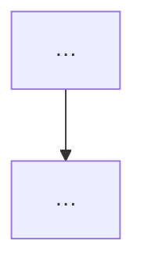

# Period Work Collect

When the wake asks you to build a **采集包 / collector pack**, follow this skill
end-to-end. Read `references/collect-recipes.md` for copy-paste shell recipes.

You are gathering **work traces on the machine this runtime actually runs on**
— not platform Facts, not Host Digest APIs, not the final Brief. You see the
**fullest local picture** for this Computer: after harvesting evidence, do
**preliminary grouping** into **Work groups** and, when it helps, add
**Mermaid** diagrams that only someone with full local context can draw
honestly.

## Scope

| Runtime | Scan root |
| --- | --- |
| local | Owner `$HOME` (whole machine home) |
| cloud | That cloud runtime environment (`$HOME` / workspace dirs you can see) |

Prefer **git repositories under the scan root** that have commits or dirty
files **inside the wake `<window>`** (RFC3339 start → end, half-open). Also
note obvious project dirs that are not git if they clearly changed **in that
same window**. Never pad the pack with earlier/later history.

## Hard rules

- **OWN COMPUTER ONLY** — collect solely on the OS where **this** runtime
  runs (the Computer you are bound to). Never harvest another member's
  machine, never remote into a sibling laptop/cloud box, never treat a
  visible/`public` runtime as scannable from here.
- **STRICT WINDOW** — every Highlight, commit, and Work-group claim must fall
  inside wake `<window>` start→end. Drop out-of-range evidence; do not invent
  continuity from outside the window.
- **Do** use `git` + bounded file reads for short diffs / summaries / key snippets.
- **Do** add **`## Work groups`** that classify this machine's work for the
  synthesizer — **without dropping evidence**. Highlights + Repos remain the
  evidence layer; Work groups organize them.
- **Grouping rules (required):**
  1. **Same project / same git repo / same project root → one group** by
     default.
  2. **Related across repos, files, or surfaces → still one group** when they
     share one outcome or initiative (e.g. frontend + backend for the same
     feature). State **why** under the group.
  3. **Unrelated work → separate groups**, even if same day or same machine.
     Never glue by calendar.
  4. Every Highlight belongs to **exactly one** group.
- **Do** add Mermaid diagrams when a multi-step flow, dependency, or state
  change cannot be recovered from bullets alone (flowchart / sequence / state
  preferred). Cite which Highlights the diagram covers.
- **Do not** replace evidence with groups-only or diagram-only content.
- **Do not** invent work, secrets, or diagrams for decorative effect.
- **Do not** use keymouse, screenshots, clipboard, browser history, or full-repo dumps.
- **Do not** read or quote secrets: `.ssh`, `.gnupg`, `.aws`, `.env` / `.env.*`,
  credential stores, private keys, tokens.
- **Skip noise dirs** while walking: `node_modules`, `.next`, `dist`, `build`,
  `target`, `vendor`, `__pycache__`, `.cache`, `.git` (as a walk skip — still
  treat parent as a repo root).
- **Do not** call Host Digest / Journal APIs. Collect with shell on this OS.
- **Do not** write the final Period Work Brief — only the collector pack page.

## Required procedure (do in order)

1. **Identify runtime** — hostname, `uname -s`, `$HOME`, local vs cloud (best effort).
2. **Discover git roots** under the scan root (see recipes). Cap exploration:
   prefer depth-limited `find`, skip denylist dirs, stop after ~40 roots.
3. **Per repo in the window** collect:
   - remotes (`git remote -v`)
   - commits in window (`git log --after="$START" --before="$END"`, subject + short hash) — **required filter**
   - dirty paths only when the path’s mtime (or a related commit) is in-window;
     otherwise omit or park under Unscoped with an explicit “mtime outside window” note
   - for the **top 3–7** most relevant **in-window** changes: a **short** diff or file
     summary (`git diff --stat`, `git show --stat`, or ≤80 lines of patch /
     file head — never whole files)
4. **Group (this machine only)** — write **`## Work groups`**:
   - Start from repos/project roots; merge into larger groups when work is
     related across repos/files.
   - Aim for **3–7 groups** when there is that much signal (fewer is fine).
   - Each group: human title + why + repos/paths + nested items citing Highlights.
   - Interleaved calendar moments stay in one group when they are the same
     initiative; unrelated work stays separate.
5. **Diagram when necessary** — if a flow/dependency/state change needs the
   full local picture, add 1–3 Mermaid blocks under **Diagrams**. Skip if
   bullets already suffice.
6. **Write the pack** with the exact heading shape below.
7. **Deliver** with `multica notes period-brief submit-pack --draft-page-id <draft>`
   from the wake — body = pack markdown only. Do **not** `--note-write` the pack
   into Notes; packs are ephemeral run artifacts and are purged after synthesis.

If a step fails, keep going: record the failure under **Unscoped / unclear**,
still deliver a pack with whatever you found. An empty honest pack is better
than inventing work.

## Pack markdown shape (required)

```markdown
# 采集包 <window-label>

## Runtime
- mode: local|cloud
- hostname / env: …
- home / scan root: …
- window: <start> → <end>

## Repos / roots
- `/path/to/repo` — remotes: … — N commits in window, M dirty paths — one-line summary

## Highlights
- <claim> — evidence: short hash / path / ≤80-line diff or snippet
- …

## Work groups

### <group title — project or related initiative>
- why: same repo/project | related outcome across <repos/paths>
- repos/paths: …
- items:
  - <in-window work in this group> (cite Highlights)
  - …

### <another group>
- why: …
- repos/paths: …
- items:
  - …

## Diagrams
<!-- Optional. Omit the whole section if no diagram is needed. -->
### <short title>

- covers: <Highlight bullets / paths this diagram explains>

## Unscoped / unclear
- leftover traces, permission errors, non-git dirs, or gaps
```

Aim for **enough signal for a manager Brief**: at least several repo lines
when repos exist, Highlights that cite concrete paths or commits, plus clear
**Work groups** — not vague “worked on stuff”.

## Delivery

```bash
multica notes period-brief submit-pack --draft-page-id <draft-page-id>
```

Body = pack markdown only (stdin, or `--markdown`, or JSON `{"markdown":"..."}`).

Do **not** use `message send --note-write` for collector packs. Packs are stored
on `note_period_brief_run` and deleted after the synthesizer wake — they must not
appear as Notes pages under 工作介绍/.

You may still `multica message send --target …` for a short visible status reply.

## Out of scope

- Final Period Work Brief / 工作介绍 synthesis (周报 Agent)
- `multica computer` lifecycle / upgrade / doctor (see `multica-runtimes`)
- Platform Facts loading (server already did that)

Source map: `references/period-work-collect-source-map.md`
