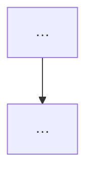

# Period Work Collect

When the wake asks you to build a **采集包 / collector pack**, follow this skill
end-to-end. Read `references/collect-recipes.md` for copy-paste shell recipes.

You are gathering **work traces on the machine this runtime actually runs on**
— not platform Facts, not Host Digest APIs, not the final Brief. You see the
**fullest local picture** for this Computer: after harvesting evidence, do a
**preliminary integration** and, when it helps, add **Mermaid** diagrams that
only someone with full local context can draw honestly.

## Scope

| Runtime | Scan root |
| --- | --- |
| local | Owner `$HOME` (whole machine home) |
| cloud | That cloud runtime environment (`$HOME` / workspace dirs you can see) |

Prefer **git repositories under the scan root** that have commits or dirty
files inside the wake `<window>` (RFC3339 start → end). Also note obvious
project dirs that are not git if they clearly changed.

## Hard rules

- **Do** use `git` + bounded file reads for short diffs / summaries / key snippets.
- **Do** add an **Integrated summary** that groups this machine's work into
  themes / threads — **without dropping evidence**. Highlights + Repos remain
  the evidence layer; the summary is additive.
- **Do** add Mermaid diagrams when a multi-step flow, dependency, or state
  change cannot be recovered from bullets alone (flowchart / sequence / state
  preferred). Cite which Highlights the diagram covers.
- **Do not** replace evidence with summary-only or diagram-only content.
- **Do not** invent work, secrets, or diagrams for decorative effect.
- **Do not** use keymouse, screenshots, clipboard, browser history, or full-repo dumps.
- **Do not** read or quote secrets: `.ssh`, `.gnupg`, `.aws`, `.env` / `.env.*`,
  credential stores, private keys, tokens.
- **Skip noise dirs** while walking: `node_modules`, `.next`, `dist`, `build`,
  `target`, `vendor`, `__pycache__`, `.cache`, `.git` (as a walk skip — still
  treat parent as a repo root).
- **Do not** call Host Digest / Journal APIs. Collect with shell on this OS.
- **Do not** write the final Period Work Brief — only the collector pack page.

## Required procedure (do in order)

1. **Identify runtime** — hostname, `uname -s`, `$HOME`, local vs cloud (best effort).
2. **Discover git roots** under the scan root (see recipes). Cap exploration:
   prefer depth-limited `find`, skip denylist dirs, stop after ~40 roots.
3. **Per repo in the window** collect:
   - remotes (`git remote -v`)
   - commits in window (`git log --after/--before`, subject + short hash)
   - dirty paths (`git status --porcelain`)
   - for the **top 3–7** most relevant changes: a **short** diff or file
     summary (`git diff --stat`, `git show --stat`, or ≤80 lines of patch /
     file head — never whole files)
4. **Integrate (this machine only)** — write **Integrated summary**: 3–7
   themes/threads with what changed and why it matters locally. Every claim
   must still be backed by a Highlight or repo line.
5. **Diagram when necessary** — if a flow/dependency/state change needs the
   full local picture, add 1–3 Mermaid blocks under **Diagrams**. Skip if
   bullets already suffice.
6. **Write the pack** with the exact heading shape below.
7. **Deliver** with `--note-write` to the pack page id from the wake
   instruction / sticky — body = pack markdown only.

If a step fails, keep going: record the failure under **Unscoped / unclear**,
still deliver a pack with whatever you found. An empty honest pack is better
than inventing work.

## Pack markdown shape (required)

```markdown
# 采集包 <window-label>

## Runtime
- mode: local|cloud
- hostname / env: …
- home / scan root: …
- window: <start> → <end>

## Repos / roots
- `/path/to/repo` — remotes: … — N commits in window, M dirty paths — one-line summary

## Highlights
- <claim> — evidence: short hash / path / ≤80-line diff or snippet
- …

## Integrated summary
- <theme/thread>: what this machine accomplished in the window (cite Highlights)
- … keep evidence above; do not drop commits/paths just because they appear here

## Diagrams
<!-- Optional. Omit the whole section if no diagram is needed. -->
### <short title>

- covers: <Highlight bullets / paths this diagram explains>

## Unscoped / unclear
- leftover traces, permission errors, non-git dirs, or gaps
```

Aim for **enough signal for a manager Brief**: at least several repo lines
when repos exist, Highlights that cite concrete paths or commits, plus an
Integrated summary — not vague “worked on stuff”.

## Delivery

```bash
multica message send --target <Message target for chat transport> \
  --note-write --note-page-id <pack-page-id>
```

Body = pack markdown only. Title like `采集包 <window-label>`.

Human confirmation writes the pack page. Until then the pack page stays empty —
your job is still to send `--note-write` with real content.

## Out of scope

- Final Period Work Brief / 工作介绍 synthesis (周报 Agent)
- `multica computer` lifecycle / upgrade / doctor (see `multica-runtimes`)
- Platform Facts loading (server already did that)

Source map: `references/period-work-collect-source-map.md`
